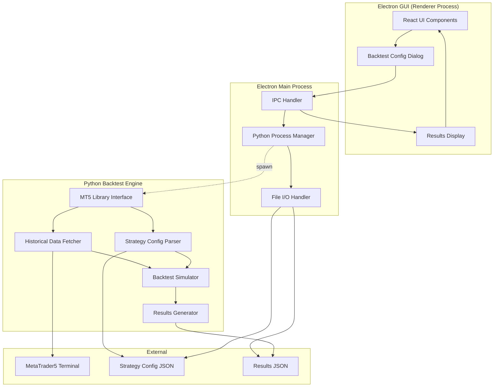

# 設計書

## 概要

GUIバックテスト統合機能は、Strategy Bricks GUIビルダーにバックテスト実行機能を追加します。この機能により、ユーザーはGUIで作成したストラテジーを、PythonのMetaTrader5ライブラリを使用して過去データに対してテストできます。

システムは3つの主要コンポーネントで構成されます：
1. **Electronフロントエンド（React + TypeScript）**: バックテスト設定UI、進捗表示、結果表示
2. **ElectronメインプロセスIPCハンドラー**: GUIとPythonプロセス間の橋渡し
3. **Pythonバックテストエンジン**: MT5データ取得、ストラテジーシミュレーション、結果生成

## アーキテクチャ

### システム構成図



### データフロー

1. **バックテスト開始**:
   - ユーザーがGUIで「バックテスト実行」をクリック
   - 設定ダイアログが表示され、パラメータ入力（シンボル、時間軸、日付範囲）
   - GUIがストラテジー設定をJSONファイルにエクスポート（`ea/tests/strategy_<timestamp>.json`）

2. **プロセス起動**:
   - RendererプロセスがIPCメッセージを送信: `backtest:start`
   - MainプロセスがPythonプロセスを起動: `python backtest_engine.py --config <path> --symbol USDJPY --timeframe M1 --start <date> --end <date>`

3. **バックテスト実行**:
   - PythonがMT5ライブラリを初期化
   - 過去データを取得（ティックまたはバーデータ）
   - ストラテジー設定を解析
   - データを時系列順に反復処理し、エントリー/エグジット条件を評価
   - トレードを記録し、損益を計算

4. **結果返却**:
   - Pythonが結果をJSONファイルに出力（`ea/tests/results_<timestamp>.json`）
   - Pythonプロセスが終了コード0で終了
   - MainプロセスがIPCメッセージを送信: `backtest:complete`
   - RendererプロセスがJSONファイルを読み取り、結果を表示

## コンポーネントとインターフェース

### 1. Electronフロントエンド（React + TypeScript）

#### BacktestConfigDialog コンポーネント

```typescript
interface BacktestConfig {
  symbol: string;        // デフォルト: "USDJPY"
  timeframe: string;     // デフォルト: "M1"
  startDate: Date;       // デフォルト: 3ヶ月前
  endDate: Date;         // デフォルト: 今日
}

interface BacktestConfigDialogProps {
  isOpen: boolean;
  onClose: () => void;
  onSubmit: (config: BacktestConfig) => void;
  lastConfig?: BacktestConfig;
}

// バリデーション関数
function validateBacktestConfig(config: BacktestConfig): string[] {
  const errors: string[] = [];
  
  if (!config.symbol || config.symbol.trim() === '') {
    errors.push('シンボルは必須です');
  }
  
  if (!config.timeframe) {
    errors.push('時間軸は必須です');
  }
  
  if (config.startDate >= config.endDate) {
    errors.push('開始日は終了日より前である必要があります');
  }
  
  if (config.endDate > new Date()) {
    errors.push('終了日は未来の日付にできません');
  }
  
  return errors;
}
```

#### BacktestResultsView コンポーネント

```typescript
interface BacktestResults {
  metadata: {
    strategyName: string;
    symbol: string;
    timeframe: string;
    startDate: string;
    endDate: string;
    executionTimestamp: string;
  };
  
  summary: {
    totalTrades: number;
    winningTrades: number;
    losingTrades: number;
    winRate: number;           // パーセンテージ
    totalProfitLoss: number;
    maxDrawdown: number;
    avgTradeProfitLoss: number;
  };
  
  trades: Trade[];
}

interface Trade {
  entryTime: string;
  entryPrice: number;
  exitTime: string;
  exitPrice: number;
  positionSize: number;
  profitLoss: number;
  type: 'BUY' | 'SELL';
}

interface BacktestResultsViewProps {
  results: BacktestResults | null;
  error: string | null;
  onExport: () => void;
}
```

#### BacktestProgressIndicator コンポーネント

```typescript
interface BacktestProgressProps {
  isRunning: boolean;
  elapsedTime: number;  // 秒単位
  onCancel: () => void;
}
```

### 2. Electron Main Process IPC Handler

#### IPCイベントハンドラー

```typescript
// preload.ts - コンテキストブリッジ
interface BacktestAPI {
  startBacktest: (config: BacktestConfig, strategyPath: string) => Promise<void>;
  cancelBacktest: () => Promise<void>;
  onBacktestProgress: (callback: (progress: BacktestProgress) => void) => void;
  onBacktestComplete: (callback: (results: BacktestResults) => void) => void;
  onBacktestError: (callback: (error: string) => void) => void;
  exportResults: (results: BacktestResults, outputPath: string) => Promise<void>;
}

contextBridge.exposeInMainWorld('backtestAPI', {
  startBacktest: (config, strategyPath) => 
    ipcRenderer.invoke('backtest:start', config, strategyPath),
  cancelBacktest: () => 
    ipcRenderer.invoke('backtest:cancel'),
  onBacktestProgress: (callback) => 
    ipcRenderer.on('backtest:progress', (_, progress) => callback(progress)),
  onBacktestComplete: (callback) => 
    ipcRenderer.on('backtest:complete', (_, results) => callback(results)),
  onBacktestError: (callback) => 
    ipcRenderer.on('backtest:error', (_, error) => callback(error)),
  exportResults: (results, outputPath) => 
    ipcRenderer.invoke('backtest:export', results, outputPath)
});
```

#### Pythonプロセス管理

```typescript
// main.ts
import { spawn, ChildProcess } from 'child_process';
import * as path from 'path';
import * as fs from 'fs';

class BacktestProcessManager {
  private currentProcess: ChildProcess | null = null;
  private readonly TIMEOUT_MS = 5 * 60 * 1000; // 5分
  private timeoutHandle: NodeJS.Timeout | null = null;
  
  async startBacktest(
    config: BacktestConfig,
    strategyConfigPath: string
  ): Promise<string> {
    // 既存プロセスがあればキャンセル
    if (this.currentProcess) {
      await this.cancelBacktest();
    }
    
    // 結果ファイルパスを生成
    const timestamp = Date.now();
    const resultsPath = path.join(
      __dirname,
      '../ea/tests',
      `results_${timestamp}.json`
    );
    
    // Pythonスクリプトパス
    const scriptPath = path.join(__dirname, '../python/backtest_engine.py');
    
    // コマンドライン引数を構築
    const args = [
      scriptPath,
      '--config', strategyConfigPath,
      '--symbol', config.symbol,
      '--timeframe', config.timeframe,
      '--start', config.startDate.toISOString(),
      '--end', config.endDate.toISOString(),
      '--output', resultsPath
    ];
    
    // Pythonプロセスを起動
    this.currentProcess = spawn('python', args, {
      cwd: path.join(__dirname, '../python'),
      env: { ...process.env }
    });
    
    // タイムアウトを設定
    this.timeoutHandle = setTimeout(() => {
      this.handleTimeout();
    }, this.TIMEOUT_MS);
    
    // 標準出力/エラー出力をキャプチャ
    let stdout = '';
    let stderr = '';
    
    this.currentProcess.stdout?.on('data', (data) => {
      stdout += data.toString();
      console.log('[Backtest]', data.toString());
    });
    
    this.currentProcess.stderr?.on('data', (data) => {
      stderr += data.toString();
      console.error('[Backtest Error]', data.toString());
    });
    
    // プロセス終了を待機
    return new Promise((resolve, reject) => {
      this.currentProcess!.on('exit', (code) => {
        if (this.timeoutHandle) {
          clearTimeout(this.timeoutHandle);
          this.timeoutHandle = null;
        }
        
        this.currentProcess = null;
        
        if (code === 0) {
          resolve(resultsPath);
        } else {
          reject(new Error(`Backtest failed with code ${code}: ${stderr}`));
        }
      });
      
      this.currentProcess!.on('error', (err) => {
        if (this.timeoutHandle) {
          clearTimeout(this.timeoutHandle);
          this.timeoutHandle = null;
        }
        
        this.currentProcess = null;
        reject(err);
      });
    });
  }
  
  async cancelBacktest(): Promise<void> {
    if (this.currentProcess) {
      this.currentProcess.kill('SIGTERM');
      this.currentProcess = null;
    }
    
    if (this.timeoutHandle) {
      clearTimeout(this.timeoutHandle);
      this.timeoutHandle = null;
    }
  }
  
  private handleTimeout(): void {
    console.error('[Backtest] Timeout exceeded');
    this.cancelBacktest();
  }
}

// IPCハンドラー登録
const backtestManager = new BacktestProcessManager();

ipcMain.handle('backtest:start', async (event, config, strategyPath) => {
  try {
    const resultsPath = await backtestManager.startBacktest(config, strategyPath);
    
    // 結果ファイルを読み取り
    const resultsJson = fs.readFileSync(resultsPath, 'utf-8');
    const results = JSON.parse(resultsJson);
    
    // Rendererに結果を送信
    event.sender.send('backtest:complete', results);
  } catch (error) {
    event.sender.send('backtest:error', error.message);
  }
});

ipcMain.handle('backtest:cancel', async () => {
  await backtestManager.cancelBacktest();
});

ipcMain.handle('backtest:export', async (event, results, outputPath) => {
  fs.writeFileSync(outputPath, JSON.stringify(results, null, 2), 'utf-8');
});
```

### 3. Pythonバックテストエンジン

#### メインスクリプト構造

```python
# backtest_engine.py
import argparse
import json
import sys
from datetime import datetime
from typing import List, Dict, Any
import MetaTrader5 as mt5

class BacktestEngine:
    def __init__(self, config_path: str, symbol: str, timeframe: str, 
                 start_date: datetime, end_date: datetime, output_path: str):
        self.config_path = config_path
        self.symbol = symbol
        self.timeframe = timeframe
        self.start_date = start_date
        self.end_date = end_date
        self.output_path = output_path
        self.strategy_config = None
        self.historical_data = None
        self.trades: List[Dict[str, Any]] = []
        
    def run(self) -> None:
        """バックテスト実行のメインフロー"""
        try:
            # 1. MT5初期化
            if not self.initialize_mt5():
                raise Exception("MT5初期化に失敗しました")
            
            # 2. ストラテジー設定を読み込み
            self.load_strategy_config()
            
            # 3. 過去データを取得
            self.fetch_historical_data()
            
            # 4. バックテストシミュレーションを実行
            self.simulate_strategy()
            
            # 5. 結果を生成
            self.generate_results()
            
            # 6. クリーンアップ
            mt5.shutdown()
            
        except Exception as e:
            print(f"エラー: {str(e)}", file=sys.stderr)
            mt5.shutdown()
            sys.exit(1)
    
    def initialize_mt5(self) -> bool:
        """MT5ライブラリを初期化"""
        if not mt5.initialize():
            print(f"MT5初期化失敗: {mt5.last_error()}", file=sys.stderr)
            return False
        
        print(f"MT5初期化成功: バージョン {mt5.version()}")
        return True
    
    def load_strategy_config(self) -> None:
        """ストラテジー設定JSONを読み込み"""
        try:
            with open(self.config_path, 'r', encoding='utf-8') as f:
                self.strategy_config = json.load(f)
            
            print(f"ストラテジー設定を読み込みました: {self.config_path}")
            
            # 必須フィールドを検証
            required_fields = ['strategyName', 'blocks']
            for field in required_fields:
                if field not in self.strategy_config:
                    raise ValueError(f"必須フィールドが見つかりません: {field}")
                    
        except FileNotFoundError:
            raise Exception(f"設定ファイルが見つかりません: {self.config_path}")
        except json.JSONDecodeError as e:
            raise Exception(f"無効なJSON形式: {str(e)}")
    
    def fetch_historical_data(self) -> None:
        """MT5から過去データを取得"""
        # 時間軸をMT5定数に変換
        timeframe_map = {
            'M1': mt5.TIMEFRAME_M1,
            'M5': mt5.TIMEFRAME_M5,
            'M15': mt5.TIMEFRAME_M15,
            'M30': mt5.TIMEFRAME_M30,
            'H1': mt5.TIMEFRAME_H1,
            'H4': mt5.TIMEFRAME_H4,
            'D1': mt5.TIMEFRAME_D1
        }
        
        mt5_timeframe = timeframe_map.get(self.timeframe)
        if mt5_timeframe is None:
            raise ValueError(f"サポートされていない時間軸: {self.timeframe}")
        
        # バーデータを取得
        rates = mt5.copy_rates_range(
            self.symbol,
            mt5_timeframe,
            self.start_date,
            self.end_date
        )
        
        if rates is None or len(rates) == 0:
            raise Exception(
                f"データ取得失敗: {self.symbol} {self.timeframe} "
                f"{self.start_date} - {self.end_date}"
            )
        
        self.historical_data = rates
        print(f"過去データを取得しました: {len(rates)} バー")
        
        # データ範囲を検証
        first_time = datetime.fromtimestamp(rates[0]['time'])
        last_time = datetime.fromtimestamp(rates[-1]['time'])
        
        if first_time > self.start_date or last_time < self.end_date:
            print(
                f"警告: データ範囲が不完全です。"
                f"要求: {self.start_date} - {self.end_date}, "
                f"取得: {first_time} - {last_time}",
                file=sys.stderr
            )
    
    def simulate_strategy(self) -> None:
        """ストラテジーロジックをシミュレート"""
        # ストラテジーブロックを解析
        blocks = self.strategy_config.get('blocks', [])
        
        # 簡易的なシミュレーションロジック
        # 実際の実装では、ブロックベースのロジックを評価する必要があります
        position = None  # None, 'BUY', 'SELL'
        entry_price = 0.0
        entry_time = None
        
        for i, bar in enumerate(self.historical_data):
            current_time = datetime.fromtimestamp(bar['time'])
            current_price = bar['close']
            
            # エントリー条件を評価（簡易版）
            if position is None:
                # エントリーシグナルをチェック
                if self.check_entry_signal(bar, i, 'BUY'):
                    position = 'BUY'
                    entry_price = current_price
                    entry_time = current_time
                    print(f"BUYエントリー: {current_time} @ {entry_price}")
                    
                elif self.check_entry_signal(bar, i, 'SELL'):
                    position = 'SELL'
                    entry_price = current_price
                    entry_time = current_time
                    print(f"SELLエントリー: {current_time} @ {entry_price}")
            
            # エグジット条件を評価
            elif position is not None:
                if self.check_exit_signal(bar, i, position):
                    exit_price = current_price
                    exit_time = current_time
                    
                    # 損益を計算
                    if position == 'BUY':
                        pnl = exit_price - entry_price
                    else:  # SELL
                        pnl = entry_price - exit_price
                    
                    # トレードを記録
                    self.trades.append({
                        'entryTime': entry_time.isoformat(),
                        'entryPrice': entry_price,
                        'exitTime': exit_time.isoformat(),
                        'exitPrice': exit_price,
                        'positionSize': 1.0,  # 簡略化のため固定
                        'profitLoss': pnl,
                        'type': position
                    })
                    
                    print(f"{position}エグジット: {exit_time} @ {exit_price}, P/L: {pnl}")
                    
                    # ポジションをクローズ
                    position = None
        
        print(f"シミュレーション完了: {len(self.trades)} トレード")
    
    def check_entry_signal(self, bar: Dict, index: int, direction: str) -> bool:
        """エントリーシグナルをチェック（簡易版）"""
        # 実際の実装では、strategy_configのブロックを評価
        # ここでは簡易的なロジックを使用
        
        # 例: 単純な移動平均クロスオーバー
        if index < 20:
            return False
        
        # 過去20バーの平均を計算
        recent_bars = self.historical_data[index-20:index]
        avg_price = sum(b['close'] for b in recent_bars) / len(recent_bars)
        
        if direction == 'BUY':
            return bar['close'] > avg_price
        else:  # SELL
            return bar['close'] < avg_price
    
    def check_exit_signal(self, bar: Dict, index: int, position: str) -> bool:
        """エグジットシグナルをチェック（簡易版）"""
        # 実際の実装では、strategy_configのブロックを評価
        # ここでは簡易的なロジックを使用
        
        # 例: 10バー後に自動クローズ
        return index % 10 == 0
    
    def generate_results(self) -> None:
        """バックテスト結果を生成"""
        # 統計を計算
        total_trades = len(self.trades)
        winning_trades = sum(1 for t in self.trades if t['profitLoss'] > 0)
        losing_trades = sum(1 for t in self.trades if t['profitLoss'] < 0)
        win_rate = (winning_trades / total_trades * 100) if total_trades > 0 else 0
        
        total_pnl = sum(t['profitLoss'] for t in self.trades)
        avg_pnl = total_pnl / total_trades if total_trades > 0 else 0
        
        # 最大ドローダウンを計算
        max_drawdown = self.calculate_max_drawdown()
        
        # 結果オブジェクトを構築
        results = {
            'metadata': {
                'strategyName': self.strategy_config.get('strategyName', 'Unknown'),
                'symbol': self.symbol,
                'timeframe': self.timeframe,
                'startDate': self.start_date.isoformat(),
                'endDate': self.end_date.isoformat(),
                'executionTimestamp': datetime.now().isoformat()
            },
            'summary': {
                'totalTrades': total_trades,
                'winningTrades': winning_trades,
                'losingTrades': losing_trades,
                'winRate': round(win_rate, 2),
                'totalProfitLoss': round(total_pnl, 5),
                'maxDrawdown': round(max_drawdown, 5),
                'avgTradeProfitLoss': round(avg_pnl, 5)
            },
            'trades': self.trades
        }
        
        # JSONファイルに書き込み
        with open(self.output_path, 'w', encoding='utf-8') as f:
            json.dump(results, f, indent=2, ensure_ascii=False)
        
        print(f"結果を保存しました: {self.output_path}")
    
    def calculate_max_drawdown(self) -> float:
        """最大ドローダウンを計算"""
        if not self.trades:
            return 0.0
        
        cumulative_pnl = 0.0
        peak = 0.0
        max_dd = 0.0
        
        for trade in self.trades:
            cumulative_pnl += trade['profitLoss']
            
            if cumulative_pnl > peak:
                peak = cumulative_pnl
            
            drawdown = peak - cumulative_pnl
            if drawdown > max_dd:
                max_dd = drawdown
        
        return max_dd


def main():
    parser = argparse.ArgumentParser(description='Strategy Bricks Backtest Engine')
    parser.add_argument('--config', required=True, help='ストラテジー設定JSONファイルパス')
    parser.add_argument('--symbol', required=True, help='シンボル（例: USDJPY）')
    parser.add_argument('--timeframe', required=True, help='時間軸（例: M1）')
    parser.add_argument('--start', required=True, help='開始日（ISO形式）')
    parser.add_argument('--end', required=True, help='終了日（ISO形式）')
    parser.add_argument('--output', required=True, help='結果出力パス')
    
    args = parser.parse_args()
    
    # 日付を解析
    start_date = datetime.fromisoformat(args.start.replace('Z', '+00:00'))
    end_date = datetime.fromisoformat(args.end.replace('Z', '+00:00'))
    
    # バックテストエンジンを実行
    engine = BacktestEngine(
        config_path=args.config,
        symbol=args.symbol,
        timeframe=args.timeframe,
        start_date=start_date,
        end_date=end_date,
        output_path=args.output
    )
    
    engine.run()


if __name__ == '__main__':
    main()
```

## データモデル

### Strategy Config JSON

```json
{
  "strategyName": "My Strategy",
  "blocks": [
    {
      "id": "block_1",
      "type": "indicator",
      "indicator": "SMA",
      "period": 20
    },
    {
      "id": "block_2",
      "type": "condition",
      "condition": "price_above_sma"
    },
    {
      "id": "block_3",
      "type": "action",
      "action": "buy"
    }
  ]
}
```

### Backtest Results JSON

```json
{
  "metadata": {
    "strategyName": "My Strategy",
    "symbol": "USDJPY",
    "timeframe": "M1",
    "startDate": "2024-01-01T00:00:00Z",
    "endDate": "2024-03-31T23:59:59Z",
    "executionTimestamp": "2024-04-01T10:30:00Z"
  },
  "summary": {
    "totalTrades": 150,
    "winningTrades": 90,
    "losingTrades": 60,
    "winRate": 60.0,
    "totalProfitLoss": 125.50,
    "maxDrawdown": 45.20,
    "avgTradeProfitLoss": 0.84
  },
  "trades": [
    {
      "entryTime": "2024-01-01T10:00:00Z",
      "entryPrice": 145.123,
      "exitTime": "2024-01-01T10:15:00Z",
      "exitPrice": 145.156,
      "positionSize": 1.0,
      "profitLoss": 0.033,
      "type": "BUY"
    }
  ]
}
```


## 正確性プロパティ

プロパティとは、システムのすべての有効な実行において真であるべき特性または動作です。本質的には、システムが何をすべきかについての形式的な記述です。プロパティは、人間が読める仕様と機械で検証可能な正確性保証の橋渡しとなります。

### プロパティ1: 設定のラウンドトリップ一貫性

*任意の*有効なバックテスト設定に対して、設定を保存してから読み込むと、元の設定と同等の設定が得られる

**検証: 要件 1.5, 2.1**

### プロパティ2: 有効なパラメータの受け入れ

*任意の*有効なバックテストパラメータ（シンボル、時間軸、日付範囲）に対して、GUIはパラメータを受け入れ、IPCハンドラーに渡す

**検証: 要件 1.3**

### プロパティ3: 無効なパラメータの拒否

*任意の*無効なバックテストパラメータ（空のシンボル、無効な日付範囲など）に対して、GUIはパラメータを拒否し、検証エラーを表示し、バックテスト実行を防止する

**検証: 要件 1.4, 2.4**

### プロパティ4: ストラテジー設定のシリアライゼーション

*任意の*有効なストラテジー設定に対して、設定をJSONにシリアライズしてからデシリアライズすると、元の設定と同等の設定が得られる

**検証: 要件 2.1, 5.1**

### プロパティ5: ファイルパスの一意性

*任意の*2つの異なるバックテスト実行に対して、生成されるストラテジー設定ファイルパスと結果ファイルパスは一意である

**検証: 要件 2.2**

### プロパティ6: プロセス起動の信頼性

*任意の*有効なバックテストリクエストに対して、IPCハンドラーはPythonプロセスを起動し、正しいコマンドライン引数（設定パス、シンボル、時間軸、日付範囲）を渡す

**検証: 要件 3.1, 3.2**

### プロパティ7: プロセスタイムアウト

*任意の*バックテストプロセスに対して、設定されたタイムアウト期間を超えた場合、IPCハンドラーはプロセスを終了する

**検証: 要件 3.5**

### プロパティ8: エラー条件の適切な処理

*任意の*エラー条件（MT5接続失敗、データ取得失敗、無効な設定、ファイルシステムエラー）に対して、システムは説明的なエラーメッセージをログに記録し、ユーザーに表示し、一時ファイルをクリーンアップする

**検証: 要件 3.4, 4.2, 4.4, 5.2, 10.1, 10.2, 10.3, 10.4**

### プロパティ9: データ範囲の検証

*任意の*取得された過去データに対して、バックテストエンジンはシミュレーションを進める前に、データが要求された日付範囲をカバーしていることを検証する

**検証: 要件 4.5**

### プロパティ10: 時系列順の処理

*任意の*過去データセットに対して、バックテストエンジンはデータを時系列順に反復処理し、各バーで条件を評価する

**検証: 要件 5.3**

### プロパティ11: トレード記録の完全性

*任意の*ストラテジー条件が満たされた時、バックテストエンジンはエントリータイムスタンプ、エントリー価格、エグジットタイムスタンプ、エグジット価格、ポジションサイズを含む完全なトレード記録を記録する

**検証: 要件 5.4**

### プロパティ12: 損益計算の正確性

*任意の*トレード（エントリー価格、エグジット価格、ポジションサイズ、タイプ）に対して、計算された損益は以下の式に従う：
- BUYの場合: P/L = (エグジット価格 - エントリー価格) × ポジションサイズ
- SELLの場合: P/L = (エントリー価格 - エグジット価格) × ポジションサイズ

**検証: 要件 5.5**

### プロパティ13: 統計計算の正確性

*任意の*トレードリストに対して、計算された統計（総トレード数、勝ちトレード数、負けトレード数、勝率、総損益、平均トレード損益）は、トレードデータから正しく導出される

**検証: 要件 6.1, 6.2**

### プロパティ14: 最大ドローダウン計算

*任意の*トレードリストに対して、計算された最大ドローダウンは、累積損益曲線のピークから最低点までの最大の下落幅である

**検証: 要件 6.2**

### プロパティ15: 結果のシリアライゼーション

*任意の*バックテスト結果に対して、結果をJSONにシリアライズしてからデシリアライズすると、元の結果と同等の結果が得られる

**検証: 要件 6.3**

### プロパティ16: 結果メタデータの完全性

*任意の*バックテスト結果に対して、結果JSONはメタデータ（ストラテジー名、シンボル、時間軸、日付範囲、実行タイムスタンプ）を含む

**検証: 要件 6.5**

### プロパティ17: 結果表示の完全性

*任意の*有効なバックテスト結果に対して、GUIは主要なパフォーマンス指標（総トレード数、勝率、総損益、最大ドローダウン）と個別トレードリスト（タイムスタンプ、価格、損益）を表示する

**検証: 要件 7.2, 7.3**

### プロパティ18: キャンセル時のクリーンアップ

*任意の*実行中のバックテストに対して、ユーザーがキャンセルした場合、IPCハンドラーはPythonプロセスを終了し、一時ファイルをクリーンアップする

**検証: 要件 8.3**

### プロパティ19: リクエストのキューイング

*任意の*複数のバックテストリクエストに対して、IPCハンドラーはリクエストをキューに入れ、順次実行する（並行実行しない）

**検証: 要件 10.5**

### プロパティ20: 環境検証

*任意の*バックテスト実行前に、GUIはPython環境とMT5ライブラリの可用性を検証し、利用不可の場合はバックテスト機能を無効にする

**検証: 要件 9.5**

## エラーハンドリング

### エラーカテゴリ

1. **設定エラー**:
   - 無効なバックテストパラメータ（空のシンボル、無効な日付範囲）
   - 不完全または無効なストラテジー設定
   - 処理: 検証エラーメッセージを表示し、実行を防止

2. **環境エラー**:
   - MT5ライブラリが利用不可
   - Python環境が見つからない
   - 非Windowsプラットフォーム
   - 処理: 機能を無効にし、インストール/プラットフォーム要件を表示

3. **実行時エラー**:
   - MT5接続失敗
   - 過去データ取得失敗
   - ファイルシステムエラー（読み取り/書き込み失敗）
   - プロセスタイムアウト
   - 処理: エラーをログに記録し、ユーザーフレンドリーなメッセージを表示し、クリーンアップ

4. **解析エラー**:
   - 不正なJSON形式
   - 必須フィールドの欠落
   - 処理: 説明的なエラーメッセージで終了

### エラーハンドリング戦略

```typescript
// Electron Main Process
class ErrorHandler {
  static handleBacktestError(error: Error, context: string): void {
    // 詳細なエラーをログに記録
    console.error(`[Backtest Error - ${context}]`, error);
    
    // ユーザーフレンドリーなメッセージを生成
    let userMessage = '';
    
    if (error.message.includes('MT5')) {
      userMessage = 'MetaTrader5への接続に失敗しました。MT5ターミナルが起動していることを確認してください。';
    } else if (error.message.includes('timeout')) {
      userMessage = 'バックテストがタイムアウトしました。日付範囲を短くしてみてください。';
    } else if (error.message.includes('data')) {
      userMessage = '過去データの取得に失敗しました。シンボルと日付範囲を確認してください。';
    } else if (error.message.includes('config')) {
      userMessage = 'ストラテジー設定が無効です。設定を確認してください。';
    } else {
      userMessage = `予期しないエラーが発生しました: ${error.message}`;
    }
    
    // GUIに送信
    BrowserWindow.getFocusedWindow()?.webContents.send('backtest:error', userMessage);
    
    // クリーンアップ
    this.cleanup();
  }
  
  static cleanup(): void {
    // 一時ファイルを削除
    // プロセスを終了
  }
}
```

```python
# Python Backtest Engine
class BacktestError(Exception):
    """バックテスト固有のエラー"""
    pass

def handle_error(error: Exception, context: str) -> None:
    """エラーを処理し、適切なメッセージを出力"""
    error_msg = f"[{context}] {str(error)}"
    print(error_msg, file=sys.stderr)
    
    # MT5をシャットダウン
    if mt5.initialize():
        mt5.shutdown()
    
    sys.exit(1)
```

## テスト戦略

### デュアルテストアプローチ

バックテスト統合機能の包括的なカバレッジを確保するために、単体テストとプロパティベーステストの両方を使用します：

- **単体テスト**: 特定の例、エッジケース、エラー条件を検証
- **プロパティテスト**: すべての入力にわたる普遍的なプロパティを検証

両方のアプローチは補完的であり、包括的なカバレッジに必要です。

### 単体テストの焦点

単体テストは以下に焦点を当てます：
- 特定の設定例（USDJPY M1、3ヶ月）
- エッジケース（空のトレードリスト、単一トレード、すべて勝ちトレード）
- エラー条件（MT5接続失敗、無効なJSON、ファイルが見つからない）
- コンポーネント間の統合ポイント（IPC通信、ファイルI/O）

### プロパティベーステストの設定

プロパティテストには以下を使用します：
- **TypeScript/JavaScript**: fast-check ライブラリ
- **Python**: Hypothesis ライブラリ

各プロパティテストは以下を満たす必要があります：
- 最低100回の反復実行（ランダム化のため）
- 設計書のプロパティを参照するタグ
- タグ形式: `Feature: gui-backtest-integration, Property {番号}: {プロパティテキスト}`

### テストカバレッジマトリックス

| コンポーネント | 単体テスト | プロパティテスト |
|--------------|----------|----------------|
| BacktestConfigDialog | 検証ロジック、UI状態 | プロパティ2, 3 |
| BacktestResultsView | 表示フォーマット | プロパティ17 |
| IPC Handler | プロセス起動、エラーハンドリング | プロパティ6, 7, 8, 19 |
| Python Engine - データ取得 | MT5接続、エラーケース | プロパティ9 |
| Python Engine - シミュレーション | 条件評価 | プロパティ10, 11 |
| Python Engine - 計算 | 損益、統計 | プロパティ12, 13, 14 |
| シリアライゼーション | JSONフォーマット | プロパティ1, 4, 15 |

### テスト例

#### 単体テスト例（TypeScript + Jest）

```typescript
describe('BacktestConfigDialog', () => {
  it('should reject empty symbol', () => {
    const config = {
      symbol: '',
      timeframe: 'M1',
      startDate: new Date('2024-01-01'),
      endDate: new Date('2024-03-31')
    };
    
    const errors = validateBacktestConfig(config);
    expect(errors).toContain('シンボルは必須です');
  });
  
  it('should reject end date before start date', () => {
    const config = {
      symbol: 'USDJPY',
      timeframe: 'M1',
      startDate: new Date('2024-03-31'),
      endDate: new Date('2024-01-01')
    };
    
    const errors = validateBacktestConfig(config);
    expect(errors).toContain('開始日は終了日より前である必要があります');
  });
});
```

#### プロパティテスト例（TypeScript + fast-check）

```typescript
import * as fc from 'fast-check';

describe('Property Tests', () => {
  // Feature: gui-backtest-integration, Property 2: 有効なパラメータの受け入れ
  it('should accept all valid backtest parameters', () => {
    fc.assert(
      fc.property(
        fc.record({
          symbol: fc.string({ minLength: 1, maxLength: 10 }),
          timeframe: fc.constantFrom('M1', 'M5', 'M15', 'M30', 'H1', 'H4', 'D1'),
          startDate: fc.date({ min: new Date('2020-01-01'), max: new Date('2024-01-01') }),
          endDate: fc.date({ min: new Date('2024-01-02'), max: new Date('2024-12-31') })
        }),
        (config) => {
          // 開始日が終了日より前であることを確認
          fc.pre(config.startDate < config.endDate);
          
          const errors = validateBacktestConfig(config);
          expect(errors).toHaveLength(0);
        }
      ),
      { numRuns: 100 }
    );
  });
  
  // Feature: gui-backtest-integration, Property 12: 損益計算の正確性
  it('should calculate profit/loss correctly for all trades', () => {
    fc.assert(
      fc.property(
        fc.record({
          entryPrice: fc.double({ min: 100, max: 200 }),
          exitPrice: fc.double({ min: 100, max: 200 }),
          positionSize: fc.double({ min: 0.01, max: 10 }),
          type: fc.constantFrom('BUY', 'SELL')
        }),
        (trade) => {
          const calculatedPnL = calculateProfitLoss(
            trade.entryPrice,
            trade.exitPrice,
            trade.positionSize,
            trade.type
          );
          
          const expectedPnL = trade.type === 'BUY'
            ? (trade.exitPrice - trade.entryPrice) * trade.positionSize
            : (trade.entryPrice - trade.exitPrice) * trade.positionSize;
          
          expect(calculatedPnL).toBeCloseTo(expectedPnL, 5);
        }
      ),
      { numRuns: 100 }
    );
  });
});
```

#### プロパティテスト例（Python + Hypothesis）

```python
from hypothesis import given, strategies as st
import pytest

# Feature: gui-backtest-integration, Property 13: 統計計算の正確性
@given(st.lists(
    st.fixed_dictionaries({
        'profitLoss': st.floats(min_value=-100, max_value=100),
        'entryTime': st.datetimes(),
        'exitTime': st.datetimes(),
        'entryPrice': st.floats(min_value=100, max_value=200),
        'exitPrice': st.floats(min_value=100, max_value=200),
        'positionSize': st.floats(min_value=0.01, max_value=10),
        'type': st.sampled_from(['BUY', 'SELL'])
    }),
    min_size=1,
    max_size=100
))
def test_statistics_calculation_accuracy(trades):
    """すべてのトレードリストに対して統計が正しく計算されることを検証"""
    summary = calculate_summary_statistics(trades)
    
    # 総トレード数
    assert summary['totalTrades'] == len(trades)
    
    # 勝ちトレード数
    winning_trades = [t for t in trades if t['profitLoss'] > 0]
    assert summary['winningTrades'] == len(winning_trades)
    
    # 負けトレード数
    losing_trades = [t for t in trades if t['profitLoss'] < 0]
    assert summary['losingTrades'] == len(losing_trades)
    
    # 勝率
    expected_win_rate = (len(winning_trades) / len(trades)) * 100
    assert abs(summary['winRate'] - expected_win_rate) < 0.01
    
    # 総損益
    expected_total_pnl = sum(t['profitLoss'] for t in trades)
    assert abs(summary['totalProfitLoss'] - expected_total_pnl) < 0.00001
    
    # 平均トレード損益
    expected_avg_pnl = expected_total_pnl / len(trades)
    assert abs(summary['avgTradeProfitLoss'] - expected_avg_pnl) < 0.00001

# Feature: gui-backtest-integration, Property 14: 最大ドローダウン計算
@given(st.lists(
    st.floats(min_value=-100, max_value=100),
    min_size=1,
    max_size=100
))
def test_max_drawdown_calculation(pnl_values):
    """すべての損益リストに対して最大ドローダウンが正しく計算されることを検証"""
    trades = [{'profitLoss': pnl} for pnl in pnl_values]
    max_dd = calculate_max_drawdown(trades)
    
    # 手動で最大ドローダウンを計算
    cumulative = 0.0
    peak = 0.0
    expected_max_dd = 0.0
    
    for pnl in pnl_values:
        cumulative += pnl
        if cumulative > peak:
            peak = cumulative
        drawdown = peak - cumulative
        if drawdown > expected_max_dd:
            expected_max_dd = drawdown
    
    assert abs(max_dd - expected_max_dd) < 0.00001

# Feature: gui-backtest-integration, Property 15: 結果のシリアライゼーション
@given(st.fixed_dictionaries({
    'metadata': st.fixed_dictionaries({
        'strategyName': st.text(min_size=1, max_size=50),
        'symbol': st.text(min_size=1, max_size=10),
        'timeframe': st.sampled_from(['M1', 'M5', 'M15', 'M30', 'H1', 'H4', 'D1']),
        'startDate': st.datetimes().map(lambda d: d.isoformat()),
        'endDate': st.datetimes().map(lambda d: d.isoformat()),
        'executionTimestamp': st.datetimes().map(lambda d: d.isoformat())
    }),
    'summary': st.fixed_dictionaries({
        'totalTrades': st.integers(min_value=0, max_value=1000),
        'winningTrades': st.integers(min_value=0, max_value=1000),
        'losingTrades': st.integers(min_value=0, max_value=1000),
        'winRate': st.floats(min_value=0, max_value=100),
        'totalProfitLoss': st.floats(min_value=-10000, max_value=10000),
        'maxDrawdown': st.floats(min_value=0, max_value=10000),
        'avgTradeProfitLoss': st.floats(min_value=-1000, max_value=1000)
    }),
    'trades': st.lists(st.fixed_dictionaries({
        'entryTime': st.datetimes().map(lambda d: d.isoformat()),
        'entryPrice': st.floats(min_value=100, max_value=200),
        'exitTime': st.datetimes().map(lambda d: d.isoformat()),
        'exitPrice': st.floats(min_value=100, max_value=200),
        'positionSize': st.floats(min_value=0.01, max_value=10),
        'profitLoss': st.floats(min_value=-100, max_value=100),
        'type': st.sampled_from(['BUY', 'SELL'])
    }), max_size=10)
}))
def test_results_serialization_round_trip(results):
    """すべての結果に対してシリアライゼーションのラウンドトリップが一貫していることを検証"""
    # JSONにシリアライズ
    json_str = json.dumps(results)
    
    # デシリアライズ
    deserialized = json.loads(json_str)
    
    # 元の結果と同等であることを確認
    assert deserialized == results
```

### 継続的インテグレーション

すべてのテスト（単体テストとプロパティテスト）は、コミット前とCI/CDパイプラインで実行する必要があります。プロパティテストは実行時間が長いため、以下のように設定します：

- **開発中**: 各プロパティテストで100回の反復
- **CI/CD**: 各プロパティテストで1000回の反復（より徹底的なカバレッジ）
