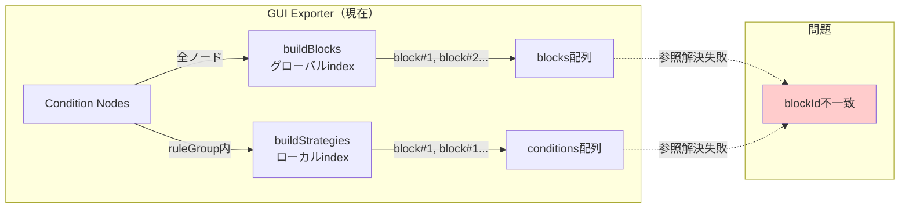
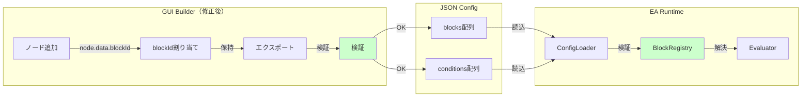

# 設計書

## 概要

本設計書は、GUI BuilderとEA Runtime間のblockId参照不一致問題を解決するための詳細設計を定義します。現在の問題は、GUI Exporterが`buildBlocks()`でグローバルインデックスを使用してblockIdを生成する一方、`buildStrategies()`でruleGroup内のローカルインデックスを使用してblockIdを再生成することにより、参照の不一致が発生することです。

本設計では、以下のアプローチを採用します:

1. **ノードベースのblockId割り当て**: 各conditionノードに、キャンバス追加時に一意のblockIdを割り当てる
2. **参照の保持**: エクスポート時にblockIdを再生成せず、ノードに割り当てられたblockIdを保持する
3. **検証の強化**: GUI側とEA側の両方でblockId参照の整合性を検証する
4. **エラー報告の改善**: 参照エラーを明確に報告し、デバッグを容易にする

## アーキテクチャ

### 現在の問題



### 修正後のアーキテクチャ




## コンポーネントとインターフェース

### GUI Builder側のコンポーネント

#### 1. NodeManager（新規）

**責務**: conditionノードのblockId割り当てと管理

**インターフェース**:
```typescript
interface NodeManager {
  // ノード追加時にblockIdを割り当て
  assignBlockId(node: Node): string
  
  // ノードのblockIdを取得
  getBlockId(nodeId: string): string | undefined
  
  // すべてのblockIdを取得（重複チェック用）
  getAllBlockIds(): string[]
}
```

**実装詳細**:
- conditionノードが追加される時、`node.data.blockId`に一意のIDを割り当てる
- blockId形式: `${node.data.blockTypeId}#${uniqueCounter}`
- uniqueCounterはtypeId毎に管理（例: "filter.spreadMax#1", "filter.spreadMax#2"）
- ノードIDとblockIdのマッピングを保持

#### 2. Exporter（修正）

**責務**: strategy_config.jsonの生成（blockId再生成を削除）

**修正内容**:

**修正前**:
```typescript
// buildStrategies内
conditions: connectedConditions.map((condition, idx) => ({
  blockId: `${condition.data?.blockTypeId || 'block'}#${idx + 1}` // ❌ 再生成
}))
```

**修正後**:
```typescript
// buildStrategies内
conditions: connectedConditions.map((condition) => ({
  blockId: condition.data?.blockId || '' // ✅ 保持
}))
```

**修正前**:
```typescript
// buildBlocks内
return conditionNodes.map((node, index) => ({
  id: `${node.data?.blockTypeId || 'block'}#${index + 1}`, // ❌ グローバルindex
  typeId: node.data?.blockTypeId || 'unknown',
  params: node.data?.params || {}
}))
```

**修正後**:
```typescript
// buildBlocks内
return conditionNodes.map((node) => ({
  id: node.data?.blockId || '', // ✅ ノードのblockIdを使用
  typeId: node.data?.blockTypeId || 'unknown',
  params: node.data?.params || {}
}))
```

#### 3. Validator（拡張）

**責務**: blockId参照の整合性検証

**新規検証ルール**:
```typescript
interface ValidationRule {
  name: string
  validate(config: StrategyConfig): ValidationError[]
}

// 新規ルール1: すべての参照が解決可能
class BlockIdReferenceRule implements ValidationRule {
  validate(config: StrategyConfig): ValidationError[] {
    const blockIds = new Set(config.blocks.map(b => b.id))
    const errors: ValidationError[] = []
    
    for (const strategy of config.strategies) {
      for (const ruleGroup of strategy.entryRequirement.ruleGroups) {
        for (const condition of ruleGroup.conditions) {
          if (!blockIds.has(condition.blockId)) {
            errors.push({
              type: 'UNRESOLVED_BLOCK_REFERENCE',
              message: `blockId "${condition.blockId}" が blocks[] に存在しません`,
              location: `strategies[${strategy.id}].ruleGroups[${ruleGroup.id}]`
            })
          }
        }
      }
    }
    
    return errors
  }
}

// 新規ルール2: blockIdの重複チェック
class DuplicateBlockIdRule implements ValidationRule {
  validate(config: StrategyConfig): ValidationError[] {
    const seen = new Map<string, number>()
    const errors: ValidationError[] = []
    
    for (const block of config.blocks) {
      const count = seen.get(block.id) || 0
      seen.set(block.id, count + 1)
    }
    
    for (const [blockId, count] of seen.entries()) {
      if (count > 1) {
        errors.push({
          type: 'DUPLICATE_BLOCK_ID',
          message: `blockId "${blockId}" が ${count} 回出現しています`,
          location: 'blocks[]'
        })
      }
    }
    
    return errors
  }
}

// 新規ルール3: blockId形式チェック
class BlockIdFormatRule implements ValidationRule {
  validate(config: StrategyConfig): ValidationError[] {
    const errors: ValidationError[] = []
    const pattern = /^[a-zA-Z0-9._]+#\d+$/
    
    for (const block of config.blocks) {
      if (!pattern.test(block.id)) {
        errors.push({
          type: 'INVALID_BLOCK_ID_FORMAT',
          message: `blockId "${block.id}" が形式 "{typeId}#{index}" に従っていません`,
          location: `blocks[${block.id}]`
        })
      }
    }
    
    return errors
  }
}
```


### EA Runtime側のコンポーネント

#### 1. ConfigLoader（拡張）

**責務**: strategy_config.jsonの読み込みと検証

**新規検証ロジック**:
```mql5
// ConfigLoader.mqh

class ConfigLoader {
private:
    Logger* m_logger;
    
public:
    ConfigLoader(Logger* logger) : m_logger(logger) {}
    
    // 設定読み込みと検証
    bool LoadConfig(string path, Config &outConfig) {
        // JSON読み込み
        if (!ReadJsonFile(path, outConfig)) {
            m_logger.LogError("CONFIG_LOAD_FAILED", "Failed to read config file: " + path);
            return false;
        }
        
        // blockId参照検証
        if (!ValidateBlockReferences(outConfig)) {
            m_logger.LogError("CONFIG_VALIDATION_FAILED", "Block reference validation failed");
            return false;
        }
        
        // blockId重複検証
        if (!ValidateDuplicateBlockIds(outConfig)) {
            m_logger.LogError("CONFIG_VALIDATION_FAILED", "Duplicate blockId detected");
            return false;
        }
        
        // blockId形式検証
        if (!ValidateBlockIdFormat(outConfig)) {
            m_logger.LogError("CONFIG_VALIDATION_FAILED", "Invalid blockId format detected");
            return false;
        }
        
        m_logger.LogInfo("CONFIG_LOADED", "Config loaded successfully");
        return true;
    }
    
private:
    // blockId参照検証
    bool ValidateBlockReferences(const Config &config) {
        // blocks[]からblockIdセットを構築
        string blockIds[];
        ArrayResize(blockIds, config.blockCount);
        for (int i = 0; i < config.blockCount; i++) {
            blockIds[i] = config.blocks[i].id;
        }
        
        // すべてのstrategyのconditionを検証
        for (int s = 0; s < config.strategyCount; s++) {
            Strategy strategy = config.strategies[s];
            EntryRequirement req = strategy.entryRequirement;
            
            for (int rg = 0; rg < req.ruleGroupCount; rg++) {
                RuleGroup ruleGroup = req.ruleGroups[rg];
                
                for (int c = 0; c < ruleGroup.conditionCount; c++) {
                    string blockId = ruleGroup.conditions[c].blockId;
                    
                    // blockIdが存在するか確認
                    if (!ArrayContains(blockIds, blockId)) {
                        m_logger.LogError(
                            "UNRESOLVED_BLOCK_REFERENCE",
                            StringFormat(
                                "blockId '%s' not found in blocks[] (Strategy: %s, RuleGroup: %s)",
                                blockId, strategy.id, ruleGroup.id
                            )
                        );
                        return false;
                    }
                }
            }
        }
        
        return true;
    }
    
    // blockId重複検証
    bool ValidateDuplicateBlockIds(const Config &config) {
        for (int i = 0; i < config.blockCount; i++) {
            string blockId = config.blocks[i].id;
            
            // 同じblockIdが他に存在するか確認
            for (int j = i + 1; j < config.blockCount; j++) {
                if (config.blocks[j].id == blockId) {
                    m_logger.LogError(
                        "DUPLICATE_BLOCK_ID",
                        StringFormat("Duplicate blockId '%s' found in blocks[]", blockId)
                    );
                    return false;
                }
            }
        }
        
        return true;
    }
    
    // blockId形式検証
    bool ValidateBlockIdFormat(const Config &config) {
        for (int i = 0; i < config.blockCount; i++) {
            string blockId = config.blocks[i].id;
            
            // 形式チェック: {typeId}#{index}
            int hashPos = StringFind(blockId, "#");
            if (hashPos < 0) {
                m_logger.LogError(
                    "INVALID_BLOCK_ID_FORMAT",
                    StringFormat("blockId '%s' does not contain '#' separator", blockId)
                );
                return false;
            }
            
            // インデックス部分が数値か確認
            string indexPart = StringSubstr(blockId, hashPos + 1);
            if (!IsNumeric(indexPart)) {
                m_logger.LogError(
                    "INVALID_BLOCK_ID_FORMAT",
                    StringFormat("blockId '%s' has non-numeric index part", blockId)
                );
                return false;
            }
        }
        
        return true;
    }
    
    // 配列に要素が含まれるか確認
    bool ArrayContains(const string &arr[], const string &value) {
        for (int i = 0; i < ArraySize(arr); i++) {
            if (arr[i] == value) return true;
        }
        return false;
    }
    
    // 文字列が数値か確認
    bool IsNumeric(const string &str) {
        for (int i = 0; i < StringLen(str); i++) {
            ushort ch = StringGetCharacter(str, i);
            if (ch < '0' || ch > '9') return false;
        }
        return true;
    }
};
```

#### 2. BlockRegistry（既存、変更なし）

**責務**: blockIdからブロック実装への解決

**現在の実装**:
- `GetBlock(config, blockId)`メソッドでblockIdを解決
- blocks[]配列を線形探索してblockIdに一致するブロックを検索
- 見つかった場合、typeIdに基づいてブロックインスタンスを生成
- 見つからない場合、NULLを返す

**変更不要の理由**:
- ConfigLoaderで事前検証するため、BlockRegistryは常に有効なblockIdを受け取る
- 既存のロジックで十分に機能する


## データモデル

### ノードデータ構造（GUI）

```typescript
// conditionノードのデータ構造
interface ConditionNodeData {
  blockId: string        // 一意のブロックID（例: "filter.spreadMax#1"）
  blockTypeId: string    // ブロックタイプID（例: "filter.spreadMax"）
  params: Record<string, any>  // ブロックパラメータ
  label?: string         // 表示用ラベル
}

// ノード構造
interface Node {
  id: string             // React FlowのノードID
  type: string           // "conditionNode"
  data: ConditionNodeData
  position: { x: number, y: number }
}
```

### 設定ファイル構造（JSON）

```json
{
  "meta": {
    "formatVersion": "1.0",
    "name": "example",
    "generatedBy": "GUI Builder",
    "generatedAt": "2026-01-22T10:00:00Z"
  },
  "strategies": [
    {
      "id": "S1",
      "entryRequirement": {
        "type": "OR",
        "ruleGroups": [
          {
            "id": "RG1",
            "type": "AND",
            "conditions": [
              { "blockId": "filter.spreadMax#1" },
              { "blockId": "trend.maRelation#1" }
            ]
          },
          {
            "id": "RG2",
            "type": "AND",
            "conditions": [
              { "blockId": "filter.spreadMax#1" },
              { "blockId": "trend.maRelation#2" }
            ]
          }
        ]
      }
    }
  ],
  "blocks": [
    {
      "id": "filter.spreadMax#1",
      "typeId": "filter.spreadMax",
      "params": { "maxSpreadPips": 2.0 }
    },
    {
      "id": "trend.maRelation#1",
      "typeId": "trend.maRelation",
      "params": { "period": 200, "maType": "EMA", "relation": "closeAbove" }
    },
    {
      "id": "trend.maRelation#2",
      "typeId": "trend.maRelation",
      "params": { "period": 50, "maType": "SMA", "relation": "closeBelow" }
    }
  ]
}
```

**重要な点**:
- `filter.spreadMax#1`は複数のruleGroupで共有されている（RG1とRG2）
- すべての`conditions[].blockId`は`blocks[].id`に存在する
- blockIdは一意である

### EA内部データ構造（MQL5）

```mql5
// ブロック定義
struct BlockDef {
    string id;        // blockId（例: "filter.spreadMax#1"）
    string typeId;    // typeId（例: "filter.spreadMax"）
    string params;    // JSON文字列
};

// Condition
struct Condition {
    string blockId;   // 参照するblockId
};

// RuleGroup
struct RuleGroup {
    string id;
    string type;      // "AND"
    Condition conditions[];
    int conditionCount;
};

// EntryRequirement
struct EntryRequirement {
    string type;      // "OR"
    RuleGroup ruleGroups[];
    int ruleGroupCount;
};

// Strategy
struct Strategy {
    string id;
    string name;
    EntryRequirement entryRequirement;
    // ... その他のフィールド
};

// Config
struct Config {
    Strategy strategies[];
    int strategyCount;
    BlockDef blocks[];
    int blockCount;
};
```

## 正確性プロパティ

プロパティとは、システムのすべての有効な実行において真であるべき特性または動作です。プロパティは、人間が読める仕様と機械検証可能な正確性保証の橋渡しとなります。

### Property 1: 一意のblockId生成

*すべての*エクスポートされた設定において、blocks[]配列内のすべてのblockIdは一意でなければならない

**検証方法**: ランダムな戦略設定を生成し、エクスポートし、blocks[]配列内に重複するblockIdが存在しないことを確認する

**Validates: 要件 1.1**

### Property 2: condition参照の解決可能性

*すべての*エクスポートされた設定において、strategies[].entryRequirement.ruleGroups[].conditions[].blockIdで参照されるすべてのblockIdは、blocks[]配列に存在しなければならない

**検証方法**: ランダムな戦略設定を生成し、エクスポートし、すべてのcondition.blockIdがblocks[]配列に存在することを確認する

**Validates: 要件 1.2, 1.4**

### Property 3: 共有ブロックの一貫した参照

*すべての*戦略において、同じブロックインスタンスを参照する複数のconditionは、同じblockIdを使用しなければならない

**検証方法**: 同じノードを複数のruleGroupで使用する戦略を作成し、すべての参照が同じblockIdを使用することを確認する

**Validates: 要件 1.3**

### Property 4: Validator参照検証

*すべての*設定において、Validatorは解決できないblockId参照を検出しなければならない

**検証方法**: 有効な設定と無効な設定（欠落参照を含む）を生成し、Validatorが無効な設定を正しく拒否することを確認する

**Validates: 要件 2.1**

### Property 5: 重複blockId検出

*すべての*設定において、Validatorはblocks[]配列内の重複blockIdを検出しなければならない

**検証方法**: 重複blockIdを持つ設定を生成し、Validatorが検出することを確認する

**Validates: 要件 2.4**

### Property 6: ConfigLoader参照検証

*すべての*設定において、ConfigLoaderは解決できないblockId参照を検出し、初期化を拒否しなければならない

**検証方法**: 有効な設定と無効な設定をEAに読み込ませ、ConfigLoaderが無効な設定を正しく拒否することを確認する

**Validates: 要件 3.1**

### Property 7: BlockRegistry参照解決

*すべての*有効な設定において、BlockRegistryは戦略評価中にすべてのblockId参照を正常に解決しなければならない

**検証方法**: ランダムな有効な戦略を生成し、評価中にすべてのブロックが解決されることを確認する

**Validates: 要件 3.4**

### Property 8: blockId形式準拠

*すべての*生成されたblockIdは、`{typeId}#{uniqueIndex}`形式に従わなければならない（uniqueIndexは正の整数）

**検証方法**: ランダムなノードを追加し、生成されたblockIdが正規表現`^[a-zA-Z0-9._]+#\d+$`に一致することを確認する

**Validates: 要件 4.1**

### Property 9: blockId割り当てと保持の一貫性

*すべての*conditionノードにおいて、ノード追加時に割り当てられたblockIdは、エクスポート時に保持されなければならない

**検証方法**: ノードにblockIdを割り当て、エクスポートし、同じblockIdが保持されることを確認する（往復プロパティ）

**Validates: 要件 4.2, 4.3**

### Property 10: typeId抽出

*すべての*有効なblockIdにおいて、EA_RuntimeはblockIdを解析して正しいtypeIdを抽出しなければならない

**検証方法**: ランダムなblockIdを生成し、`#`の前の部分が正しくtypeIdとして抽出されることを確認する

**Validates: 要件 4.4**


## エラーハンドリング

### GUI側のエラーハンドリング

#### 1. ノード追加時のエラー

**エラーケース**: blockTypeIdが未設定のノード

**対応**:
```typescript
assignBlockId(node: Node): string {
  if (!node.data?.blockTypeId) {
    throw new Error('blockTypeId is required for condition nodes')
  }
  
  const typeId = node.data.blockTypeId
  const counter = this.getNextCounter(typeId)
  const blockId = `${typeId}#${counter}`
  
  node.data.blockId = blockId
  this.nodeBlockIdMap.set(node.id, blockId)
  
  return blockId
}
```

#### 2. エクスポート時のエラー

**エラーケース1**: blockIdが未設定のノード

**対応**:
```typescript
const buildBlocks = (nodes: Node[]) => {
  const conditionNodes = nodes.filter((node) => node.type === 'conditionNode')
  
  return conditionNodes.map((node) => {
    if (!node.data?.blockId) {
      throw new Error(`Node ${node.id} is missing blockId`)
    }
    
    return {
      id: node.data.blockId,
      typeId: node.data.blockTypeId || 'unknown',
      params: node.data.params || {}
    }
  })
}
```

**エラーケース2**: 検証失敗

**対応**:
```typescript
export const exportConfig = async (
  profileName: string,
  nodes: Node[],
  edges: Edge[]
): Promise<ExportResult> => {
  const config = buildConfig(nodes, edges, profileName)
  
  // 検証実行
  const validator = new ConfigValidator()
  const errors = validator.validate(config)
  
  if (errors.length > 0) {
    // エラーをUIに表示
    console.error('[Exporter] Validation failed:', errors)
    return {
      ok: false,
      errors: errors
    }
  }
  
  // エクスポート実行
  const result = await window.electron.exportConfig({
    profileName,
    content: JSON.stringify(config, null, 2)
  })
  
  return result
}
```

#### 3. 検証エラーの表示

**UIコンポーネント**:
```typescript
interface ValidationErrorDisplayProps {
  errors: ValidationError[]
}

const ValidationErrorDisplay: React.FC<ValidationErrorDisplayProps> = ({ errors }) => {
  if (errors.length === 0) return null
  
  return (
    <div className="validation-errors">
      <h3>設定エラー</h3>
      <ul>
        {errors.map((error, index) => (
          <li key={index}>
            <strong>{error.type}</strong>: {error.message}
            <br />
            <small>場所: {error.location}</small>
          </li>
        ))}
      </ul>
    </div>
  )
}
```

### EA側のエラーハンドリング

#### 1. 設定読み込み時のエラー

**エラーケース1**: blockId参照が解決できない

**対応**:
```mql5
bool ValidateBlockReferences(const Config &config) {
    // ... 検証ロジック
    
    if (!ArrayContains(blockIds, blockId)) {
        m_logger.LogError(
            "UNRESOLVED_BLOCK_REFERENCE",
            StringFormat(
                "blockId '%s' not found in blocks[] (Strategy: %s, RuleGroup: %s)",
                blockId, strategy.id, ruleGroup.id
            )
        );
        return false;
    }
    
    // ... 続き
}
```

**エラーケース2**: blockIdの重複

**対応**:
```mql5
bool ValidateDuplicateBlockIds(const Config &config) {
    // ... 検証ロジック
    
    if (config.blocks[j].id == blockId) {
        m_logger.LogError(
            "DUPLICATE_BLOCK_ID",
            StringFormat("Duplicate blockId '%s' found in blocks[]", blockId)
        );
        return false;
    }
    
    // ... 続き
}
```

**エラーケース3**: blockId形式が不正

**対応**:
```mql5
bool ValidateBlockIdFormat(const Config &config) {
    // ... 検証ロジック
    
    if (hashPos < 0) {
        m_logger.LogError(
            "INVALID_BLOCK_ID_FORMAT",
            StringFormat("blockId '%s' does not contain '#' separator", blockId)
        );
        return false;
    }
    
    // ... 続き
}
```

#### 2. 初期化失敗時の動作

**OnInit内の処理**:
```mql5
int OnInit() {
    // ConfigLoader初期化
    ConfigLoader loader(&logger);
    Config config;
    
    // 設定読み込み
    if (!loader.LoadConfig("strategy/active.json", config)) {
        // 初期化失敗
        logger.LogError("INIT_FAILED", "Failed to load config");
        return INIT_FAILED;
    }
    
    // 正常初期化
    logger.LogInfo("INIT_SUCCESS", "EA initialized successfully");
    return INIT_SUCCEEDED;
}
```

#### 3. ログ出力

**ログイベント**:
- `CONFIG_LOAD_FAILED`: 設定ファイル読み込み失敗
- `CONFIG_VALIDATION_FAILED`: 設定検証失敗
- `UNRESOLVED_BLOCK_REFERENCE`: blockId参照が解決できない
- `DUPLICATE_BLOCK_ID`: blockIdの重複
- `INVALID_BLOCK_ID_FORMAT`: blockId形式が不正
- `CONFIG_LOADED`: 設定読み込み成功
- `INIT_FAILED`: 初期化失敗
- `INIT_SUCCESS`: 初期化成功

**ログ形式（JSONL）**:
```jsonl
{"ts":"2026-01-22 10:00:00","event":"CONFIG_VALIDATION_FAILED","error":"UNRESOLVED_BLOCK_REFERENCE","message":"blockId 'filter.spreadMax#2' not found in blocks[] (Strategy: S1, RuleGroup: RG1)"}
{"ts":"2026-01-22 10:00:01","event":"INIT_FAILED","reason":"Failed to load config"}
```

## テスト戦略

### デュアルテストアプローチ

本設計では、ユニットテストとプロパティベーステストの両方を使用します:

- **ユニットテスト**: 特定の例、エッジケース、エラー条件を検証
- **プロパティベーステスト**: すべての入力に対する普遍的なプロパティを検証

両方のアプローチは補完的であり、包括的なカバレッジに必要です。

### GUI側のテスト

#### 1. ユニットテスト

**NodeManagerのテスト**:
```typescript
describe('NodeManager', () => {
  it('should assign unique blockId to new node', () => {
    const manager = new NodeManager()
    const node1 = createConditionNode('filter.spreadMax')
    const node2 = createConditionNode('filter.spreadMax')
    
    const blockId1 = manager.assignBlockId(node1)
    const blockId2 = manager.assignBlockId(node2)
    
    expect(blockId1).toBe('filter.spreadMax#1')
    expect(blockId2).toBe('filter.spreadMax#2')
    expect(blockId1).not.toBe(blockId2)
  })
  
  it('should throw error if blockTypeId is missing', () => {
    const manager = new NodeManager()
    const node = { id: 'node1', type: 'conditionNode', data: {} }
    
    expect(() => manager.assignBlockId(node)).toThrow('blockTypeId is required')
  })
})
```

**Exporterのテスト**:
```typescript
describe('Exporter', () => {
  it('should preserve blockId from node data', () => {
    const nodes = [
      createConditionNode('filter.spreadMax', 'filter.spreadMax#1'),
      createConditionNode('trend.maRelation', 'trend.maRelation#1')
    ]
    const edges = []
    
    const config = buildConfig(nodes, edges, 'test')
    
    expect(config.blocks[0].id).toBe('filter.spreadMax#1')
    expect(config.blocks[1].id).toBe('trend.maRelation#1')
  })
  
  it('should use same blockId in conditions and blocks', () => {
    const node1 = createConditionNode('filter.spreadMax', 'filter.spreadMax#1')
    const strategyNode = createStrategyNode()
    const ruleGroupNode = createRuleGroupNode()
    
    const edges = [
      { source: strategyNode.id, target: ruleGroupNode.id },
      { source: ruleGroupNode.id, target: node1.id }
    ]
    
    const config = buildConfig([strategyNode, ruleGroupNode, node1], edges, 'test')
    
    const conditionBlockId = config.strategies[0].entryRequirement.ruleGroups[0].conditions[0].blockId
    const blockId = config.blocks[0].id
    
    expect(conditionBlockId).toBe(blockId)
  })
})
```

**Validatorのテスト**:
```typescript
describe('Validator', () => {
  it('should detect unresolved block reference', () => {
    const config = {
      strategies: [{
        entryRequirement: {
          ruleGroups: [{
            conditions: [{ blockId: 'filter.spreadMax#1' }]
          }]
        }
      }],
      blocks: [] // 空のblocks配列
    }
    
    const validator = new ConfigValidator()
    const errors = validator.validate(config)
    
    expect(errors).toHaveLength(1)
    expect(errors[0].type).toBe('UNRESOLVED_BLOCK_REFERENCE')
  })
  
  it('should detect duplicate blockId', () => {
    const config = {
      strategies: [],
      blocks: [
        { id: 'filter.spreadMax#1', typeId: 'filter.spreadMax', params: {} },
        { id: 'filter.spreadMax#1', typeId: 'filter.spreadMax', params: {} }
      ]
    }
    
    const validator = new ConfigValidator()
    const errors = validator.validate(config)
    
    expect(errors).toHaveLength(1)
    expect(errors[0].type).toBe('DUPLICATE_BLOCK_ID')
  })
})
```


#### 2. プロパティベーステスト

**テストライブラリ**: fast-check（TypeScript/JavaScript用）

**設定**:
- 最小100イテレーション/テスト
- 各テストは設計書のプロパティを参照

**Property 1のテスト**:
```typescript
import fc from 'fast-check'

describe('Property 1: Unique blockId generation', () => {
  it('should generate unique blockIds for all blocks', () => {
    // Feature: gui-ea-config-integration-fix, Property 1: すべてのblockIdは一意
    fc.assert(
      fc.property(
        fc.array(fc.record({
          typeId: fc.constantFrom('filter.spreadMax', 'trend.maRelation', 'trigger.bbReentry'),
          params: fc.object()
        }), { minLength: 1, maxLength: 20 }),
        (blockDefs) => {
          // ノード作成
          const nodes = blockDefs.map((def, i) => 
            createConditionNode(def.typeId, undefined, `node${i}`)
          )
          
          // blockId割り当て
          const manager = new NodeManager()
          nodes.forEach(node => manager.assignBlockId(node))
          
          // エクスポート
          const config = buildConfig(nodes, [], 'test')
          
          // すべてのblockIdが一意であることを確認
          const blockIds = config.blocks.map(b => b.id)
          const uniqueBlockIds = new Set(blockIds)
          
          return blockIds.length === uniqueBlockIds.size
        }
      ),
      { numRuns: 100 }
    )
  })
})
```

**Property 2のテスト**:
```typescript
describe('Property 2: Condition reference resolvability', () => {
  it('should ensure all condition blockIds exist in blocks array', () => {
    // Feature: gui-ea-config-integration-fix, Property 2: すべての参照が解決可能
    fc.assert(
      fc.property(
        fc.array(fc.record({
          typeId: fc.constantFrom('filter.spreadMax', 'trend.maRelation'),
          params: fc.object()
        }), { minLength: 1, maxLength: 10 }),
        fc.array(fc.nat(), { minLength: 1, maxLength: 5 }),
        (blockDefs, conditionIndices) => {
          // ノード作成とblockId割り当て
          const nodes = blockDefs.map((def, i) => 
            createConditionNode(def.typeId, undefined, `node${i}`)
          )
          const manager = new NodeManager()
          nodes.forEach(node => manager.assignBlockId(node))
          
          // 戦略作成（ランダムなノードを参照）
          const strategyNode = createStrategyNode()
          const ruleGroupNode = createRuleGroupNode()
          
          const edges = [
            { source: strategyNode.id, target: ruleGroupNode.id }
          ]
          
          // ランダムなconditionを追加
          conditionIndices.forEach(idx => {
            const nodeIdx = idx % nodes.length
            edges.push({ source: ruleGroupNode.id, target: nodes[nodeIdx].id })
          })
          
          // エクスポート
          const config = buildConfig(
            [strategyNode, ruleGroupNode, ...nodes],
            edges,
            'test'
          )
          
          // すべてのcondition.blockIdがblocks[]に存在することを確認
          const blockIds = new Set(config.blocks.map(b => b.id))
          
          for (const strategy of config.strategies) {
            for (const ruleGroup of strategy.entryRequirement.ruleGroups) {
              for (const condition of ruleGroup.conditions) {
                if (!blockIds.has(condition.blockId)) {
                  return false
                }
              }
            }
          }
          
          return true
        }
      ),
      { numRuns: 100 }
    )
  })
})
```

**Property 9のテスト（往復プロパティ）**:
```typescript
describe('Property 9: BlockId assignment and preservation consistency', () => {
  it('should preserve blockId from assignment through export', () => {
    // Feature: gui-ea-config-integration-fix, Property 9: blockId割り当てと保持の一貫性
    fc.assert(
      fc.property(
        fc.array(fc.record({
          typeId: fc.constantFrom('filter.spreadMax', 'trend.maRelation'),
          params: fc.object()
        }), { minLength: 1, maxLength: 10 }),
        (blockDefs) => {
          // ノード作成
          const nodes = blockDefs.map((def, i) => 
            createConditionNode(def.typeId, undefined, `node${i}`)
          )
          
          // blockId割り当て
          const manager = new NodeManager()
          const assignedBlockIds = nodes.map(node => manager.assignBlockId(node))
          
          // エクスポート
          const config = buildConfig(nodes, [], 'test')
          
          // エクスポートされたblockIdが割り当てられたものと一致することを確認
          const exportedBlockIds = config.blocks.map(b => b.id)
          
          return JSON.stringify(assignedBlockIds.sort()) === 
                 JSON.stringify(exportedBlockIds.sort())
        }
      ),
      { numRuns: 100 }
    )
  })
})
```

### EA側のテスト

#### 1. ユニットテスト

**ConfigLoaderのテスト**:
```mql5
// ConfigLoaderTest.mq5

#include <UnitTest.mqh>
#include "../include/Core/ConfigLoader.mqh"

void TestValidateBlockReferences_Valid() {
    // 有効な設定
    Config config;
    config.blockCount = 2;
    ArrayResize(config.blocks, 2);
    config.blocks[0].id = "filter.spreadMax#1";
    config.blocks[1].id = "trend.maRelation#1";
    
    config.strategyCount = 1;
    ArrayResize(config.strategies, 1);
    config.strategies[0].entryRequirement.ruleGroupCount = 1;
    ArrayResize(config.strategies[0].entryRequirement.ruleGroups, 1);
    config.strategies[0].entryRequirement.ruleGroups[0].conditionCount = 2;
    ArrayResize(config.strategies[0].entryRequirement.ruleGroups[0].conditions, 2);
    config.strategies[0].entryRequirement.ruleGroups[0].conditions[0].blockId = "filter.spreadMax#1";
    config.strategies[0].entryRequirement.ruleGroups[0].conditions[1].blockId = "trend.maRelation#1";
    
    Logger logger;
    ConfigLoader loader(&logger);
    
    bool result = loader.ValidateBlockReferences(config);
    
    Assert(result == true, "Valid config should pass validation");
}

void TestValidateBlockReferences_Invalid() {
    // 無効な設定（欠落参照）
    Config config;
    config.blockCount = 1;
    ArrayResize(config.blocks, 1);
    config.blocks[0].id = "filter.spreadMax#1";
    
    config.strategyCount = 1;
    ArrayResize(config.strategies, 1);
    config.strategies[0].entryRequirement.ruleGroupCount = 1;
    ArrayResize(config.strategies[0].entryRequirement.ruleGroups, 1);
    config.strategies[0].entryRequirement.ruleGroups[0].conditionCount = 1;
    ArrayResize(config.strategies[0].entryRequirement.ruleGroups[0].conditions, 1);
    config.strategies[0].entryRequirement.ruleGroups[0].conditions[0].blockId = "trend.maRelation#1"; // 存在しない
    
    Logger logger;
    ConfigLoader loader(&logger);
    
    bool result = loader.ValidateBlockReferences(config);
    
    Assert(result == false, "Invalid config should fail validation");
}

void TestValidateDuplicateBlockIds() {
    // 重複blockIdを持つ設定
    Config config;
    config.blockCount = 2;
    ArrayResize(config.blocks, 2);
    config.blocks[0].id = "filter.spreadMax#1";
    config.blocks[1].id = "filter.spreadMax#1"; // 重複
    
    Logger logger;
    ConfigLoader loader(&logger);
    
    bool result = loader.ValidateDuplicateBlockIds(config);
    
    Assert(result == false, "Duplicate blockId should be detected");
}

void OnStart() {
    TestValidateBlockReferences_Valid();
    TestValidateBlockReferences_Invalid();
    TestValidateDuplicateBlockIds();
    
    Print("All tests passed");
}
```

#### 2. 統合テスト

**GUI生成設定のテスト**:
```powershell
# test_gui_generated_configs.ps1

# GUIで設定をエクスポート
Write-Host "Exporting config from GUI..."
# （GUIを起動してエクスポート、またはテストデータを使用）

# EAで設定を読み込み
Write-Host "Loading config in EA..."
$result = & "C:\Program Files\MetaTrader 5\terminal64.exe" /config:test_config.ini

# 初期化成功を確認
if ($LASTEXITCODE -eq 0) {
    Write-Host "✓ Config loaded successfully" -ForegroundColor Green
} else {
    Write-Host "✗ Config load failed" -ForegroundColor Red
    exit 1
}

# ログを確認
$logContent = Get-Content "MQL5\Files\strategy\logs\strategy_*.jsonl" -Tail 10
$errors = $logContent | Where-Object { $_ -match "UNRESOLVED_BLOCK_REFERENCE|DUPLICATE_BLOCK_ID" }

if ($errors.Count -gt 0) {
    Write-Host "✗ Validation errors found:" -ForegroundColor Red
    $errors | ForEach-Object { Write-Host $_ }
    exit 1
} else {
    Write-Host "✓ No validation errors" -ForegroundColor Green
}

Write-Host "✓ Integration test passed" -ForegroundColor Green
```

### テストカバレッジ目標

- **ユニットテスト**: 各コンポーネントの主要機能をカバー
- **プロパティベーステスト**: すべての正確性プロパティをカバー
- **統合テスト**: GUI→EA の完全なフローをカバー

**最小カバレッジ**:
- GUI側: 80%以上のコードカバレッジ
- EA側: 主要な検証ロジックを100%カバー
- プロパティテスト: 各プロパティ100イテレーション以上

