# 01_proposal/02_concept_deck.md
# コンセプトデッキ — Strategy Bricks（仮称）

## 0. ドキュメント情報
- ファイル名：`docs/01_proposal/02_concept_deck.md`
- 版：v0.1
- 対象：意思決定者、協力者、ステークホルダー
- 目的：視覚的な企画説明資料として全体像を短時間で理解可能にする

---

## 1. プロジェクト概要

### 1.1 What（何を作るか）

**Strategy Bricks（仮称）**

MT5で動く戦略自動売買システム。ブロック（レゴ）を組み合わせてGUIで戦略を構築し、EAが実行します。

**主要コンポーネント:**
- **Electron Strategy Builder（GUI）**: ブロックを組み合わせて戦略構築
- **MT5 EA Runtime**: JSON設定を読み込んで自動売買実行
- **JSON契約**: strategy_config.json（設定ファイル）

---

## 2. 全体アーキテクチャ図

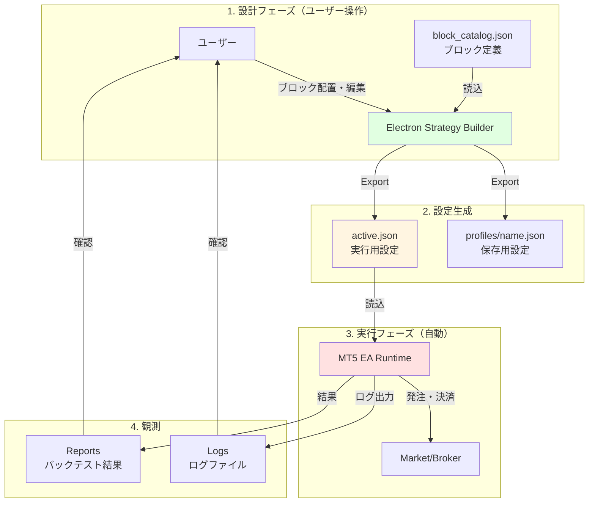

---

## 3. ユーザーフロー

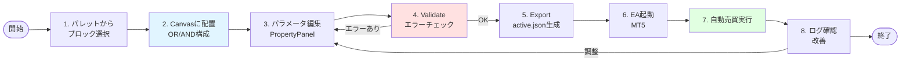

---

## 4. ルール構造図（OR枠×AND内）

### 4.1 DNF形式の視覚化

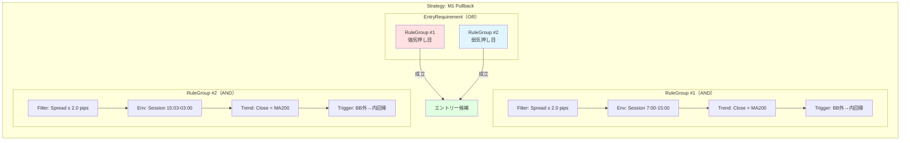

### 4.2 短絡評価の仕組み

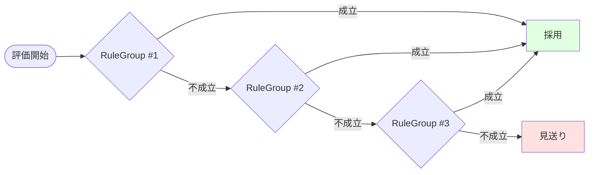

---

## 5. 競合解決（priority + firstOnly）

### 5.1 複数戦略の評価順序

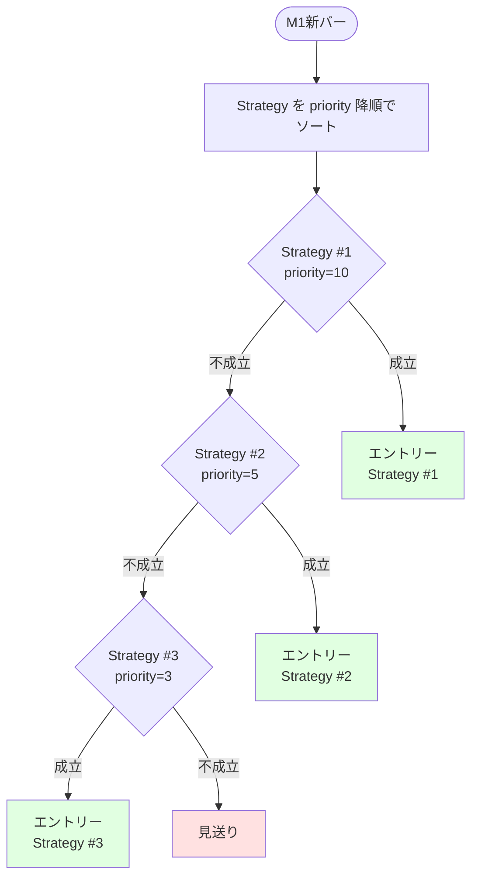

### 5.2 conflictPolicy: firstOnly

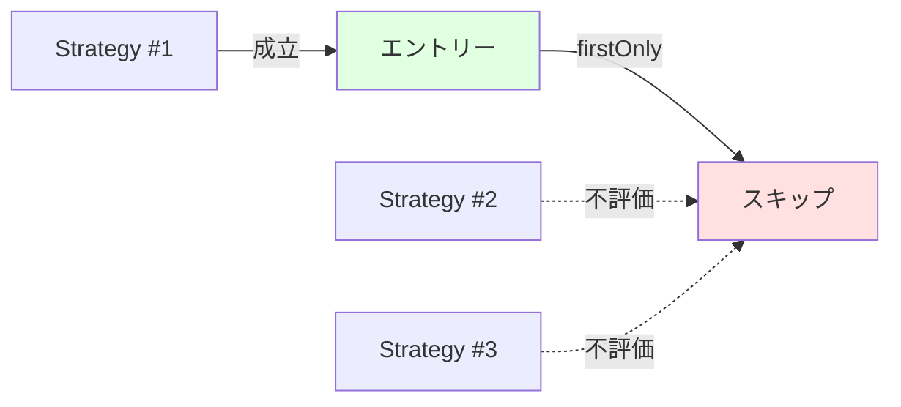

---

## 6. ナンピンモードの位置づけ

### 6.1 ナンピン戦略の流れ

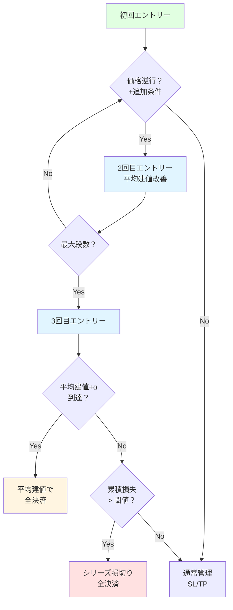

### 6.2 ナンピン安全装置

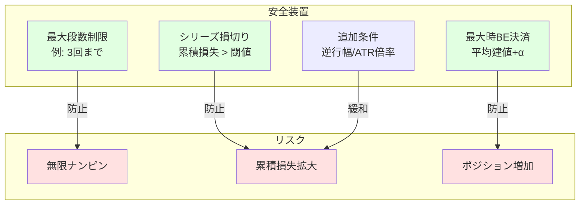

---

## 7. 価値提案の図解

### 7.1 従来の課題

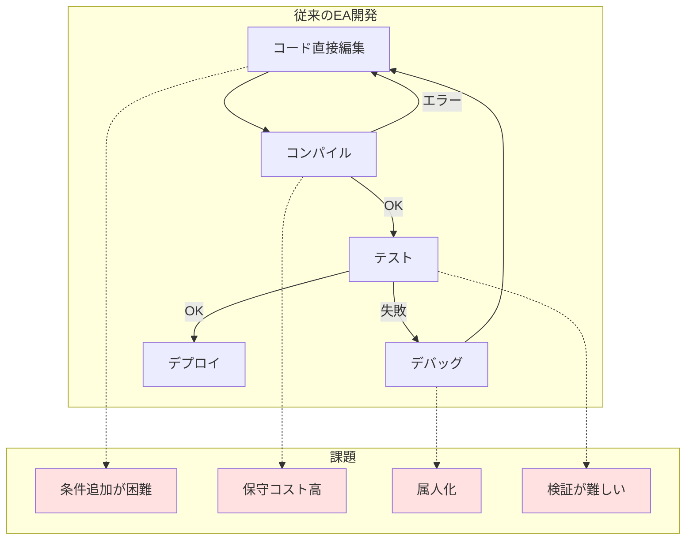

### 7.2 Strategy Bricksの価値

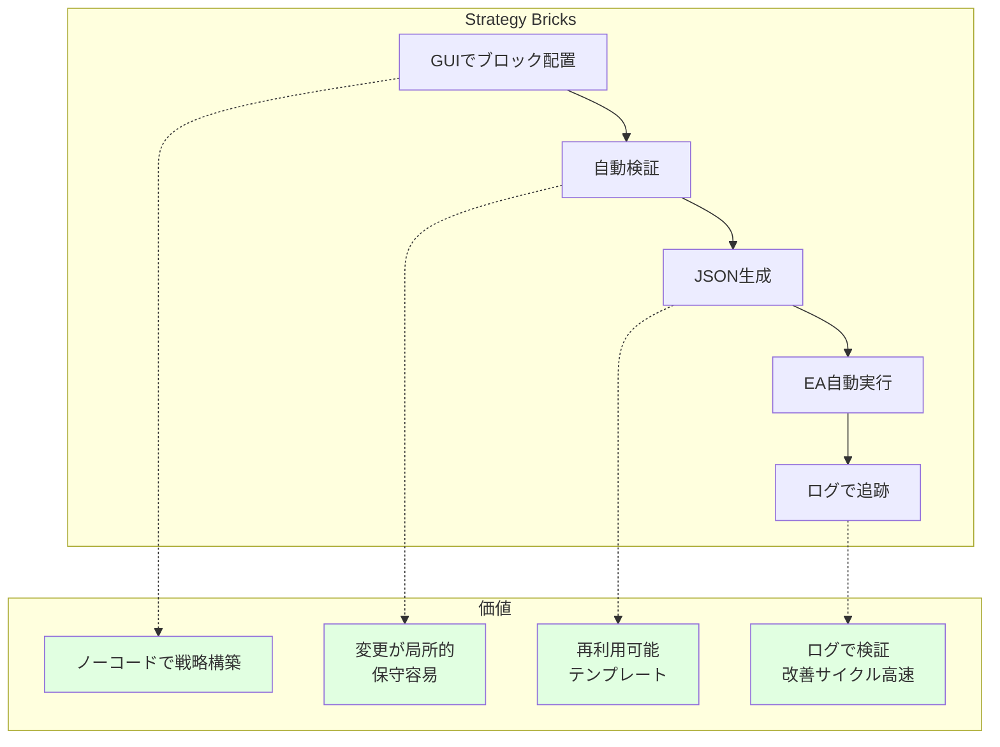

---

## 8. 開発フェーズのロードマップ

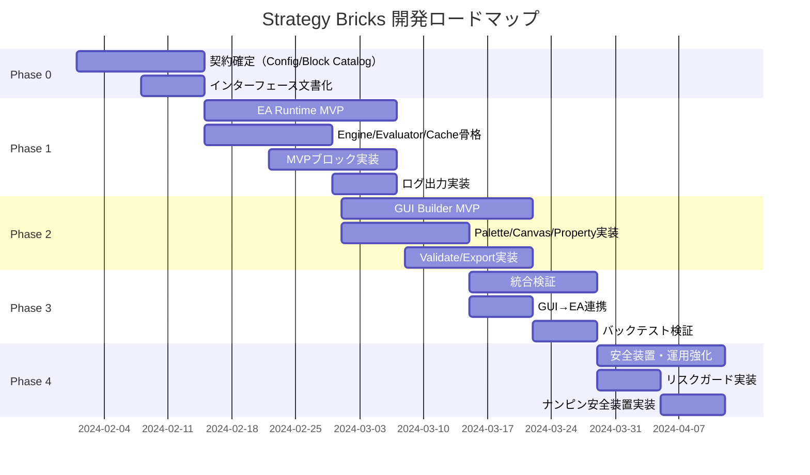

---

## 9. MVPスコープ

### 9.1 MVP必須機能

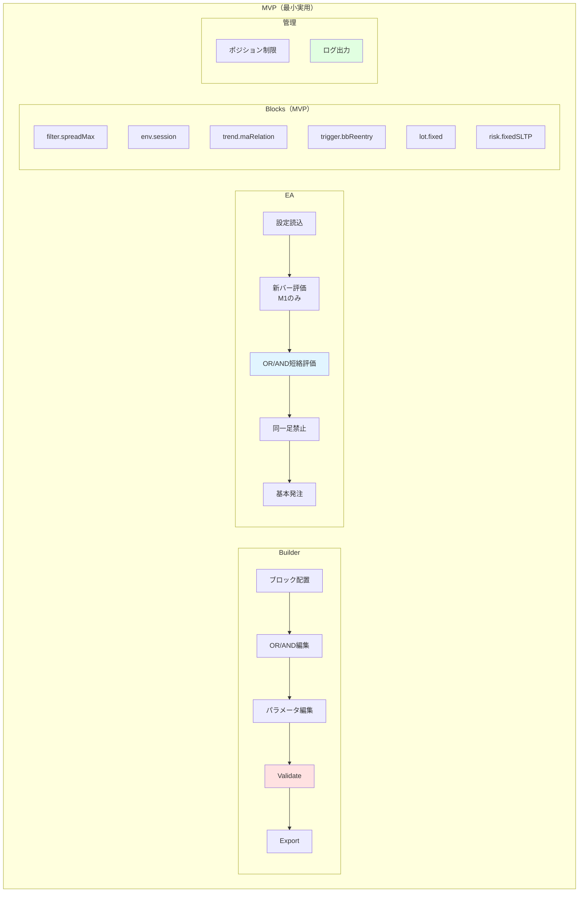

### 9.2 拡張機能（MVP後）

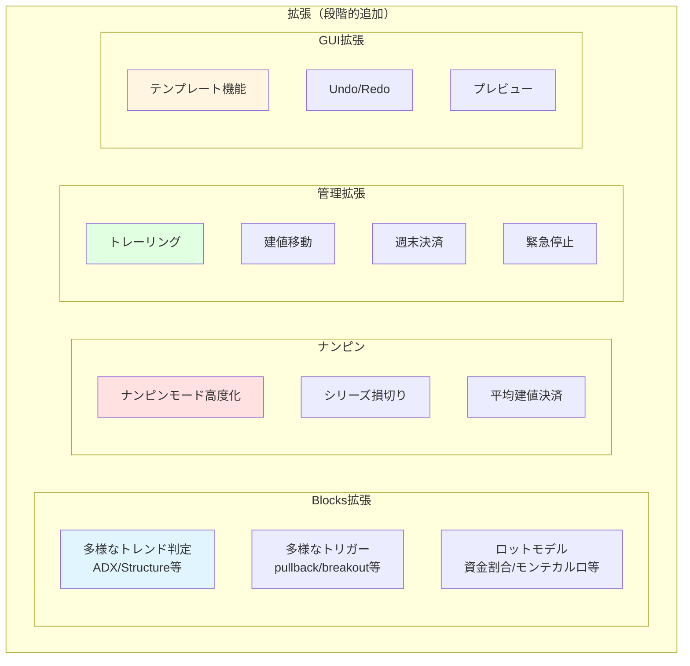

---

## 10. リスクと対策

### 10.1 主要リスク

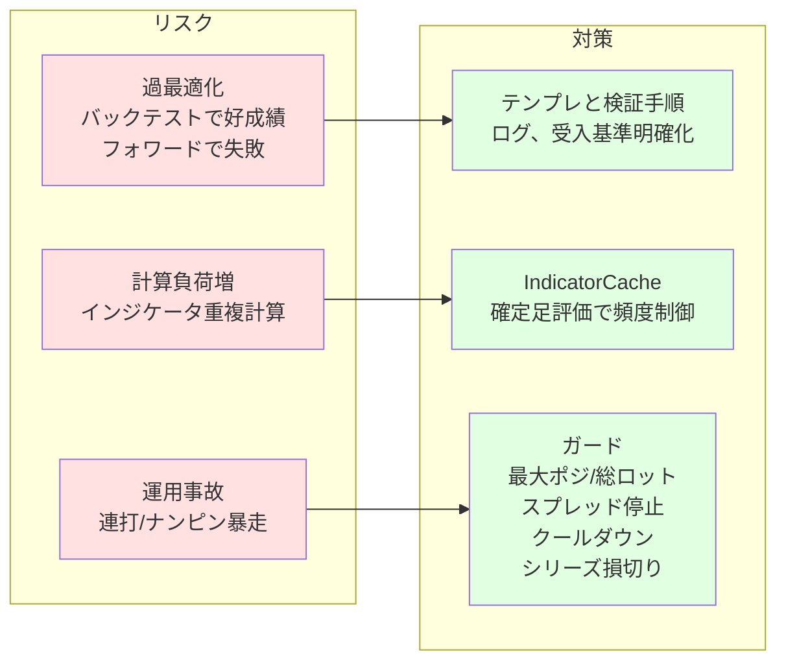

---

## 11. 成果物（アウトプット）

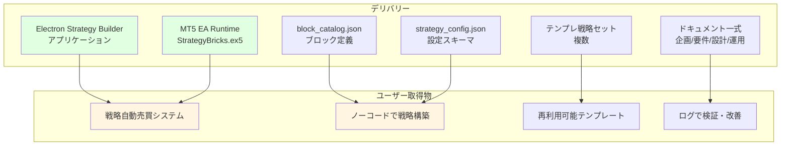

---

## 12. まとめ

### 12.1 Strategy Bricksの特徴

**1. ブロックベース設計:**
- 判定・計算はブロック化（副作用なし）
- ドラッグ＆ドロップで戦略構築
- 再利用可能、拡張容易

**2. DNF形式（OR枠×AND内）:**
- 複数の条件セットを柔軟に組み合わせ
- 短絡評価で効率的

**3. 設定駆動:**
- JSONで戦略を定義
- GUIで編集、EAが実行
- 実装とロジックの分離

**4. 観測性:**
- すべての判定・発注をログ出力
- "なぜ入った/入らなかった"を追跡可能
- 改善サイクル高速化

**5. 安全装置:**
- ポジション制限、ロット制限
- スプレッド停止、クールダウン
- ナンピン安全装置（段数制限、シリーズ損切り、BE決済）

### 12.2 ターゲットユーザー

**初心者トレーダー:**
- テンプレートから開始
- パラメータ調整のみ

**中級トレーダー:**
- ブロックを組み合わせて戦略構築
- バックテストで検証
- ログ確認して改善

**上級トレーダー:**
- 複雑な戦略を構築
- ナンピン戦略も活用
- 複数戦略を組み合わせて運用

### 12.3 次のステップ

**Phase 0（契約確定）:**
- strategy_config.json v1 スキーマ確定
- block_catalog.json スキーマ確定
- 主要インターフェース文書化

**Phase 1（EA Runtime MVP）:**
- Engine/Evaluator/Cache/Executor骨格実装
- MVPブロック実装
- ログ出力実装

**Phase 2（GUI Builder MVP）:**
- Palette/Canvas/Property/Validate/Export実装

**Phase 3（統合検証）:**
- GUI→EA連携
- バックテスト検証

---

## 13. 参照ドキュメント

本コンセプトデッキは以下のドキュメントを基に作成されています:

- `docs/00_overview.md` - 合意事項・前提条件
- `docs/01_proposal/01_project_brief.md` - 企画資料
- `docs/02_requirements/10_requirements.md` - 要件定義書
- `docs/03_design/20_architecture.md` - アーキテクチャ設計
- `docs/05_development_plan/10_development_plan.md` - 開発計画

詳細は各ドキュメントを参照してください。

---
