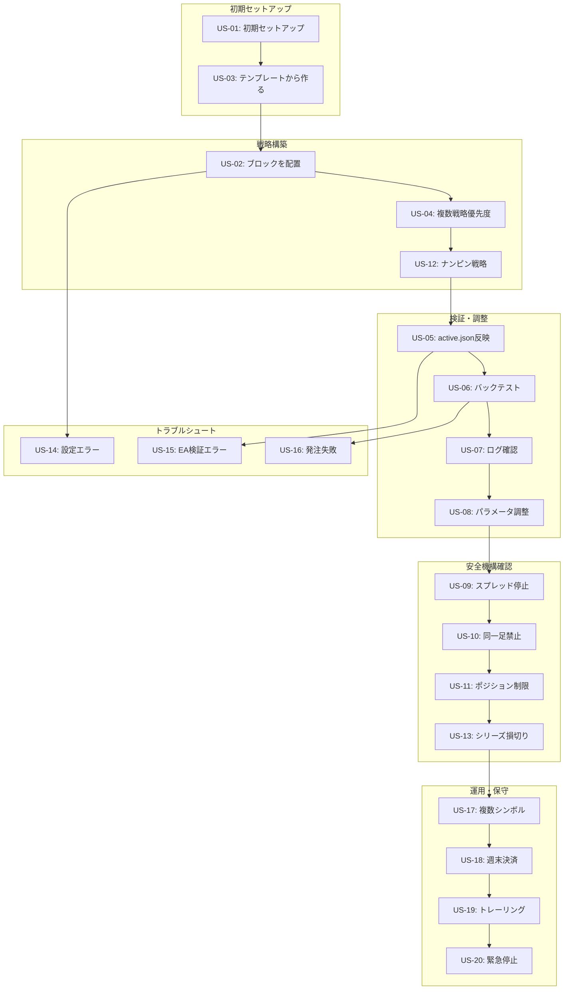

# 02_requirements/11_user_stories.md
# ユーザーストーリー — Strategy Bricks（仮称）

## 0. ドキュメント情報
- ファイル名：`docs/02_requirements/11_user_stories.md`
- 版：v0.1
- 対象：開発担当、テスト担当
- 目的：具体的な利用シナリオを通じて要件を明確化

---

## 1. ユーザーストーリーとは

ユーザーストーリーは、ユーザーがシステムをどのように使用するかを具体的なシナリオとして記述したものです。

**形式:**
- **As a** （ユーザー種別）
- **I want to** （やりたいこと）
- **So that** （目的・価値）

**受入条件（Acceptance Criteria）:**
- 各ストーリーの達成条件を明確化

---

## 2. ユーザー種別

**初心者トレーダー:**
- プログラミング経験なし
- 既存戦略を使いたい
- パラメータ調整程度はできる

**中級トレーダー:**
- ブロックを組み合わせて戦略を構築
- バックテストで検証
- ログを確認して改善

**上級トレーダー:**
- 複雑な戦略を構築
- ナンピン戦略も活用
- 複数戦略を組み合わせて運用

---

## 3. ユーザーストーリー一覧

### US-01: 初期セットアップ

**As a** 初心者トレーダー
**I want to** Strategy Bricksを初めてセットアップする
**So that** 戦略の自動売買を開始できる

**シナリオ:**
1. Strategy Bricks Builderをダウンロードしてインストール
2. MT5のMQL5/Files/strategy/フォルダを出力先に設定
3. block_catalog.jsonを確認（同梱されている）
4. 既存のテンプレート戦略（例: "M1 Pullback Basic"）を開く
5. Exportして`active.json`を生成
6. MT5のExpertsフォルダにEA（StrategyBricks.ex5）を配置
7. チャートにEAをドラッグ&ドロップ
8. EAが起動し、ログに"CONFIG_LOADED"が出力される

**受入条件:**
- Builderが正常にインストールできる
- 出力先フォルダを設定できる
- テンプレートを開いてExportできる
- EAが設定を読み込んで起動できる

---

### US-02: ブロックを配置して戦略を作る

**As a** 中級トレーダー
**I want to** パレットからブロックをドラッグ&ドロップして戦略を構築する
**So that** 自分のアイデアを形にできる

**シナリオ:**
1. Builder起動、New Strategyを選択
2. Palette（左パネル）から"filter.spreadMax"をCanvasにドラッグ
3. RuleGroup（OR枠）を追加
4. RuleGroup内に以下のブロックを配置:
   - filter.spreadMax
   - env.session.timeWindow
   - trend.maRelation
   - trigger.bbReentry
5. 各ブロックを選択してPropertyパネルでパラメータ設定:
   - filter.spreadMax: maxSpreadPips = 2.0
   - trend.maRelation: period = 200, maType = "EMA", relation = "closeAbove"
   - trigger.bbReentry: period = 20, deviation = 2.0, side = "lowerToInside"
6. Lot/Risk/Exitモデルも設定
7. Validateボタンで検証 → エラーなし
8. Exportボタンで`profiles/my_strategy.json`と`active.json`を生成

**受入条件:**
- ブロックをドラッグ&ドロップできる
- RuleGroupを追加できる
- パラメータを編集できる
- バリデーションが実行できる
- Exportが成功する

---

### US-03: 戦略をテンプレートから作る

**As a** 初心者トレーダー
**I want to** 既存のテンプレート戦略を使って開始する
**So that** すぐに自動売買を始められる

**シナリオ:**
1. Builder起動
2. File → Open Template → "M1 Pullback Basic"を選択
3. 戦略の内容を確認（RuleGroup、ブロック配置等）
4. 必要に応じてパラメータを微調整:
   - MA期間を200→100に変更
   - SL/TPを30pips→20pipsに変更
5. Save As → "My Custom Pullback"として保存
6. Export → `active.json`生成

**受入条件:**
- テンプレート一覧が表示される
- テンプレートを開ける
- パラメータを変更できる
- 別名で保存できる
- Exportできる

---

### US-04: 複数戦略の優先度設定

**As a** 上級トレーダー
**I want to** 複数の戦略を作成して優先度を設定する
**So that** 相場状況に応じて最適な戦略を選択できる

**シナリオ:**
1. Builder起動
2. Strategy #1を作成: "Pullback Long Only"
   - priority: 10
   - directionPolicy: "longOnly"
   - RuleGroup: トレンドフォロー + 押し目
3. Strategy #2を作成: "Breakout Both"
   - priority: 5
   - directionPolicy: "both"
   - RuleGroup: ブレイクアウト
4. Strategy #3を作成: "Range Short Only"
   - priority: 3
   - directionPolicy: "shortOnly"
   - RuleGroup: レンジ判定 + 反発
5. Validate → OK
6. Export → `active.json`に3つの戦略が含まれる
7. EAが起動し、priority降順（10, 5, 3）で評価される

**受入条件:**
- 複数のStrategyを作成できる
- priorityを設定できる
- directionPolicyを設定できる
- Exportに全Strategy含まれる
- EAがpriority順に評価する

---

### US-05: active.jsonで設定を反映

**As a** 中級トレーダー
**I want to** 新しい設定をactive.jsonとしてExportする
**So that** EAが次回起動時に新設定を使用する

**シナリオ:**
1. Builderで戦略を編集
2. Export → `active.json`更新
3. MT5のチャートでEAを再起動（Remove → 再適用）
4. EAが新しい`active.json`を読み込む
5. ログに"CONFIG_LOADED"と新設定の内容が出力される
6. 新設定で取引開始

**受入条件:**
- Exportで`active.json`が更新される
- EA再起動で新設定が読み込まれる
- ログで設定内容を確認できる

---

### US-06: バックテストを実行

**As a** 中級トレーダー
**I want to** 作成した戦略をバックテストで検証する
**So that** 戦略の有効性を確認できる

**シナリオ:**
1. Builderで戦略を作成してExport
2. MT5のStrategy Testerを開く
3. Expert: "StrategyBricks.ex5"を選択
4. Symbol, Period（M1）, Dateを設定
5. Startでバックテスト実行
6. 結果レポートを確認:
   - Profit Factor
   - Max Drawdown
   - Total Trades
7. ログファイル（MQL5/Files/strategy/logs/*.jsonl）を確認:
   - BAR_EVAL_START が1分に1回
   - BLOCK_EVAL でブロック判定理由
   - ORDER_RESULT で発注成否
8. 問題があれば戦略を調整して再テスト

**受入条件:**
- Strategy Testerでバックテストできる
- 結果レポートが表示される
- ログファイルが出力される
- ログで判定理由を追跡できる

---

### US-07: ログ確認・原因追跡

**As a** 中級トレーダー
**I want to** ログを確認してエントリーしなかった理由を知る
**So that** 戦略を改善できる

**シナリオ:**
1. バックテスト実行後、ログファイルを開く
2. 特定のバー時刻（例: 2024-01-10 10:00）でのログを検索
3. BAR_EVAL_START を確認 → 評価開始
4. BLOCK_EVAL を確認:
   - filter.spreadMax: PASS（Spread=1.5 pips）
   - env.session: PASS（In session）
   - trend.maRelation: FAIL（Close < MA）
   - → AND評価でFAIL
5. STRATEGY_EVAL: "not matched"
6. 理由: トレンドブロックがFAIL → MA期間を調整すべきか検討

**受入条件:**
- ログファイルがJSONL形式で出力される
- バー時刻で検索できる
- BLOCK_EVALにreason文字列が含まれる
- 判定理由から原因を特定できる

---

### US-08: パラメータ調整・再エクスポート

**As a** 中級トレーダー
**I want to** バックテスト結果を見てパラメータを調整する
**So that** 戦略の成績を改善できる

**シナリオ:**
1. バックテスト結果を確認 → Profit Factor = 1.2（低い）
2. ログ確認 → トレンドブロックのFAILが多い
3. Builderで戦略を開く
4. trend.maRelation の period を 200 → 100 に変更
5. Validate → OK
6. Save、Export
7. 再度バックテスト実行
8. 結果確認 → Profit Factor = 1.5（改善）

**受入条件:**
- 保存済み戦略を再度開ける
- パラメータを変更できる
- 変更後にExportできる
- 再バックテストで結果が変わる

---

### US-09: スプレッド拡大時の停止確認

**As a** 中級トレーダー
**I want to** スプレッドが拡大した時にエントリーが停止されることを確認する
**So that** 不利な条件での取引を避けられる

**シナリオ:**
1. 戦略にfilter.spreadMax（maxSpreadPips=2.0）を設定
2. バックテストで経済指標発表時（スプレッド3.0pips）を含む期間を選択
3. ログ確認:
   - BLOCK_EVAL: filter.spreadMax FAIL（Spread=3.0 pips > 2.0）
   - STRATEGY_EVAL: "not matched"
   - ORDER_ATTEMPTなし
4. スプレッドが正常範囲に戻った後はエントリー再開

**受入条件:**
- スプレッド超過時にfilter.spreadMaxがFAIL
- エントリーが停止される
- ログに理由が記録される

---

### US-10: 同一足再エントリー禁止の確認

**As a** 中級トレーダー
**I want to** 同一M1バー内で複数回エントリーしないことを確認する
**So that** 意図しない連続発注を防げる

**シナリオ:**
1. 戦略を作成（複数RuleGroupあり）
2. バックテスト実行
3. ログ確認:
   - 同一barTimeM1でBAR_EVAL_STARTが1回のみ
   - ORDER_RESULTも1回のみ
   - 2回目のRuleGroup成立時もORDER_REJECTログに"SAME_BAR_REENTRY"
4. 1分ごとに1回だけエントリー評価

**受入条件:**
- 新バー時のみエントリー評価
- 同一バーでの再エントリーが拒否される
- ログで確認できる

---

### US-11: ポジション制限超過時の挙動確認

**As a** 中級トレーダー
**I want to** ポジション制限を超えた時にエントリーが停止されることを確認する
**So that** リスクを制限できる

**シナリオ:**
1. globalGuards.maxPositionsTotal = 2 に設定
2. バックテスト実行
3. 2ポジション保有後、3回目のエントリー条件成立
4. ログ確認:
   - LIMIT_EXCEEDED: "Total positions limit exceeded: 2/2"
   - ORDER_ATTEMPTなし
   - MANAGEMENT_ACTION: ポジション管理は継続
5. 1ポジション決済後、再度エントリー可能に

**受入条件:**
- 制限超過時にエントリーが停止される
- ポジション管理は継続される
- ログに理由が記録される

---

### US-12: ナンピン戦略の構築

**As a** 上級トレーダー
**I want to** ナンピン戦略を構築する
**So that** 平均建値を改善しながら利益を狙える

**シナリオ:**
1. Strategy作成
2. nanpinModelを設定:
   - type: "nanpin.standard"
   - maxCount: 3
   - additionalCondition: reverseDistance 20pips
   - seriesStopLoss: totalLoss 100.0
   - breakEvenAtMax: true
   - breakEvenPips: 0.5
3. バックテスト実行
4. ログ確認:
   - 初回エントリー
   - 逆行20pips後に2回目エントリー（NANPIN_ACTION）
   - 3回目エントリー
   - 最大段数到達後、平均建値+0.5pipsで全決済（NANPIN_BE_AT_MAX）

**受入条件:**
- nanpinModelを設定できる
- 追加条件で段階的にエントリーされる
- 最大段数で平均建値決済される
- ログに各アクションが記録される

---

### US-13: ナンピンシリーズ損切り

**As a** 上級トレーダー
**I want to** ナンピンシリーズ全体で損失が一定額を超えたら全決済する
**So that** 損失を限定できる

**シナリオ:**
1. nanpinModel.seriesStopLoss: totalLoss 100.0 に設定
2. バックテスト実行
3. ナンピン3段階で累積損失が-100.0に到達
4. ログ確認:
   - NANPIN_SERIES_CUT: "Series stop loss triggered: -100.0 <= -100.0"
   - POSITION_CLOSED: 全ポジション決済
5. 損失が限定される

**受入条件:**
- seriesStopLossを設定できる
- 累積損失が閾値を超えたら全決済される
- ログに理由が記録される

---

### US-14: 設定エラーのトラブルシュート

**As a** 初心者トレーダー
**I want to** 設定ミスをした時にエラーメッセージで原因を知る
**So that** 修正できる

**シナリオ:**
1. Builderで戦略作成時、必須パラメータ（maxSpreadPips）を未入力
2. Validateボタン押下
3. ValidationPanel（下部）にエラー表示:
   - "Required parameter 'maxSpreadPips' is missing (filter.spreadMax#1)"
4. エラーをダブルクリック → 該当ブロックが選択・ハイライト
5. Propertyパネルで maxSpreadPips を入力
6. 再Validate → エラーなし
7. Export可能に

**受入条件:**
- 必須パラメータ未設定時にエラー検出
- エラーメッセージで原因がわかる
- エラー箇所へジャンプできる
- 修正後にExportできる

---

### US-15: EA起動時の設定検証エラー

**As a** 中級トレーダー
**I want to** EAが起動時に設定を検証してエラーを検出する
**So that** 不正な設定での取引を防げる

**シナリオ:**
1. active.jsonを手動編集してformatVersionを"2.0"に変更（非互換）
2. MT5でEA起動
3. EAがOnInitでバリデーション実行
4. ログ確認:
   - CONFIG_ERROR: "Unsupported formatVersion: 2.0 (Supported: 1.0)"
5. OnInitがINIT_FAILEDを返す
6. EAが取引を開始しない
7. ユーザーがactive.jsonを修正して再起動

**受入条件:**
- EA起動時に設定検証される
- formatVersion非互換でINIT_FAILED
- ログにエラー理由が記録される
- 取引処理が実行されない

---

### US-16: 発注失敗時のログ確認

**As a** 中級トレーダー
**I want to** 発注が失敗した時にログで理由を確認する
**So that** 原因を特定して対処できる

**シナリオ:**
1. 戦略でSL/TPを設定（30pips）
2. ブローカーのストップレベルが40pipsの時にバックテスト
3. エントリー条件成立
4. ログ確認:
   - ORDER_ATTEMPT: 発注試行
   - ORDER_REJECT: "INVALID_SL: SL too close: 1.10000 (min distance=40 points)"
5. 原因: ストップレベル違反
6. SL/TPを50pipsに変更して再テスト
7. 発注成功

**受入条件:**
- 発注失敗時にORDER_REJECTログ
- 拒否理由がログに記録される
- 理由から対処方法がわかる

---

### US-17: 複数シンボルでの運用

**As a** 上級トレーダー
**I want to** 同じ戦略を複数のシンボルで運用する
**So that** 分散投資できる

**シナリオ:**
1. 戦略を作成してExport
2. EURUSD, GBPUSD, USDJPYのチャートにそれぞれEAを適用
3. globalGuards.maxPositionsPerSymbol = 1 に設定
4. 各シンボルで独立してエントリー評価
5. EURUSDでエントリー → 1ポジション
6. GBPUSDでエントリー → 1ポジション
7. 各シンボルで最大1ポジションまで

**受入条件:**
- 複数シンボルでEAを適用できる
- シンボル別にポジション制限が機能する
- 各シンボルで独立して動作する

---

### US-18: 週末決済の設定

**As a** 中級トレーダー
**I want to** 金曜日の終了時刻に全ポジションを決済する
**So that** 週末リスクを回避できる

**シナリオ:**
1. exitModelに"exit.weekend"を設定:
   - closeTime: "23:50"
   - dayOfWeek: "Friday"
2. バックテスト実行（金曜23:50を含む）
3. 金曜23:50にポジション保有中
4. ログ確認:
   - MANAGEMENT_ACTION: "Weekend close: Friday 23:50"
   - POSITION_CLOSED: 全ポジション決済
5. 週末はポジションなし

**受入条件:**
- exit.weekendを設定できる
- 指定時刻に全決済される
- ログにアクションが記録される

---

### US-19: トレーリングストップの設定

**As a** 中級トレーダー
**I want to** 利益が出たらSLを建値に移動し、さらにトレールする
**So that** 利益を確保しながら伸ばせる

**シナリオ:**
1. exitModelに"exit.trailing"を設定:
   - breakEvenPips: 10.0
   - trailStartPips: 20.0
   - trailStepPips: 5.0
2. バックテスト実行
3. エントリー後、+10pips到達
4. ログ確認:
   - MANAGEMENT_ACTION: "BreakEven: SL moved to entry price"
5. +20pips到達
6. ログ確認:
   - MANAGEMENT_ACTION: "Trailing start: +20 pips"
7. +25pips, +30pips... でSLが追従
8. 反転してSLヒット → 利益確保

**受入条件:**
- exit.trailingを設定できる
- 建値移動とトレールが機能する
- ログにアクションが記録される

---

### US-20: 緊急停止の実行

**As a** 上級トレーダー
**I want to** 異常を検知した時にEAが取引を停止する
**So that** 予期しない損失を防げる

**シナリオ:**
1. EAを稼働中
2. 何らかの異常（例: ポジション数が10を超える）が発生
3. StateStore.DetectAnomaly()がtrueを返す
4. ログ確認:
   - ANOMALY_DETECTED: "Too many positions: 11"
   - EMERGENCY_STOP: "Anomaly detected, trading halted"
5. 以降のOnTickで全処理がスキップされる
6. 手動で異常を解消後、EAを再起動

**受入条件:**
- 異常検知機能が動作する
- 緊急停止が発動される
- ログに理由が記録される
- 再起動まで取引が停止される

---

## 4. ストーリーマップ

---

## 5. 優先順位

**Must Have（MVP必須）:**
- US-01: 初期セットアップ
- US-02: ブロックを配置
- US-05: active.json反映
- US-06: バックテスト
- US-07: ログ確認
- US-09: スプレッド停止
- US-10: 同一足禁止
- US-11: ポジション制限
- US-14: 設定エラー
- US-15: EA検証エラー

**Should Have（優先度高）:**
- US-03: テンプレートから作る
- US-04: 複数戦略優先度
- US-08: パラメータ調整
- US-16: 発注失敗
- US-18: 週末決済

**Could Have（優先度中）:**
- US-12: ナンピン戦略
- US-13: シリーズ損切り
- US-17: 複数シンボル
- US-19: トレーリング

**Won't Have（将来拡張）:**
- US-20: 緊急停止（MVP後）

---

## 6. 参照ドキュメント

本ユーザーストーリーは以下のドキュメントを基に作成されています:

- `docs/02_requirements/10_requirements.md` - 要件定義書
- `docs/03_design/20_architecture.md` - アーキテクチャ設計
- `docs/03_design/50_ea_runtime_design.md` - EA Runtime詳細設計
- `docs/03_design/60_gui_builder_design.md` - GUI Builder詳細設計
- `docs/03_design/70_security_safety.md` - セキュリティ・安全設計

次のステップ:
- `docs/02_requirements/12_acceptance_criteria.md` - 受入基準（各ストーリーをテスト可能な条件に変換）

---
