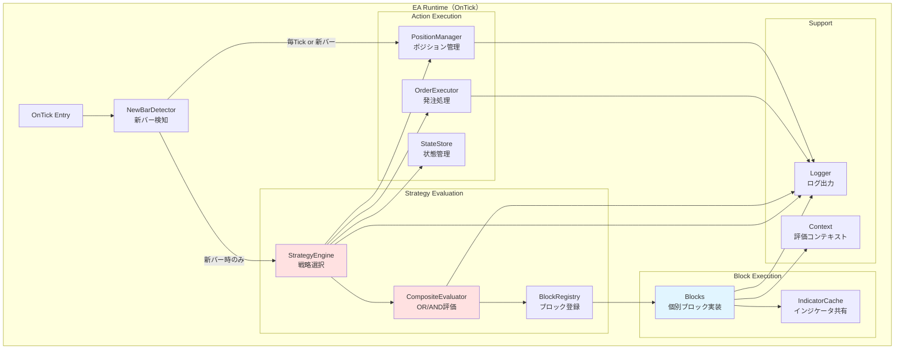

# 03_design/20_architecture.md
# アーキテクチャ設計 — Strategy Bricks（仮称）

## 0. ドキュメント情報
- ファイル名：`docs/03_design/20_architecture.md`
- 版：v0.1
- 対象：実装担当（AIエージェント含む）、レビュー担当
- 目的：システム全体の構造を定義し、すべての詳細設計の基盤を確立する

---

## 1. 概要と設計方針

### 1.1 設計の核心理念
Strategy Bricksは、**メンテナンス性を最優先**したアーキテクチャを採用します。

**重要な設計方針:**
- **保守性最優先**：疎結合、副作用の集約、責務の明確化
- **AIエージェント分担**：契約（JSON/Interface）を中心に分担実装しやすい構造
- **ブロック＝判定・計算のみ**（副作用なし）
- **副作用＝Executor/Managerに集約**
- **IndicatorCacheでインジケータ取得を集中管理**（性能・一貫性）

### 1.2 アーキテクチャの特徴
- **設定駆動**：ロジックはJSONで定義、実装は設定を解釈して実行
- **ブロックベース**：小さな判定・計算部品（Block）を組み合わせて戦略を構築
- **契約中心**：GUIとEAは`strategy_config.json`と`block_catalog.json`を契約として共有
- **疎結合**：コンポーネント間の依存を最小化、インターフェースで分離

---

## 2. システム全体像

### 2.1 システム全体構成図


### 2.2 コンポーネント間の責務境界

**Electron Builder（GUI）の責務:**
- ブロックカタログの読み込みとパレット表示
- OR/ANDルール構造のビジュアル編集
- パラメータ入力フォームの自動生成
- 設定の検証（参照切れ、必須未設定、型不整合等）
- JSON設定ファイルの出力

**EA Runtime（MQL5）の責務:**
- JSON設定の読み込みと解釈
- 戦略の優先度順評価
- ブロックの実行と結果の合成
- インジケータの効率的な取得と管理
- 発注・決済・ポジション管理の実行
- 状態の永続化とログ出力

**JSON契約（設定ファイル）の責務:**
- GUIとEA間の設定情報の受け渡し
- 戦略とブロックの構造定義
- パラメータとメタ情報の保持
- バージョン管理（formatVersion）

---

## 3. レイヤアーキテクチャ

### 3.1 レイヤ構成図


### 3.2 レイヤの責務定義

**Presentation Layer（プレゼンテーション層）**
- ユーザーインターフェースの表示
- ユーザー入力の受付とイベント処理
- 該当：Electron GUI（Palette/Canvas/Property等）

**Application Layer（アプリケーション層）**
- ビジネスロジックの調整
- 設定の検証と変換
- JSON入出力の制御
- 該当：Validator, Exporter, ConfigLoader

**Domain Layer（ドメイン層）**
- コアビジネスロジック
- 戦略評価とブロック実行
- 副作用なしの純粋な判定・計算
- 該当：StrategyEngine, CompositeEvaluator, Blocks

**Infrastructure Layer（インフラストラクチャ層）**
- 外部システムとの接続
- データの永続化
- 副作用の実行（発注・決済・管理）
- 該当：IndicatorCache, OrderExecutor, PositionManager, StateStore, FileSystem

---

## 4. EA Runtimeコンポーネント

### 4.1 EA Runtimeコンポーネント図



### 4.2 主要コンポーネントの責務

#### 4.2.1 NewBarDetector（新バー検知）
**責務:**
- M1の新バー発生を検知
- 同一足再エントリー防止の第一ガード
- 評価タイミングの制御

**主要メソッド:**
- `bool IsNewBar()` - 新バーかどうかを判定
- `datetime GetCurrentBarTime()` - 現在のバー時刻を取得

**設計ポイント:**
- static変数で前回のバー時刻を保持
- M1固定（PERIOD_M1）
- エントリー評価は新バー時のみ実行

#### 4.2.2 StrategyEngine（戦略エンジン）
**責務:**
- 複数のStrategyをpriority順に評価
- firstOnly（最初に成立したStrategyのみ採用）の実装
- 制限超過時のエントリー停止制御
- ログ出力の統括

**主要メソッド:**
- `void EvaluateStrategies()` - 全Strategy評価
- `bool IsLimitExceeded()` - ポジション制限チェック
- `void ExecuteStrategy(Strategy &strat)` - Strategy実行

**設計ポイント:**
- priority降順でStrategyをソート
- 成立したStrategyで即座に終了（firstOnly）
- 制限超過時はポジション管理のみ

#### 4.2.3 CompositeEvaluator（複合評価器）
**責務:**
- OR/AND構造の短絡評価
- RuleGroupとConditionの評価
- 評価結果のログ出力

**主要メソッド:**
- `bool EvaluateOR(RuleGroup[] groups)` - OR評価
- `bool EvaluateAND(Condition[] conditions)` - AND評価
- `BlockResult EvaluateBlock(string blockId)` - ブロック評価

**設計ポイント:**
- OR: いずれかPASSで即座にtrue
- AND: いずれかFAILで即座にfalse
- 短絡評価で無駄な計算を削減

#### 4.2.4 BlockRegistry（ブロック登録）
**責務:**
- typeIdから実装へのマッピング
- ブロックインスタンスの生成
- ブロックパラメータの設定

**主要メソッド:**
- `IBlock* CreateBlock(string typeId, params)` - ブロック生成
- `void RegisterBlock(string typeId, factory)` - ブロック登録

**設計ポイント:**
- Factory Patternでブロック生成
- typeIdをキーとしたマップ管理

#### 4.2.5 IndicatorCache（インジケータキャッシュ）
**責務:**
- インジケータハンドルの共有と管理
- 計算結果のキャッシュ（同一バー内）
- shift=1統一の強制

**主要メソッド:**
- `int GetMAHandle(symbol, period, shift, maType)` - MAハンドル取得
- `double GetMAValue(handle, index)` - MA値取得
- `void ClearCache()` - キャッシュクリア

**設計ポイント:**
- OnInitまたは初回利用時にハンドル生成
- 同一パラメータのハンドルは共有
- shift=1固定でデータ取得

#### 4.2.6 OrderExecutor（発注実行）
**責務:**
- 発注処理の集約（副作用）
- ブローカー制約の考慮（最小ロット、ストップレベル等）
- 発注失敗理由のログ出力
- 同一足再エントリー防止の第二ガード

**主要メソッド:**
- `bool SendOrder(direction, lot, sl, tp)` - 発注実行
- `bool ValidateOrder(params)` - 発注前検証
- `void LogOrderResult(result)` - 結果ログ

**設計ポイント:**
- lastEntryBarTimeで同一足再エントリー拒否
- OrderSend前にブローカー制約を検証
- 失敗理由を詳細にログ

#### 4.2.7 PositionManager（ポジション管理）
**責務:**
- ポジション管理アクションの集約（副作用）
- トレール、建値、平均建値決済、週末決済等
- ナンピン制御
- 管理アクションのログ出力

**主要メソッド:**
- `void ManagePositions()` - ポジション管理実行
- `void ApplyTrailing()` - トレーリング適用
- `void ApplyBreakEven()` - 建値移動
- `void ApplyNanpin()` - ナンピン判定

**設計ポイント:**
- 毎Tickまたは新バーのみで実行（設計選択）
- exitModelとnanpinModelに従って動作
- 管理アクション発動をログ

#### 4.2.8 StateStore（状態管理）
**責務:**
- 状態の永続化と復元
- lastEntryBarTime等の重要状態管理
- ナンピン段数等の追跡

**主要メソッド:**
- `void SaveState(key, value)` - 状態保存
- `T LoadState(key)` - 状態読込
- `void ClearState()` - 状態クリア

**設計ポイント:**
- グローバル変数またはファイル永続化
- 再起動時の復元（範囲は設計で決定）

#### 4.2.9 Logger（ログ出力）
**責務:**
- 構造化ログの出力
- ログイベント種別の管理
- ファイル出力の制御

**主要メソッド:**
- `void LogBarEval(barTime)` - バー評価ログ
- `void LogBlockEval(blockId, result)` - ブロック評価ログ
- `void LogOrderResult(result)` - 発注結果ログ

**設計ポイント:**
- JSONL形式で出力（推奨）
- 日次ローテーション
- 必須イベント種別の網羅

---

## 5. GUI Builderコンポーネント

### 5.1 GUI Builderコンポーネント図


### 5.2 主要コンポーネントの責務

#### 5.2.1 Palette（パレット）
**責務:**
- block_catalog.jsonの読み込み
- カテゴリ別ブロック一覧の表示
- ドラッグ＆ドロップ対応

**主要機能:**
- カテゴリフィルタ（filter/trend/trigger/lot/risk/exit/nanpin）
- 検索機能
- ブロック詳細のツールチップ表示

**設計ポイント:**
- paramsSchemaからブロックの必須パラメータを表示
- displayNameとdescriptionを使用

#### 5.2.2 Canvas（キャンバス）
**責務:**
- ノードベースエディタの提供
- OR/AND構造のビジュアル編集
- ノード配置とリンク管理

**主要機能:**
- OR枠（RuleGroup）の作成
- AND内（Condition）へのブロック配置
- ノード間のリンク表示

**設計ポイント:**
- UI制約でDNF形式を強制
  - EntryRequirement = OR（RuleGroup...）
  - RuleGroup = AND（ConditionBlock...）
- ドラッグ＆ドロップでブロック追加
- 視覚的にOR/ANDを区別

#### 5.2.3 Property Panel（プロパティパネル）
**責務:**
- 選択ブロックのパラメータ編集
- paramsSchemaからのフォーム自動生成
- バリデーションエラー表示

**主要機能:**
- 型別コントロール生成（number/select/checkbox等）
- リアルタイムバリデーション
- 必須項目のマーク表示

**設計ポイント:**
- paramsSchema.ui.controlでフォーム種別決定
- required/minimum/maximum等の制約を反映
- 変更即座にStateManagerへ反映

#### 5.2.4 CatalogLoader（カタログローダー）
**責務:**
- block_catalog.jsonの読み込み
- カタログデータの解析とバリデーション

**主要メソッド:**
- `Catalog LoadCatalog(path)` - カタログ読込
- `bool ValidateCatalog(catalog)` - カタログ検証

**設計ポイント:**
- formatVersionチェック
- paramsSchemaの妥当性検証

#### 5.2.5 FormGenerator（フォーム生成）
**責務:**
- paramsSchemaからUIコントロールを自動生成
- バリデーションルールの適用

**主要メソッド:**
- `UIControl GenerateControl(schema)` - コントロール生成
- `Validator CreateValidator(schema)` - バリデータ生成

**設計ポイント:**
- JSON Schemaからフォームを自動生成
- ui.controlヒントで最適なUIを選択

#### 5.2.6 Validator（バリデータ）
**責務:**
- 設定の妥当性検証
- エラーメッセージの生成

**検証項目:**
- 必須パラメータ未設定
- 型不整合（number/string/boolean等）
- 範囲外（minimum/maximum）
- 参照切れ（存在しないblockId参照）
- 循環参照（将来拡張）

**主要メソッド:**
- `ValidationResult Validate(config)` - 全体検証
- `Error[] ValidateBlock(block)` - ブロック検証
- `Error[] ValidateStrategy(strategy)` - Strategy検証

**設計ポイント:**
- Export前に必ず実行
- エラー検出時はExportを抑止
- ユーザーにエラー箇所を視覚的に提示

#### 5.2.7 Exporter（エクスポーター）
**責務:**
- strategy_config.jsonの生成
- profiles/<name>.jsonとactive.jsonの出力

**主要メソッド:**
- `string GenerateJSON(state)` - JSON生成
- `void ExportProfile(name, json)` - プロファイル保存
- `void ExportActive(json)` - active.json更新

**設計ポイント:**
- meta.formatVersionを付与
- meta.generatedAt等のメタ情報追加
- 出力先フォルダは設定可能（MT5/Files/strategy/）

#### 5.2.8 StateManager（状態管理）
**責務:**
- 編集中の設定状態管理
- Undo/Redo（将来拡張）
- 変更検知

**主要メソッド:**
- `void UpdateBlock(blockId, params)` - ブロック更新
- `void AddRuleGroup()` - RuleGroup追加
- `State GetCurrentState()` - 現在状態取得

**設計ポイント:**
- Reactiveな状態管理（Redux/Vuex等）
- 変更時にリアルタイムバリデーション

---

## 6. データフロー

### 6.1 データフロー図（全体）


### 6.2 データフロー詳細（シーケンス）

#### 6.2.1 GUI → JSON生成フロー


#### 6.2.2 EA → エントリー評価フロー


---

## 7. 依存関係ルール

### 7.1 依存方向の原則

**基本原則:**
1. **上位層は下位層に依存可、逆は不可**
   - Presentation → Application → Domain → Infrastructure
2. **Domain層は他層に依存しない**
   - ブロック（Blocks）は副作用なし、外部依存なし
3. **Infrastructure層はDomain層を実装**
   - Executor/PositionManagerはDomain層のインターフェースを実装

### 7.2 疎結合の実現方法

#### 7.2.1 インターフェース分離

**IBlock（ブロックインターフェース）:**
```mql5
// 疑似コード（MQL5にはインターフェースがないため構造体で代用）
struct BlockResult {
    int status;        // PASS/FAIL/NEUTRAL
    int direction;     // LONG/SHORT/NEUTRAL
    string reason;     // ログ用理由
    double score;      // 将来拡張
};

// 各ブロックはこのシグネチャを満たす
BlockResult Evaluate(const Context &ctx);
```

**Context（評価コンテキスト）:**
```mql5
struct Context {
    MarketInfo market;       // 価格・スプレッド等
    StateInfo state;         // ポジション数、lastEntryBarTime等
    IndicatorCache &cache;   // インジケータ取得
    ParamsMap params;        // ブロックパラメータ
};
```

#### 7.2.2 Factory Pattern（ブロック生成）

```mql5
// BlockRegistryでtypeIdから実装を生成
class BlockRegistry {
    IBlock* CreateBlock(string typeId, ParamsMap params) {
        if (typeId == "filter.spreadMax") {
            return new FilterSpreadMax(params);
        }
        // ...他のブロック
    }
};
```

#### 7.2.3 Dependency Injection（設定注入）

```mql5
// StrategyEngineは設定を外部から注入
class StrategyEngine {
    Strategy[] strategies;
    CompositeEvaluator evaluator;
    OrderExecutor executor;

    void Initialize(Config config) {
        // 設定から戦略を構築
        this.strategies = config.strategies;
    }
};
```

### 7.3 副作用の集約

**副作用なし（Domain層）:**
- Blocks - 判定・計算のみ
- CompositeEvaluator - 評価のみ
- StrategyEngine - 判断のみ（実行はExecutorへ委譲）

**副作用あり（Infrastructure層）:**
- OrderExecutor - 発注・決済
- PositionManager - ポジション変更
- StateStore - 状態永続化
- Logger - ファイル書き込み

---

## 8. 拡張性の考慮点

### 8.1 ブロックの追加

**追加手順:**
1. block_catalog.jsonに新typeIdを追加
2. EA側で新ブロッククラスを実装（IBlockインターフェース準拠）
3. BlockRegistryに登録
4. 単体テスト実施

**疎結合により:**
- 既存ブロックへの影響なし
- GUI側は自動的にパレットに表示
- paramsSchemaからフォーム自動生成

### 8.2 Strategyロジックの拡張

**現在（MVP）:**
- conflictPolicy: "firstOnly"（最初に成立したStrategyのみ）

**将来拡張:**
- "bestScore"（スコア最高のStrategyを採用）
- "all"（成立した全Strategyを実行）
- "allowMulti"（複数Strategy同時実行）

**拡張方法:**
- StrategyEngineのEvaluateStrategies()を修正
- strategy_config.jsonにconflictPolicyフィールド追加
- 既存設定との互換性はformatVersionで管理

### 8.3 ルール合成の拡張

**現在（MVP）:**
- DNF形式（OR × AND）

**将来拡張:**
- NOT（否定）
- KofN（N個中K個成立）
- スコア合成（重み付け評価）

**拡張方法:**
- CompositeEvaluatorに新評価メソッド追加
- entryRequirement構造に新typeフィールド追加
- GUI Canvasに新ノードタイプ追加

### 8.4 インジケータの追加

**追加手順:**
1. IndicatorCacheに新インジケータ取得メソッド追加
2. ハンドル管理とキャッシュロジック実装
3. ブロックから利用

**疎結合により:**
- 各ブロックは直接CopyBufferせずCacheを利用
- 同一インジケータの重複計算を抑制
- shift=1統一を強制

---

## 9. 未決事項

以下は実装フェーズで決定が必要:

### 9.1 ポジション管理の評価タイミング
**選択肢:**
- 方針A: 毎Tickで実行（トレール等が滑らか）
- 方針B: 新バーのみ実行（挙動が単純で再現性が高い）

**影響:**
- トレーリングの精度
- バックテストとフォワードの差異
- 処理負荷

**推奨:** 方針Bで開始し、必要に応じて方針Aへ拡張

### 9.2 ナンピン詳細仕様
**未決定項目:**
- 追加条件の厳格度（逆行幅のみ vs 再トリガー必須）
- シリーズ損切りの定義粒度（価格 vs 時間 vs DD）
- 最大段数到達時の挙動詳細

**影響:**
- nanpinModelのパラメータ構造
- PositionManagerの実装複雑度

### 9.3 Strategy競合解決の拡張
**未決定項目:**
- bestScore実装時のスコア計算方法
- all/allowMulti時のリスク管理

**影響:**
- StrategyEngineの実装
- strategy_config.jsonのスキーマ

### 9.4 状態永続化の範囲
**未決定項目:**
- 再起動時の復元範囲（lastEntryBarTime、ナンピン段数等）
- 永続化方法（グローバル変数 vs ファイル）

**影響:**
- StateStoreの実装
- 再起動時の安全性

---

## 10. 参照ドキュメント

本アーキテクチャ設計は以下のドキュメントを基に作成されています:

- `docs/00_overview.md` - 合意事項・前提条件
- `docs/01_proposal/01_project_brief.md` - 企画資料
- `docs/02_requirements/10_requirements.md` - 要件定義書
- `docs/03_design/30_config_spec.md` - strategy_config.json仕様
- `docs/03_design/40_block_catalog_spec.md` - block_catalog.json仕様
- `docs/04_operations/90_observability_and_testing.md` - 観測性とテスト
- `docs/05_development_plan/10_development_plan.md` - 開発計画

詳細設計は以下のドキュメントで定義されます:

- `docs/03_design/50_ea_runtime_design.md` - EA Runtime詳細設計
- `docs/03_design/60_gui_builder_design.md` - GUI Builder詳細設計
- `docs/03_design/70_security_safety.md` - セキュリティ・安全設計

---
