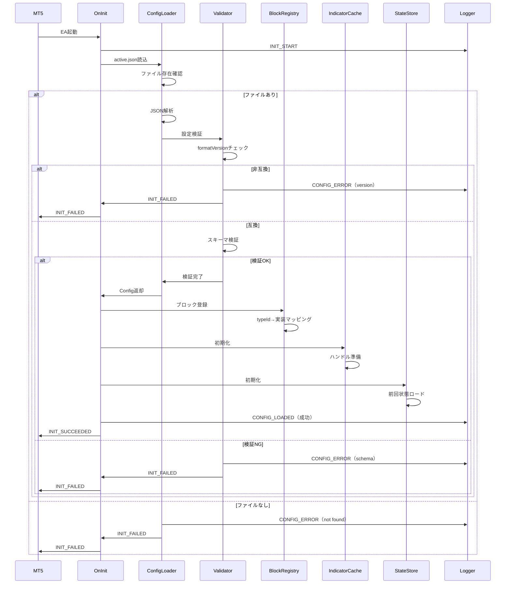
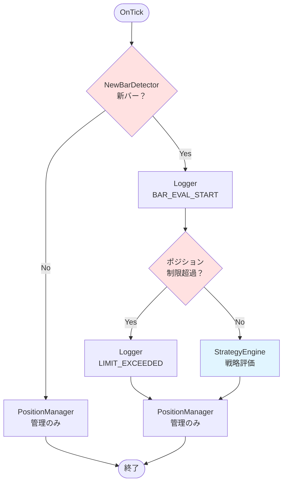
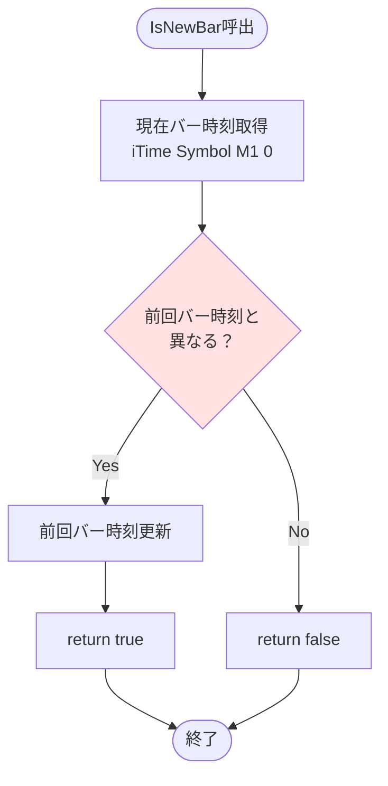
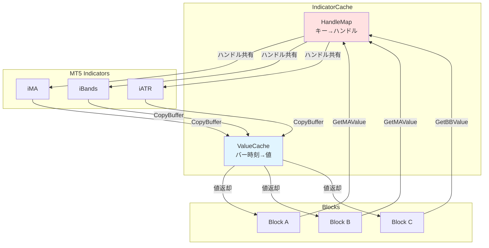
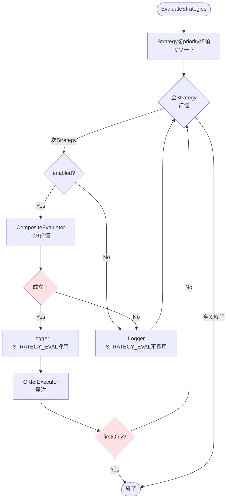
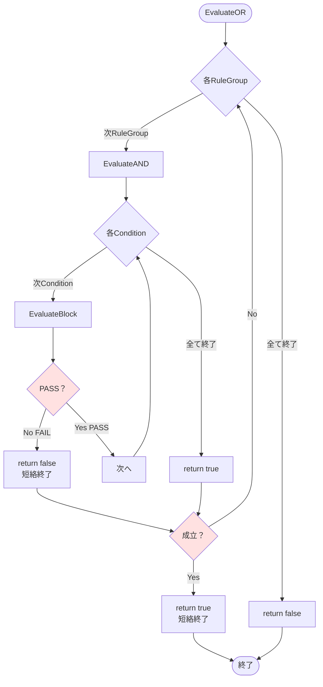
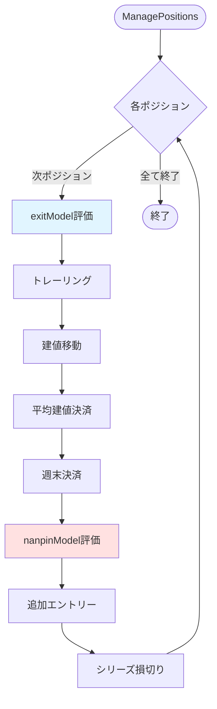
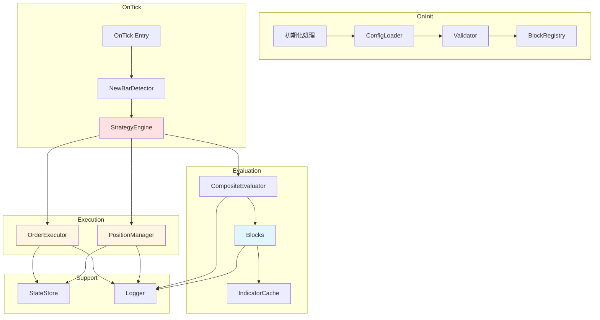

# 03_design/50_ea_runtime_design.md
# EA Runtime詳細設計 — Strategy Bricks（仮称）

## 0. ドキュメント情報
- ファイル名：`docs/03_design/50_ea_runtime_design.md`
- 版：v0.1
- 対象：EA実装担当（AIエージェント含む）
- 目的：EA Runtimeの実装可能レベルでの詳細設計

---

## 1. 概要と設計方針

### 1.1 EA Runtimeの役割
MT5上で動作するExpert Advisor（EA）として、以下を実現します：

- `active.json`（strategy_config.json）を読み込み、戦略を実行
- M1新バー時にのみエントリー評価（1分に1回）
- 確定足（shift=1）でのブロック評価
- 同一足再エントリー禁止（二重ガード）
- OR/AND短絡評価によるStrategy選択
- 副作用（発注・決済・管理）の集約
- 構造化ログによる追跡可能性

### 1.2 設計の核心方針

**絶対条件（必須）:**
- M1（1分足）固定
- 確定足（shift=1）基準
- 同一足再エントリー禁止（二重ガード）
- DNF形式（枠がOR、ルール内がAND）
- ポジション制限超過時はエントリー停止、管理のみ

**メンテナンス性:**
- ブロックは副作用なし（判定・計算のみ）
- 副作用はExecutor/Managerに集約
- IndicatorCacheでインジケータ取得を集中管理
- 状態はStateStoreで一元管理

**観測性:**
- すべての判定・発注・拒否理由をログ出力
- reason文字列で原因追跡可能
- ログイベント種別の明確化

---

## 2. 初期化フロー（OnInit）

### 2.1 初期化シーケンス図



### 2.2 初期化処理詳細

#### 2.2.1 設定ファイル読込（ConfigLoader）

**ファイルパス:**
```mql5
// 既定パス
string configPath = "strategy/active.json";

// 完全パス
string fullPath = TerminalInfoString(TERMINAL_DATA_PATH) +
                  "\\MQL5\\Files\\" + configPath;
```

**読込処理:**
```mql5
bool LoadConfig(string path, Config &config) {
    // ファイル存在確認
    if (!FileIsExist(path)) {
        LogError("CONFIG_ERROR", "File not found: " + path);
        return false;
    }

    // ファイル読込
    int handle = FileOpen(path, FILE_READ|FILE_TXT);
    if (handle == INVALID_HANDLE) {
        LogError("CONFIG_ERROR", "Cannot open file: " + path);
        return false;
    }

    string jsonContent = "";
    while (!FileIsEnding(handle)) {
        jsonContent += FileReadString(handle) + "\n";
    }
    FileClose(handle);

    // JSON解析（MQL5のJSON機能またはカスタムパーサー）
    if (!ParseJSON(jsonContent, config)) {
        LogError("CONFIG_ERROR", "JSON parse failed");
        return false;
    }

    return true;
}
```

#### 2.2.2 設定検証（Validator）

**必須検証項目:**

1. **formatVersionチェック:**
```mql5
bool ValidateFormatVersion(const Config &config) {
    string version = config.meta.formatVersion;

    // サポート範囲（例：1.0のみ）
    if (version != "1.0") {
        LogError("CONFIG_ERROR",
                 "Unsupported formatVersion: " + version +
                 " (Supported: 1.0)");
        return false;
    }
    return true;
}
```

2. **必須フィールドチェック:**
```mql5
bool ValidateRequiredFields(const Config &config) {
    // meta必須
    if (config.meta.formatVersion == "") {
        LogError("CONFIG_ERROR", "meta.formatVersion is required");
        return false;
    }

    // globalGuards必須
    if (config.globalGuards.timeframe != "M1") {
        LogError("CONFIG_ERROR", "globalGuards.timeframe must be M1");
        return false;
    }

    if (!config.globalGuards.useClosedBarOnly) {
        LogError("CONFIG_ERROR", "globalGuards.useClosedBarOnly must be true");
        return false;
    }

    if (!config.globalGuards.noReentrySameBar) {
        LogError("CONFIG_ERROR", "globalGuards.noReentrySameBar must be true");
        return false;
    }

    // strategies[]必須
    if (ArraySize(config.strategies) == 0) {
        LogError("CONFIG_ERROR", "strategies[] is empty");
        return false;
    }

    return true;
}
```

3. **ブロック参照チェック:**
```mql5
bool ValidateBlockReferences(const Config &config) {
    // blocks[]からIDマップ作成
    string blockIds[];
    for (int i = 0; i < ArraySize(config.blocks); i++) {
        // blockIds配列に追加
    }

    // 各Strategyのconditionsが参照するblockIdが存在するか確認
    for (int i = 0; i < ArraySize(config.strategies); i++) {
        Strategy &strat = config.strategies[i];
        for (int j = 0; j < ArraySize(strat.entryRequirement.ruleGroups); j++) {
            RuleGroup &rg = strat.entryRequirement.ruleGroups[j];
            for (int k = 0; k < ArraySize(rg.conditions); k++) {
                string blockId = rg.conditions[k].blockId;
                if (!IsBlockIdExists(blockIds, blockId)) {
                    LogError("CONFIG_ERROR", "Block not found: " + blockId);
                    return false;
                }
            }
        }
    }

    return true;
}
```

#### 2.2.3 ブロック登録（BlockRegistry）

**Factory Patternによる登録:**
```mql5
class BlockRegistry {
private:
    // typeId → Factoryマップ（MQL5では関数ポインタまたは条件分岐）

public:
    void RegisterMVPBlocks() {
        // MVPブロックを登録
        // filter.spreadMax
        // env.session.timeWindow
        // trend.maRelation
        // trigger.bbReentry
        // lot.fixed
        // risk.fixedSLTP
        // exit.none
        // nanpin.off
    }

    IBlock* CreateBlock(string typeId, ParamsMap params) {
        if (typeId == "filter.spreadMax") {
            return new FilterSpreadMax(params);
        }
        else if (typeId == "env.session.timeWindow") {
            return new EnvSessionTimeWindow(params);
        }
        else if (typeId == "trend.maRelation") {
            return new TrendMARelation(params);
        }
        else if (typeId == "trigger.bbReentry") {
            return new TriggerBBReentry(params);
        }
        else if (typeId == "lot.fixed") {
            return new LotFixed(params);
        }
        else if (typeId == "risk.fixedSLTP") {
            return new RiskFixedSLTP(params);
        }
        // ... 他のブロック
        else {
            LogError("BLOCK_ERROR", "Unknown typeId: " + typeId);
            return NULL;
        }
    }
};
```

#### 2.2.4 IndicatorCache初期化

**初期化時の処理:**
```mql5
class IndicatorCache {
private:
    // ハンドルキャッシュ
    struct HandleKey {
        string symbol;
        int period;
        string indicatorType;
        // ... パラメータ
    };

    // キー→ハンドルマップ（簡易実装：配列）

public:
    void Initialize() {
        // 初期化時は何もしない
        // ハンドルは初回利用時に遅延生成
    }

    void Cleanup() {
        // 全ハンドルを解放
        // IndicatorRelease()
    }
};
```

#### 2.2.5 StateStore初期化

**前回状態の復元:**
```mql5
class StateStore {
private:
    datetime lastEntryBarTime;
    int nanpinCount;
    // ... 他の状態

public:
    void Initialize() {
        // グローバル変数から復元（オプション）
        if (GlobalVariableCheck("lastEntryBarTime")) {
            lastEntryBarTime = (datetime)GlobalVariableGet("lastEntryBarTime");
        } else {
            lastEntryBarTime = 0;
        }

        // 他の状態も同様に復元
    }

    void Persist() {
        // グローバル変数に保存
        GlobalVariableSet("lastEntryBarTime", (double)lastEntryBarTime);
        // ... 他の状態
    }
};
```

---

## 3. 実行フロー（OnTick）

### 3.1 OnTickフロー図



### 3.2 OnTick実装例

```mql5
// グローバル変数
Config g_config;
NewBarDetector g_newBarDetector;
StrategyEngine g_strategyEngine;
PositionManager g_positionManager;
Logger g_logger;
StateStore g_stateStore;

void OnTick() {
    // 新バー検知
    if (g_newBarDetector.IsNewBar()) {
        datetime barTime = g_newBarDetector.GetCurrentBarTime();

        // ログ：新バー評価開始
        g_logger.LogBarEvalStart(barTime);

        // ポジション制限チェック
        if (IsPositionLimitExceeded()) {
            g_logger.LogInfo("LIMIT_EXCEEDED",
                           "Position limit exceeded, entry skipped");
            // 管理のみ実施
            g_positionManager.ManagePositions();
            return;
        }

        // 戦略評価（エントリー判定）
        g_strategyEngine.EvaluateStrategies();
    }

    // ポジション管理（毎Tick or 新バーのみ - 設計選択）
    // 方針A: 毎Tick実施
    g_positionManager.ManagePositions();

    // 方針B: 新バーのみ実施
    // if (g_newBarDetector.IsNewBar()) {
    //     g_positionManager.ManagePositions();
    // }

    // 状態永続化（定期的）
    g_stateStore.Persist();
}

bool IsPositionLimitExceeded() {
    int totalPositions = PositionsTotal();
    int maxTotal = g_config.globalGuards.maxPositionsTotal;

    if (totalPositions >= maxTotal) {
        return true;
    }

    // シンボル別制限チェック（オプション）
    int symbolPositions = CountPositionsBySymbol(Symbol());
    int maxPerSymbol = g_config.globalGuards.maxPositionsPerSymbol;

    if (symbolPositions >= maxPerSymbol) {
        return true;
    }

    return false;
}
```

---

## 4. 新バー検知の実装

### 4.1 新バー検知詳細フロー



### 4.2 NewBarDetector実装

```mql5
class NewBarDetector {
private:
    static datetime s_lastBarTime;  // 前回バー時刻

public:
    bool IsNewBar() {
        // M1の現在バー時刻を取得
        datetime currentBarTime = iTime(Symbol(), PERIOD_M1, 0);

        // エラーチェック
        if (currentBarTime == 0) {
            LogError("BAR_DETECT_ERROR", "iTime failed");
            return false;
        }

        // 前回と比較
        if (currentBarTime != s_lastBarTime) {
            s_lastBarTime = currentBarTime;
            return true;  // 新バー
        }

        return false;  // 同一バー
    }

    datetime GetCurrentBarTime() const {
        return s_lastBarTime;
    }
};

// static変数初期化
datetime NewBarDetector::s_lastBarTime = 0;
```

### 4.3 新バー検知の保証

**重要ポイント:**
- M1固定（PERIOD_M1）
- iTime()の戻り値が0でないことを確認
- static変数で前回バー時刻を保持
- 同一足では必ずfalseを返す（第一ガード）

---

## 5. 同一足再エントリー禁止の実装

### 5.1 二重ガードの構成

**第一ガード:** 新バー検知（NewBarDetector）
- OnTickで新バーでない場合はエントリー評価をスキップ

**第二ガード:** lastEntryBarTimeチェック（OrderExecutor）
- 発注前に前回発注したバー時刻と比較
- 同一バーなら発注拒否

### 5.2 実装例（OrderExecutor）

```mql5
class OrderExecutor {
private:
    StateStore &m_stateStore;
    Logger &m_logger;

public:
    OrderExecutor(StateStore &stateStore, Logger &logger)
        : m_stateStore(stateStore), m_logger(logger) {}

    bool SendOrder(int direction, double lot, double sl, double tp,
                   datetime currentBarTime) {
        // 同一足再エントリーチェック（第二ガード）
        datetime lastEntryBarTime = m_stateStore.GetLastEntryBarTime();
        if (currentBarTime == lastEntryBarTime) {
            m_logger.LogOrderReject("SAME_BAR_REENTRY",
                                   "Same bar re-entry is prohibited");
            return false;
        }

        // ブローカー制約検証
        if (!ValidateOrderParams(lot, sl, tp)) {
            return false;
        }

        // 発注実行
        MqlTradeRequest request = {};
        MqlTradeResult result = {};

        // リクエスト構築
        request.action = TRADE_ACTION_DEAL;
        request.symbol = Symbol();
        request.volume = lot;
        request.type = (direction == LONG) ? ORDER_TYPE_BUY : ORDER_TYPE_SELL;
        request.price = (direction == LONG) ?
                        SymbolInfoDouble(Symbol(), SYMBOL_ASK) :
                        SymbolInfoDouble(Symbol(), SYMBOL_BID);
        request.sl = sl;
        request.tp = tp;
        request.deviation = 5;
        request.magic = MAGIC_NUMBER;
        request.comment = "Strategy Bricks";

        // 発注
        bool success = OrderSend(request, result);

        if (success && result.retcode == TRADE_RETCODE_DONE) {
            // 成功：lastEntryBarTime更新
            m_stateStore.SetLastEntryBarTime(currentBarTime);
            m_logger.LogOrderResult(true, result.order, "");
            return true;
        } else {
            // 失敗：理由ログ
            string reason = "RetCode: " + IntegerToString(result.retcode) +
                          ", Comment: " + result.comment;
            m_logger.LogOrderResult(false, 0, reason);
            return false;
        }
    }

private:
    bool ValidateOrderParams(double lot, double sl, double tp) {
        // 最小ロットチェック
        double minLot = SymbolInfoDouble(Symbol(), SYMBOL_VOLUME_MIN);
        double maxLot = SymbolInfoDouble(Symbol(), SYMBOL_VOLUME_MAX);
        double lotStep = SymbolInfoDouble(Symbol(), SYMBOL_VOLUME_STEP);

        if (lot < minLot || lot > maxLot) {
            m_logger.LogOrderReject("INVALID_LOT",
                                   "Lot out of range: " + DoubleToString(lot));
            return false;
        }

        // ストップレベルチェック
        int stopsLevel = (int)SymbolInfoInteger(Symbol(), SYMBOL_TRADE_STOPS_LEVEL);
        double currentPrice = (direction == LONG) ?
                             SymbolInfoDouble(Symbol(), SYMBOL_ASK) :
                             SymbolInfoDouble(Symbol(), SYMBOL_BID);

        double minDistance = stopsLevel * Point();
        if (MathAbs(currentPrice - sl) < minDistance) {
            m_logger.LogOrderReject("INVALID_SL",
                                   "SL too close: " + DoubleToString(sl));
            return false;
        }

        if (MathAbs(currentPrice - tp) < minDistance) {
            m_logger.LogOrderReject("INVALID_TP",
                                   "TP too close: " + DoubleToString(tp));
            return false;
        }

        return true;
    }
};
```

---

## 6. IndicatorCache設計

### 6.1 IndicatorCache構造図



### 6.2 IndicatorCache実装

```mql5
class IndicatorCache {
private:
    // ハンドルキャッシュ（簡易実装：構造体配列）
    struct HandleCache {
        string key;      // "MA_200_EMA" 等
        int handle;
    };
    HandleCache m_handles[];

    // 値キャッシュ（同一バー内の値を保持）
    struct ValueCache {
        string key;           // "MA_200_EMA_1" 等
        datetime barTime;
        double value;
    };
    ValueCache m_values[];

public:
    // MAハンドル取得（遅延生成・共有）
    int GetMAHandle(string symbol, int period, int shift,
                    ENUM_MA_METHOD maType) {
        string key = "MA_" + IntegerToString(period) + "_" +
                     IntegerToString(maType);

        // キャッシュ検索
        for (int i = 0; i < ArraySize(m_handles); i++) {
            if (m_handles[i].key == key) {
                return m_handles[i].handle;  // 既存ハンドル返却
            }
        }

        // 新規ハンドル生成
        int handle = iMA(symbol, PERIOD_M1, period, shift, maType, PRICE_CLOSE);
        if (handle == INVALID_HANDLE) {
            LogError("INDICATOR_ERROR", "iMA failed: " + key);
            return INVALID_HANDLE;
        }

        // キャッシュ登録
        int idx = ArraySize(m_handles);
        ArrayResize(m_handles, idx + 1);
        m_handles[idx].key = key;
        m_handles[idx].handle = handle;

        return handle;
    }

    // MA値取得（shift=1固定、値キャッシュあり）
    double GetMAValue(int handle, int index, datetime barTime) {
        string key = "MA_" + IntegerToString(handle) + "_" +
                     IntegerToString(index);

        // 値キャッシュ検索（同一バー時刻なら再利用）
        for (int i = 0; i < ArraySize(m_values); i++) {
            if (m_values[i].key == key && m_values[i].barTime == barTime) {
                return m_values[i].value;  // キャッシュヒット
            }
        }

        // CopyBufferで取得
        double buffer[];
        if (CopyBuffer(handle, 0, index, 1, buffer) <= 0) {
            LogError("INDICATOR_ERROR", "CopyBuffer failed");
            return 0.0;
        }

        double value = buffer[0];

        // 値キャッシュ登録
        int idx = ArraySize(m_values);
        ArrayResize(m_values, idx + 1);
        m_values[idx].key = key;
        m_values[idx].barTime = barTime;
        m_values[idx].value = value;

        return value;
    }

    // BBハンドル・値取得（同様の実装）
    int GetBBHandle(string symbol, int period, int deviation) {
        // iB Bands実装
        // ...
    }

    double GetBBValue(int handle, int bufferIndex, int dataIndex,
                      datetime barTime) {
        // CopyBuffer実装
        // ...
    }

    // キャッシュクリア（新バー時に呼出）
    void ClearValueCache() {
        ArrayResize(m_values, 0);
    }

    // クリーンアップ（OnDeinit）
    void Cleanup() {
        for (int i = 0; i < ArraySize(m_handles); i++) {
            IndicatorRelease(m_handles[i].handle);
        }
        ArrayResize(m_handles, 0);
        ArrayResize(m_values, 0);
    }
};
```

### 6.3 shift=1統一の強制

**ブロックからの利用:**
```mql5
// ブロック実装例
BlockResult TrendMARelation::Evaluate(const Context &ctx) {
    // shift=1（確定足）で取得
    int index = 1;  // shift=1固定

    double ma = ctx.cache.GetMAValue(m_handle, index, ctx.barTime);
    double close = ctx.market.close[1];  // shift=1の終値

    bool pass = (close > ma);
    string reason = "Close[1]=" + DoubleToString(close) +
                    " vs MA[1]=" + DoubleToString(ma);

    return BlockResult(pass ? PASS : FAIL, LONG, reason);
}
```

---

## 7. StrategyEngine（戦略エンジン）

### 7.1 StrategyEngine評価フロー



### 7.2 StrategyEngine実装

```mql5
class StrategyEngine {
private:
    Config &m_config;
    CompositeEvaluator &m_evaluator;
    OrderExecutor &m_executor;
    PositionManager &m_positionManager;
    Logger &m_logger;

    Strategy m_sortedStrategies[];  // priority順

public:
    StrategyEngine(Config &config, CompositeEvaluator &evaluator,
                   OrderExecutor &executor, PositionManager &positionManager,
                   Logger &logger)
        : m_config(config), m_evaluator(evaluator), m_executor(executor),
          m_positionManager(positionManager), m_logger(logger) {
        // Strategyをpriority順にソート
        SortStrategies();
    }

    void EvaluateStrategies() {
        datetime currentBarTime = iTime(Symbol(), PERIOD_M1, 0);

        // priority降順で評価
        for (int i = 0; i < ArraySize(m_sortedStrategies); i++) {
            Strategy &strat = m_sortedStrategies[i];

            // enabled確認
            if (!strat.enabled) {
                m_logger.LogStrategyEval(strat.id, false, "disabled");
                continue;
            }

            // directionPolicy確認（オプション）
            // "longOnly" / "shortOnly" / "both"

            // OR評価（RuleGroup）
            bool success = m_evaluator.EvaluateOR(strat.entryRequirement);

            if (success) {
                // Strategy成立
                m_logger.LogStrategyEval(strat.id, true, "adopted");

                // エントリー実行
                ExecuteStrategy(strat, currentBarTime);

                // firstOnlyなら終了
                if (strat.conflictPolicy == "firstOnly") {
                    break;
                }
            } else {
                // Strategy不成立
                m_logger.LogStrategyEval(strat.id, false, "not matched");
            }
        }
    }

private:
    void SortStrategies() {
        // m_config.strategies[]をpriority降順でソート
        // （MQL5にはソート関数がないため手動実装）

        ArrayResize(m_sortedStrategies, ArraySize(m_config.strategies));
        for (int i = 0; i < ArraySize(m_config.strategies); i++) {
            m_sortedStrategies[i] = m_config.strategies[i];
        }

        // バブルソート（簡易実装）
        for (int i = 0; i < ArraySize(m_sortedStrategies) - 1; i++) {
            for (int j = 0; j < ArraySize(m_sortedStrategies) - 1 - i; j++) {
                if (m_sortedStrategies[j].priority <
                    m_sortedStrategies[j + 1].priority) {
                    Strategy temp = m_sortedStrategies[j];
                    m_sortedStrategies[j] = m_sortedStrategies[j + 1];
                    m_sortedStrategies[j + 1] = temp;
                }
            }
        }
    }

    void ExecuteStrategy(Strategy &strat, datetime barTime) {
        // ロット計算
        double lot = CalculateLot(strat.lotModel);

        // SL/TP計算
        double sl, tp;
        CalculateSLTP(strat.riskModel, sl, tp);

        // 方向決定（directional blockから取得、またはStrategy設定）
        int direction = LONG;  // 簡易実装：ブロックから取得が望ましい

        // 発注
        m_executor.SendOrder(direction, lot, sl, tp, barTime);
    }

    double CalculateLot(LotModel &model) {
        if (model.type == "lot.fixed") {
            return model.params.lots;
        }
        // 他のロットモデル実装
        return 0.1;  // デフォルト
    }

    void CalculateSLTP(RiskModel &model, double &sl, double &tp) {
        if (model.type == "risk.fixedSLTP") {
            double point = SymbolInfoDouble(Symbol(), SYMBOL_POINT);
            double ask = SymbolInfoDouble(Symbol(), SYMBOL_ASK);
            double bid = SymbolInfoDouble(Symbol(), SYMBOL_BID);

            // LONG想定（簡易）
            sl = bid - model.params.slPips * 10 * point;
            tp = bid + model.params.tpPips * 10 * point;
        }
        // 他のリスクモデル実装
    }
};
```

---

## 8. CompositeEvaluator（複合評価器）

### 8.1 OR/AND評価フロー



### 8.2 CompositeEvaluator実装

```mql5
class CompositeEvaluator {
private:
    BlockRegistry &m_blockRegistry;
    IndicatorCache &m_cache;
    Logger &m_logger;

public:
    CompositeEvaluator(BlockRegistry &registry, IndicatorCache &cache,
                       Logger &logger)
        : m_blockRegistry(registry), m_cache(cache), m_logger(logger) {}

    // OR評価（短絡評価）
    bool EvaluateOR(EntryRequirement &requirement) {
        for (int i = 0; i < ArraySize(requirement.ruleGroups); i++) {
            RuleGroup &rg = requirement.ruleGroups[i];

            m_logger.LogInfo("RULEGROUP_EVAL_START",
                           "RuleGroup: " + rg.id);

            // AND評価
            bool success = EvaluateAND(rg);

            if (success) {
                // 成立：ORなので即座にtrue
                m_logger.LogInfo("RULEGROUP_EVAL",
                               rg.id + " matched (OR short-circuit)");
                return true;
            } else {
                m_logger.LogInfo("RULEGROUP_EVAL",
                               rg.id + " not matched");
            }
        }

        // 全て不成立
        return false;
    }

    // AND評価（短絡評価）
    bool EvaluateAND(RuleGroup &ruleGroup) {
        for (int i = 0; i < ArraySize(ruleGroup.conditions); i++) {
            Condition &cond = ruleGroup.conditions[i];

            // ブロック評価
            BlockResult result = EvaluateBlock(cond.blockId);

            // ログ
            m_logger.LogBlockEval(cond.blockId, result);

            if (result.status == FAIL) {
                // 失敗：ANDなので即座にfalse
                return false;
            }

            // PASSまたはNEUTRAL：継続
        }

        // 全てPASS
        return true;
    }

    // ブロック評価
    BlockResult EvaluateBlock(string blockId) {
        // Configからブロック定義取得
        Block blockDef = GetBlockDef(blockId);

        // ブロックインスタンス生成
        IBlock *block = m_blockRegistry.CreateBlock(blockDef.typeId,
                                                    blockDef.params);
        if (block == NULL) {
            return BlockResult(FAIL, NEUTRAL, "Block creation failed");
        }

        // Context構築
        Context ctx = BuildContext();

        // 評価実行
        BlockResult result = block.Evaluate(ctx);

        // クリーンアップ
        delete block;

        return result;
    }

private:
    Block GetBlockDef(string blockId) {
        // m_config.blocks[]から検索
        // （簡易実装：グローバルConfigへのアクセス）
        // 実装時は依存注入またはマップで管理
        Block dummy;
        return dummy;
    }

    Context BuildContext() {
        Context ctx;

        // Market情報
        ctx.market.symbol = Symbol();
        ctx.market.ask = SymbolInfoDouble(Symbol(), SYMBOL_ASK);
        ctx.market.bid = SymbolInfoDouble(Symbol(), SYMBOL_BID);
        ctx.market.spread = (ctx.market.ask - ctx.market.bid) /
                           SymbolInfoDouble(Symbol(), SYMBOL_POINT);

        // 価格配列（shift=1の値）
        CopyClose(Symbol(), PERIOD_M1, 1, 1, ctx.market.close);
        CopyHigh(Symbol(), PERIOD_M1, 1, 1, ctx.market.high);
        CopyLow(Symbol(), PERIOD_M1, 1, 1, ctx.market.low);
        CopyOpen(Symbol(), PERIOD_M1, 1, 1, ctx.market.open);

        // State情報
        ctx.state.positionsTotal = PositionsTotal();
        ctx.state.barTime = iTime(Symbol(), PERIOD_M1, 0);

        // IndicatorCache参照
        ctx.cache = &m_cache;

        return ctx;
    }
};
```

---

## 9. MVPブロック実装詳細

### 9.1 filter.spreadMax（スプレッドフィルタ）

**目的:** スプレッドが指定pips以下の時のみPASS

**パラメータ:**
- `maxSpreadPips` (number): 最大スプレッド（pips）

**実装:**
```mql5
class FilterSpreadMax {
private:
    double m_maxSpreadPips;

public:
    FilterSpreadMax(ParamsMap params) {
        m_maxSpreadPips = params.GetDouble("maxSpreadPips", 2.0);
    }

    BlockResult Evaluate(const Context &ctx) {
        double currentSpread = ctx.market.spread;

        bool pass = (currentSpread <= m_maxSpreadPips);

        string reason = "Spread=" + DoubleToString(currentSpread, 1) +
                        " pips (max=" + DoubleToString(m_maxSpreadPips, 1) + ")";

        return BlockResult(pass ? PASS : FAIL, NEUTRAL, reason);
    }
};
```

### 9.2 env.session.timeWindow（セッションフィルタ）

**目的:** 指定時間帯・曜日のみPASS

**パラメータ:**
- `useGlobal` (bool): globalGuards.sessionを使用
- または個別設定

**実装:**
```mql5
class EnvSessionTimeWindow {
private:
    bool m_useGlobal;
    // 個別設定の場合
    struct TimeWindow {
        string start;  // "07:00"
        string end;    // "14:59"
    };
    TimeWindow m_windows[];
    bool m_weekDays[7];  // mon-sun

public:
    EnvSessionTimeWindow(ParamsMap params) {
        m_useGlobal = params.GetBool("useGlobal", true);
        // 個別設定のパース（useGlobal=falseの場合）
    }

    BlockResult Evaluate(const Context &ctx) {
        MqlDateTime dt;
        TimeToStruct(TimeCurrent(), dt);

        // 曜日チェック
        int dow = dt.day_of_week;  // 0=Sunday
        if (!m_weekDays[dow]) {
            return BlockResult(FAIL, NEUTRAL,
                             "Day of week not allowed: " + IntegerToString(dow));
        }

        // 時間帯チェック
        int currentMinutes = dt.hour * 60 + dt.min;
        bool inWindow = false;

        for (int i = 0; i < ArraySize(m_windows); i++) {
            int startMin = ParseTimeToMinutes(m_windows[i].start);
            int endMin = ParseTimeToMinutes(m_windows[i].end);

            // 跨日対応
            if (endMin < startMin) {
                // 例: 23:00 - 02:00
                if (currentMinutes >= startMin || currentMinutes <= endMin) {
                    inWindow = true;
                    break;
                }
            } else {
                if (currentMinutes >= startMin && currentMinutes <= endMin) {
                    inWindow = true;
                    break;
                }
            }
        }

        if (!inWindow) {
            return BlockResult(FAIL, NEUTRAL, "Outside session window");
        }

        return BlockResult(PASS, NEUTRAL, "In session window");
    }

private:
    int ParseTimeToMinutes(string timeStr) {
        // "07:00" → 7*60+0 = 420
        string parts[];
        StringSplit(timeStr, ':', parts);
        return StringToInteger(parts[0]) * 60 + StringToInteger(parts[1]);
    }
};
```

### 9.3 trend.maRelation（M1トレンド判定）

**目的:** M1の終値とMAの上下関係でトレンド判定

**パラメータ:**
- `period` (number): MA期間
- `maType` (string): "SMA" | "EMA" | "SMMA" | "LWMA"
- `relation` (string): "closeAbove" | "closeBelow"

**実装:**
```mql5
class TrendMARelation {
private:
    int m_period;
    ENUM_MA_METHOD m_maType;
    string m_relation;
    int m_handle;

public:
    TrendMARelation(ParamsMap params) {
        m_period = params.GetInt("period", 200);

        string maTypeStr = params.GetString("maType", "EMA");
        if (maTypeStr == "SMA") m_maType = MODE_SMA;
        else if (maTypeStr == "EMA") m_maType = MODE_EMA;
        else if (maTypeStr == "SMMA") m_maType = MODE_SMMA;
        else if (maTypeStr == "LWMA") m_maType = MODE_LWMA;

        m_relation = params.GetString("relation", "closeAbove");

        m_handle = INVALID_HANDLE;
    }

    BlockResult Evaluate(const Context &ctx) {
        // ハンドル取得（遅延生成）
        if (m_handle == INVALID_HANDLE) {
            m_handle = ctx.cache.GetMAHandle(ctx.market.symbol, m_period,
                                            0, m_maType);
            if (m_handle == INVALID_HANDLE) {
                return BlockResult(FAIL, NEUTRAL, "MA handle failed");
            }
        }

        // MA値取得（shift=1、確定足）
        double ma = ctx.cache.GetMAValue(m_handle, 1, ctx.state.barTime);
        double close = ctx.market.close[0];  // close[1]はshift=1

        // 判定
        bool pass = false;
        int direction = NEUTRAL;

        if (m_relation == "closeAbove") {
            pass = (close > ma);
            direction = LONG;
        } else if (m_relation == "closeBelow") {
            pass = (close < ma);
            direction = SHORT;
        }

        string reason = "Close[1]=" + DoubleToString(close, 5) +
                        " vs MA[1]=" + DoubleToString(ma, 5) +
                        " (" + m_relation + ")";

        return BlockResult(pass ? PASS : FAIL, direction, reason);
    }
};
```

### 9.4 trigger.bbReentry（ボリンジャーバンド回帰）

**目的:** 確定足で外→内回帰をトリガーとする

**パラメータ:**
- `period` (number): BB期間
- `deviation` (number): 偏差
- `side` (string): "lowerToInside" | "upperToInside"

**実装:**
```mql5
class TriggerBBReentry {
private:
    int m_period;
    double m_deviation;
    string m_side;
    int m_handle;

public:
    TriggerBBReentry(ParamsMap params) {
        m_period = params.GetInt("period", 20);
        m_deviation = params.GetDouble("deviation", 2.0);
        m_side = params.GetString("side", "lowerToInside");
        m_handle = INVALID_HANDLE;
    }

    BlockResult Evaluate(const Context &ctx) {
        // BBハンドル取得
        if (m_handle == INVALID_HANDLE) {
            m_handle = ctx.cache.GetBBHandle(ctx.market.symbol, m_period,
                                            m_deviation);
            if (m_handle == INVALID_HANDLE) {
                return BlockResult(FAIL, NEUTRAL, "BB handle failed");
            }
        }

        // BB値取得（shift=1, shift=2）
        // buffer 1: upper, 2: lower
        double upper1 = ctx.cache.GetBBValue(m_handle, 1, 1, ctx.state.barTime);
        double lower1 = ctx.cache.GetBBValue(m_handle, 2, 1, ctx.state.barTime);
        double upper2 = ctx.cache.GetBBValue(m_handle, 1, 2, ctx.state.barTime);
        double lower2 = ctx.cache.GetBBValue(m_handle, 2, 2, ctx.state.barTime);

        double close1 = ctx.market.close[0];  // shift=1
        double close2;
        CopyClose(ctx.market.symbol, PERIOD_M1, 2, 1, &close2);

        // 回帰判定
        bool pass = false;
        int direction = NEUTRAL;

        if (m_side == "lowerToInside") {
            // 前足が下限外、現足が内側
            if (close2 < lower2 && close1 >= lower1) {
                pass = true;
                direction = LONG;
            }
        } else if (m_side == "upperToInside") {
            // 前足が上限外、現足が内側
            if (close2 > upper2 && close1 <= upper1) {
                pass = true;
                direction = SHORT;
            }
        }

        string reason = "BB Reentry: close[2]=" + DoubleToString(close2, 5) +
                        ", close[1]=" + DoubleToString(close1, 5) +
                        ", lower[1]=" + DoubleToString(lower1, 5) +
                        " (" + m_side + ")";

        return BlockResult(pass ? PASS : FAIL, direction, reason);
    }
};
```

### 9.5 lot.fixed（固定ロット）

**目的:** 固定ロットを返す

**パラメータ:**
- `lots` (number): ロット数

**実装:**
```mql5
class LotFixed {
private:
    double m_lots;

public:
    LotFixed(ParamsMap params) {
        m_lots = params.GetDouble("lots", 0.1);
    }

    BlockResult Evaluate(const Context &ctx) {
        // ロット計算ブロックは特殊（PASSを返すが値を持つ）
        // 実装方法は設計選択：BlockResultにlot値を追加、または別機構

        string reason = "Fixed lot: " + DoubleToString(m_lots, 2);

        BlockResult result(PASS, NEUTRAL, reason);
        result.lotValue = m_lots;  // 拡張フィールド

        return result;
    }
};
```

### 9.6 risk.fixedSLTP（固定SL/TP）

**目的:** 固定pipsのSL/TPを設定

**パラメータ:**
- `slPips` (number): SL（pips）
- `tpPips` (number): TP（pips）

**実装:**
```mql5
class RiskFixedSLTP {
private:
    double m_slPips;
    double m_tpPips;

public:
    RiskFixedSLTP(ParamsMap params) {
        m_slPips = params.GetDouble("slPips", 30);
        m_tpPips = params.GetDouble("tpPips", 30);
    }

    BlockResult Evaluate(const Context &ctx) {
        // リスク計算ブロックも特殊（SL/TP値を持つ）

        string reason = "SL=" + DoubleToString(m_slPips, 1) +
                        " pips, TP=" + DoubleToString(m_tpPips, 1) + " pips";

        BlockResult result(PASS, NEUTRAL, reason);
        result.slPips = m_slPips;  // 拡張フィールド
        result.tpPips = m_tpPips;

        return result;
    }
};
```

---

## 10. PositionManager（ポジション管理）

### 10.1 ポジション管理フロー



### 10.2 PositionManager実装（概要）

```mql5
class PositionManager {
private:
    Config &m_config;
    Logger &m_logger;
    StateStore &m_stateStore;

public:
    PositionManager(Config &config, Logger &logger, StateStore &stateStore)
        : m_config(config), m_logger(logger), m_stateStore(stateStore) {}

    void ManagePositions() {
        for (int i = 0; i < PositionsTotal(); i++) {
            ulong ticket = PositionGetTicket(i);
            if (ticket == 0) continue;

            if (PositionGetInteger(POSITION_MAGIC) != MAGIC_NUMBER) continue;

            // Strategyに紐づくexitModel取得
            Strategy &strat = GetStrategyByMagic(MAGIC_NUMBER);

            // exitModel評価
            ApplyExitModel(ticket, strat.exitModel);

            // nanpinModel評価
            if (strat.nanpinModel.type != "nanpin.off") {
                ApplyNanpinModel(ticket, strat.nanpinModel);
            }
        }
    }

private:
    void ApplyExitModel(ulong ticket, ExitModel &model) {
        if (model.type == "exit.none") {
            // 何もしない
            return;
        }

        // 他のexitModel実装
        // exit.trailing, exit.breakeven, exit.avgProfit, exit.weekend等
    }

    void ApplyNanpinModel(ulong ticket, NanpinModel &model) {
        // ナンピン条件評価
        // 最大段数、逆行幅、シリーズ損切り等
    }

    Strategy& GetStrategyByMagic(long magic) {
        // magic numberからStrategyを特定
        // （実装時は適切なマッピング）
        return m_config.strategies[0];  // 簡易実装
    }
};
```

---

## 11. ログ出力実装

### 11.1 ログイベント種別（必須）

計画で定義されたログイベント:

- `CONFIG_LOADED` - 設定読込結果
- `BAR_EVAL_START` - 新バー評価開始
- `STRATEGY_EVAL` - Strategy評価結果
- `RULEGROUP_EVAL` - RuleGroup評価結果
- `BLOCK_EVAL` - ブロック評価結果
- `ORDER_ATTEMPT` - 発注試行
- `ORDER_RESULT` - 発注結果
- `ORDER_REJECT` - 発注拒否
- `MANAGEMENT_ACTION` - 管理アクション
- `NANPIN_ACTION` - ナンピンアクション

### 11.2 Logger実装

```mql5
class Logger {
private:
    int m_fileHandle;
    string m_logPath;

public:
    Logger() {
        // ログファイルパス（日次ローテーション）
        MqlDateTime dt;
        TimeToStruct(TimeCurrent(), dt);
        string date = StringFormat("%04d%02d%02d", dt.year, dt.mon, dt.day);
        m_logPath = "strategy/logs/strategy_" + date + ".jsonl";

        // ファイルオープン（追記モード）
        m_fileHandle = FileOpen(m_logPath, FILE_WRITE|FILE_READ|FILE_TXT);
        if (m_fileHandle != INVALID_HANDLE) {
            FileSeek(m_fileHandle, 0, SEEK_END);
        }
    }

    ~Logger() {
        if (m_fileHandle != INVALID_HANDLE) {
            FileClose(m_fileHandle);
        }
    }

    void LogBarEvalStart(datetime barTime) {
        string json = "{" +
            "\"ts\":\"" + TimeToString(TimeCurrent()) + "\"," +
            "\"event\":\"BAR_EVAL_START\"," +
            "\"symbol\":\"" + Symbol() + "\"," +
            "\"barTimeM1\":\"" + TimeToString(barTime) + "\"" +
            "}";
        WriteLine(json);
    }

    void LogStrategyEval(string strategyId, bool adopted, string reason) {
        string json = "{" +
            "\"ts\":\"" + TimeToString(TimeCurrent()) + "\"," +
            "\"event\":\"STRATEGY_EVAL\"," +
            "\"strategyId\":\"" + strategyId + "\"," +
            "\"adopted\":" + (adopted ? "true" : "false") + "," +
            "\"reason\":\"" + reason + "\"" +
            "}";
        WriteLine(json);
    }

    void LogBlockEval(string blockId, BlockResult &result) {
        string statusStr = (result.status == PASS) ? "PASS" :
                          (result.status == FAIL) ? "FAIL" : "NEUTRAL";

        string json = "{" +
            "\"ts\":\"" + TimeToString(TimeCurrent()) + "\"," +
            "\"event\":\"BLOCK_EVAL\"," +
            "\"blockId\":\"" + blockId + "\"," +
            "\"status\":\"" + statusStr + "\"," +
            "\"reason\":\"" + result.reason + "\"" +
            "}";
        WriteLine(json);
    }

    void LogOrderResult(bool success, ulong ticket, string reason) {
        string json = "{" +
            "\"ts\":\"" + TimeToString(TimeCurrent()) + "\"," +
            "\"event\":\"ORDER_RESULT\"," +
            "\"success\":" + (success ? "true" : "false") + "," +
            "\"ticket\":" + IntegerToString(ticket) + "," +
            "\"reason\":\"" + reason + "\"" +
            "}";
        WriteLine(json);
    }

    void LogOrderReject(string rejectType, string reason) {
        string json = "{" +
            "\"ts\":\"" + TimeToString(TimeCurrent()) + "\"," +
            "\"event\":\"ORDER_REJECT\"," +
            "\"rejectType\":\"" + rejectType + "\"," +
            "\"reason\":\"" + reason + "\"" +
            "}";
        WriteLine(json);
    }

    void LogInfo(string event, string message) {
        string json = "{" +
            "\"ts\":\"" + TimeToString(TimeCurrent()) + "\"," +
            "\"event\":\"" + event + "\"," +
            "\"message\":\"" + message + "\"" +
            "}";
        WriteLine(json);
    }

    void LogError(string event, string message) {
        string json = "{" +
            "\"ts\":\"" + TimeToString(TimeCurrent()) + "\"," +
            "\"event\":\"" + event + "\"," +
            "\"level\":\"ERROR\"," +
            "\"message\":\"" + message + "\"" +
            "}";
        WriteLine(json);

        // Expertログにも出力
        Print("[ERROR] " + event + ": " + message);
    }

private:
    void WriteLine(string line) {
        if (m_fileHandle != INVALID_HANDLE) {
            FileWrite(m_fileHandle, line);
            FileFlush(m_fileHandle);
        }
    }
};
```

---

## 12. エラーハンドリング

### 12.1 設定不整合の処理

**OnInit時:**
- formatVersion非互換 → INIT_FAILED、取引処理停止
- スキーマ検証失敗 → INIT_FAILED、取引処理停止
- ブロック参照切れ → INIT_FAILED、取引処理停止

**ログ出力:**
```mql5
LogError("CONFIG_ERROR", "Unsupported formatVersion: 2.0");
```

### 12.2 インジケータ取得失敗の処理

**ハンドル生成失敗:**
```mql5
int handle = iMA(...);
if (handle == INVALID_HANDLE) {
    LogError("INDICATOR_ERROR", "iMA failed");
    return BlockResult(FAIL, NEUTRAL, "Indicator unavailable");
}
```

**CopyBuffer失敗:**
```mql5
if (CopyBuffer(handle, 0, 1, 1, buffer) <= 0) {
    LogError("INDICATOR_ERROR", "CopyBuffer failed");
    return BlockResult(FAIL, NEUTRAL, "Data unavailable");
}
```

**安全側動作:**
- インジケータ取得失敗時はFAILを返す
- エントリーは見送り（安全側）
- ログに理由を残す

### 12.3 発注失敗の処理

**OrderSend失敗:**
```mql5
if (!OrderSend(request, result) || result.retcode != TRADE_RETCODE_DONE) {
    string reason = "RetCode: " + IntegerToString(result.retcode) +
                   ", " + result.comment;
    LogOrderResult(false, 0, reason);
    return false;
}
```

**リトライなし（MVP）:**
- 発注失敗は1回のみ試行
- 次のバーで再評価

---

## 13. コンポーネント連携図（全体）



---

## 14. 未決事項

以下は実装時に決定が必要:

### 14.1 ポジション管理の評価タイミング
- 方針A: 毎Tick実行（トレール滑らか）
- 方針B: 新バーのみ実行（再現性高い）

**推奨:** 方針Bで開始

### 14.2 BlockResultの拡張フィールド
- lot値、SL/TP値をどう持つか
- 別構造体（LotResult, RiskResult）にするか

### 14.3 ナンピン詳細仕様
- 追加条件の厳格度
- シリーズ損切りの定義

### 14.4 Magic Number管理
- Strategy別にmagic numberを持つか
- 1つのmagic numberで全Strategyを管理するか

---

## 15. 参照ドキュメント

本詳細設計は以下のドキュメントを基に作成されています:

- `docs/00_overview.md` - 合意事項・前提条件
- `docs/02_requirements/10_requirements.md` - 要件定義書
- `docs/03_design/20_architecture.md` - アーキテクチャ設計
- `docs/03_design/30_config_spec.md` - strategy_config.json仕様
- `docs/03_design/40_block_catalog_spec.md` - block_catalog.json仕様
- `docs/04_operations/90_observability_and_testing.md` - 観測性とテスト

---
