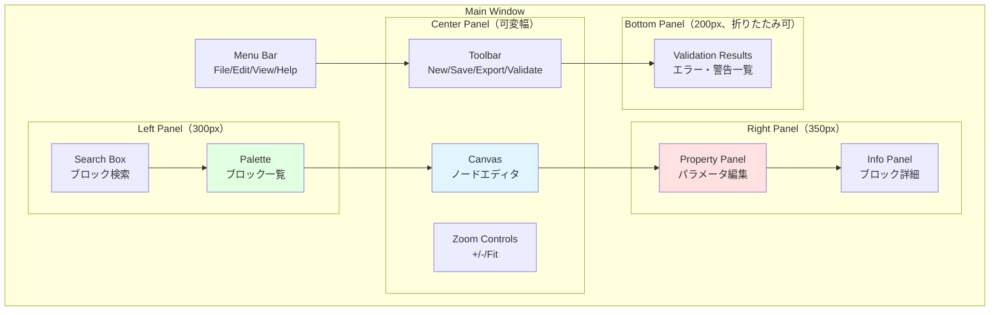
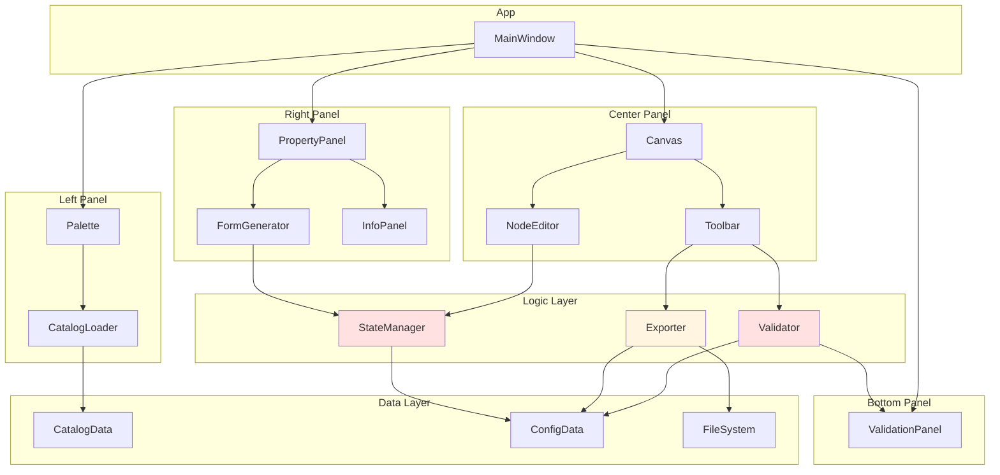
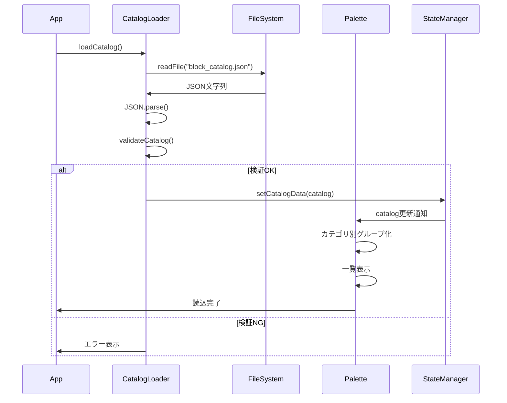
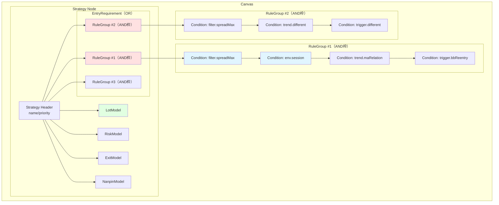
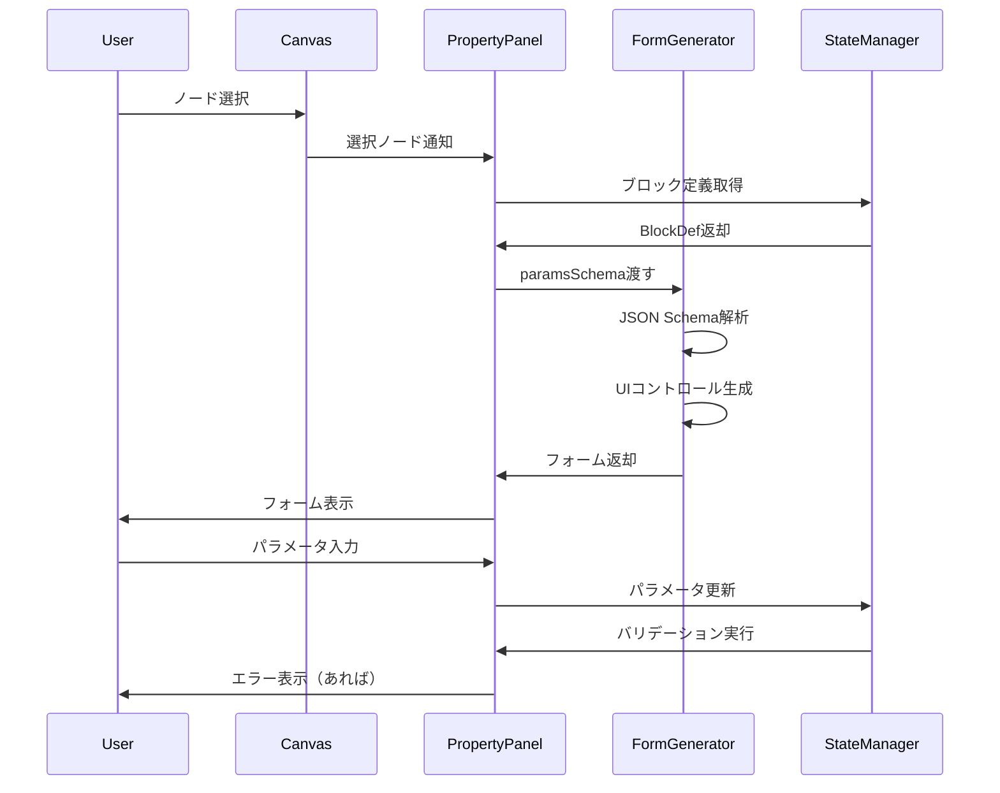
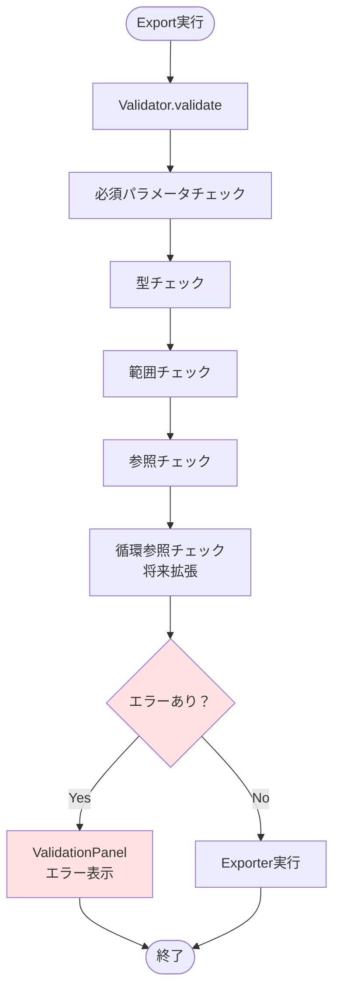
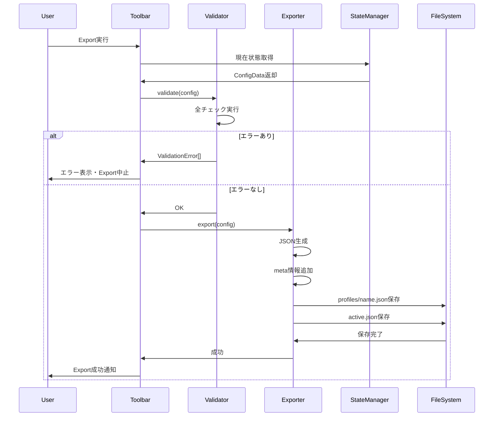

# 03_design/60_gui_builder_design.md
# GUI Builder詳細設計 — Strategy Bricks（仮称）

## 0. ドキュメント情報
- ファイル名：`docs/03_design/60_gui_builder_design.md`
- 版：v0.1
- 対象：GUI実装担当（AIエージェント含む）
- 目的：Electron Strategy Builderの実装可能レベルでの詳細設計

---

## 1. 概要と技術選定

### 1.1 GUI Builderの役割

Electron Strategy Builderは、ユーザーがブロックを視覚的に組み合わせて戦略を構築し、`active.json`を生成するためのGUIアプリケーションです。

**主要機能:**
- ブロックカタログの読み込みとパレット表示
- ノードベースエディタでのOR/AND構造編集
- パラメータ入力フォームの自動生成
- 設定の検証（参照切れ、必須未設定、型不整合等）
- JSON設定ファイルの出力（profiles/*.json + active.json）

### 1.2 技術スタック

**推奨技術:**
- **Electron** - マルチプラットフォーム（Windows/macOS/Linux）
- **React** または **Vue.js** - UIフレームワーク
- **React Flow** または **Vue Flow** - ノードベースエディタ
- **JSON Schema** - paramsSchemaからフォーム生成
- **react-jsonschema-form** または **Vue Formulate** - フォーム自動生成
- **TypeScript** - 型安全性

**代替選択肢:**
- Svelte + SvelteFlow
- Vanilla JS（軽量化優先の場合）

**本設計の前提:**
- Electron + React + React Flow + TypeScript
- 他の技術スタックでも原則は同じ

### 1.3 設計方針

**重要な方針:**
- **UI制約でDNF形式を強制**（EntryRequirement = OR × AND）
- **paramsSchemaからフォームを自動生成**（手動UI実装を最小化）
- **バリデーションはExport前に必須実行**
- **設定はprofilesとactiveの2種類を出力**
- **MT5のMQL5/Files/strategy/への出力パス設定可能**

---

## 2. 画面構成

### 2.1 画面構成図



### 2.2 画面レイアウト

**Menu Bar:**
- File: New, Open, Save, Save As, Export, Exit
- Edit: Undo, Redo, Cut, Copy, Paste, Delete
- View: Show/Hide Panels, Zoom In/Out/Fit
- Help: Documentation, About

**Left Panel（Palette）:**
- カテゴリ別タブ: Filter / Trend / Trigger / Lot / Risk / Exit / Nanpin / All
- ブロック一覧（ドラッグ可能）
- 検索ボックス（インクリメンタルサーチ）

**Center Panel（Canvas）:**
- ノードベースエディタ
- OR枠（RuleGroup）とAND内（ConditionBlock）の配置
- ズームコントロール
- グリッド表示

**Right Panel（Property）:**
- 選択ブロックのパラメータ編集フォーム
- 必須項目のマーク表示
- リアルタイムバリデーション
- ブロック詳細（description表示）

**Bottom Panel（Validation Results）:**
- エラー一覧（参照切れ、必須未設定、型不整合等）
- 警告一覧（オプション）
- エラーダブルクリックで該当ブロックへジャンプ

---

## 3. コンポーネント構成

### 3.1 コンポーネント構成図



### 3.2 主要コンポーネント責務

#### 3.2.1 MainWindow
- 全体レイアウト管理
- メニューバー
- パネル表示/非表示制御

#### 3.2.2 Palette
- ブロックカタログの表示
- カテゴリフィルタ
- 検索機能
- ドラッグ＆ドロップソース

#### 3.2.3 Canvas（NodeEditor）
- ノードベースエディタ
- OR枠（RuleGroup）の作成・削除
- AND内（ConditionBlock）へのブロック配置
- ノード選択・移動・削除

#### 3.2.4 PropertyPanel
- 選択ブロックのパラメータ編集
- フォーム自動生成
- リアルタイムバリデーション
- 変更のStateManagerへの反映

#### 3.2.5 Toolbar
- New / Save / Export / Validate アクション
- 現在の設定名表示

#### 3.2.6 ValidationPanel
- バリデーション結果の表示
- エラー/警告一覧
- エラーダブルクリックでノードへジャンプ

#### 3.2.7 StateManager
- 編集中の設定状態管理
- Undo/Redo（将来拡張）
- 変更検知
- Reactiveな状態更新

#### 3.2.8 Validator
- 設定の妥当性検証
- エラーメッセージ生成

#### 3.2.9 Exporter
- strategy_config.jsonの生成
- profiles/*.jsonとactive.jsonの出力

---

## 4. block_catalog.json読込とパレット生成

### 4.1 データフロー（catalog→Palette）



### 4.2 CatalogLoader実装

```typescript
// CatalogLoader.ts
import fs from 'fs';
import path from 'path';

interface BlockCatalog {
  meta: {
    formatVersion: string;
  };
  blocks: BlockDef[];
}

interface BlockDef {
  typeId: string;
  category: string;
  displayName: string;
  description: string;
  paramsSchema: object;
  io: {
    direction: string;
    score: string;
  };
  runtimeHints: object;
}

export class CatalogLoader {
  async loadCatalog(filePath: string): Promise<BlockCatalog> {
    // ファイル読込
    const content = fs.readFileSync(filePath, 'utf-8');

    // JSON解析
    const catalog: BlockCatalog = JSON.parse(content);

    // バリデーション
    this.validateCatalog(catalog);

    return catalog;
  }

  private validateCatalog(catalog: BlockCatalog): void {
    // formatVersionチェック
    if (!catalog.meta || !catalog.meta.formatVersion) {
      throw new Error('meta.formatVersion is required');
    }

    // blocks[]チェック
    if (!catalog.blocks || !Array.isArray(catalog.blocks)) {
      throw new Error('blocks[] is required');
    }

    // 各ブロック定義のチェック
    for (const block of catalog.blocks) {
      if (!block.typeId || !block.category || !block.displayName) {
        throw new Error(`Invalid block definition: ${JSON.stringify(block)}`);
      }

      if (!block.paramsSchema) {
        throw new Error(`paramsSchema is required for ${block.typeId}`);
      }
    }
  }
}
```

### 4.3 Palette実装

```typescript
// Palette.tsx
import React, { useState, useMemo } from 'react';
import { useStateManager } from './hooks/useStateManager';

interface PaletteProps {
  // props
}

export const Palette: React.FC<PaletteProps> = () => {
  const { catalog } = useStateManager();
  const [selectedCategory, setSelectedCategory] = useState('all');
  const [searchTerm, setSearchTerm] = useState('');

  // カテゴリ別グループ化
  const blocksByCategory = useMemo(() => {
    const grouped: Record<string, BlockDef[]> = {};

    for (const block of catalog.blocks) {
      if (!grouped[block.category]) {
        grouped[block.category] = [];
      }
      grouped[block.category].push(block);
    }

    return grouped;
  }, [catalog]);

  // フィルタ適用
  const filteredBlocks = useMemo(() => {
    let blocks = selectedCategory === 'all'
      ? catalog.blocks
      : blocksByCategory[selectedCategory] || [];

    if (searchTerm) {
      blocks = blocks.filter(block =>
        block.displayName.toLowerCase().includes(searchTerm.toLowerCase()) ||
        block.typeId.toLowerCase().includes(searchTerm.toLowerCase())
      );
    }

    return blocks;
  }, [catalog, selectedCategory, searchTerm, blocksByCategory]);

  // ドラッグ開始
  const handleDragStart = (event: React.DragEvent, block: BlockDef) => {
    event.dataTransfer.setData('application/reactflow', JSON.stringify({
      type: 'block',
      blockTypeId: block.typeId
    }));
    event.dataTransfer.effectAllowed = 'move';
  };

  return (
    <div className="palette">
      {/* カテゴリタブ */}
      <div className="category-tabs">
        <button onClick={() => setSelectedCategory('all')}>All</button>
        <button onClick={() => setSelectedCategory('filter')}>Filter</button>
        <button onClick={() => setSelectedCategory('trend')}>Trend</button>
        <button onClick={() => setSelectedCategory('trigger')}>Trigger</button>
        <button onClick={() => setSelectedCategory('lot')}>Lot</button>
        <button onClick={() => setSelectedCategory('risk')}>Risk</button>
        <button onClick={() => setSelectedCategory('exit')}>Exit</button>
        <button onClick={() => setSelectedCategory('nanpin')}>Nanpin</button>
      </div>

      {/* 検索ボックス */}
      <input
        type="text"
        placeholder="Search blocks..."
        value={searchTerm}
        onChange={(e) => setSearchTerm(e.target.value)}
      />

      {/* ブロック一覧 */}
      <div className="block-list">
        {filteredBlocks.map(block => (
          <div
            key={block.typeId}
            className="block-item"
            draggable
            onDragStart={(e) => handleDragStart(e, block)}
          >
            <div className="block-name">{block.displayName}</div>
            <div className="block-type">{block.typeId}</div>
          </div>
        ))}
      </div>
    </div>
  );
};
```

---

## 5. ノードベースエディタ設計

### 5.1 ノード配置ルール図



### 5.2 ノード種別

**Strategy Node:**
- Strategyのルート
- name, priority, enabled, conflictPolicy, directionPolicy を持つ
- EntryRequirement, LotModel, RiskModel, ExitModel, NanpinModel を子に持つ

**RuleGroup Node（OR枠）:**
- AND条件の集合
- 複数のConditionを子に持つ
- ORの一要素

**Condition Node（AND内）:**
- 個別のブロック参照
- blockIdを持つ
- パラメータはブロックインスタンスに格納

**Model Nodes（Lot/Risk/Exit/Nanpin）:**
- それぞれ対応するブロック参照
- 1つのブロックのみ配置可能

### 5.3 UI制約（DNF形式の強制）

**制約ルール:**
1. **EntryRequirementは必ずOR**
   - RuleGroupを複数持てる
   - RuleGroup以外は配置不可

2. **RuleGroupは必ずAND**
   - Conditionを複数持てる
   - Condition以外は配置不可

3. **Conditionはブロック参照**
   - 1つのブロックIDを参照
   - 子を持たない（リーフノード）

4. **ドロップ制限**
   - PaletteからのドロップはConditionまたはModel Nodeにのみ可能
   - RuleGroup追加は専用ボタン

**UI実装:**
- React Flowの`isValidConnection`でドロップ先を制限
- RuleGroup追加ボタンでOR枠を追加
- Conditionノード内にブロックをドロップ

### 5.4 NodeEditor実装（React Flow）

```typescript
// NodeEditor.tsx
import React, { useCallback } from 'react';
import ReactFlow, {
  Node,
  Edge,
  Connection,
  addEdge,
  useNodesState,
  useEdgesState,
} from 'reactflow';
import 'reactflow/dist/style.css';
import { useStateManager } from './hooks/useStateManager';

export const NodeEditor: React.FC = () => {
  const { state, updateNodes, updateEdges } = useStateManager();
  const [nodes, setNodes, onNodesChange] = useNodesState(state.nodes);
  const [edges, setEdges, onEdgesChange] = useEdgesState(state.edges);

  // ドロップ処理
  const onDrop = useCallback((event: React.DragEvent) => {
    event.preventDefault();

    const reactFlowBounds = event.currentTarget.getBoundingClientRect();
    const data = event.dataTransfer.getData('application/reactflow');

    if (!data) return;

    const { type, blockTypeId } = JSON.parse(data);

    if (type === 'block') {
      // 新規ノード作成
      const position = {
        x: event.clientX - reactFlowBounds.left,
        y: event.clientY - reactFlowBounds.top,
      };

      const newNode: Node = {
        id: `block-${Date.now()}`,
        type: 'conditionNode',
        position,
        data: {
          blockTypeId,
          params: {},
        },
      };

      setNodes((nds) => [...nds, newNode]);
      updateNodes([...nodes, newNode]);
    }
  }, [nodes, setNodes, updateNodes]);

  const onDragOver = useCallback((event: React.DragEvent) => {
    event.preventDefault();
    event.dataTransfer.dropEffect = 'move';
  }, []);

  // 接続検証（UI制約）
  const isValidConnection = useCallback((connection: Connection) => {
    // RuleGroup → Conditionのみ許可
    // Strategy → RuleGroupのみ許可
    // 等のロジック

    const sourceNode = nodes.find(n => n.id === connection.source);
    const targetNode = nodes.find(n => n.id === connection.target);

    if (!sourceNode || !targetNode) return false;

    // RuleGroup（OR枠）→ Condition（AND内）
    if (sourceNode.type === 'ruleGroupNode' &&
        targetNode.type === 'conditionNode') {
      return true;
    }

    // Strategy → RuleGroup
    if (sourceNode.type === 'strategyNode' &&
        targetNode.type === 'ruleGroupNode') {
      return true;
    }

    return false;
  }, [nodes]);

  const onConnect = useCallback((params: Connection) => {
    if (isValidConnection(params)) {
      setEdges((eds) => addEdge(params, eds));
    }
  }, [setEdges, isValidConnection]);

  // RuleGroup追加
  const addRuleGroup = useCallback(() => {
    const newNode: Node = {
      id: `rulegroup-${Date.now()}`,
      type: 'ruleGroupNode',
      position: { x: 100, y: 100 },
      data: {
        id: `RG${nodes.length + 1}`,
      },
    };

    setNodes((nds) => [...nds, newNode]);
    updateNodes([...nodes, newNode]);
  }, [nodes, setNodes, updateNodes]);

  return (
    <div className="node-editor">
      <button onClick={addRuleGroup}>Add RuleGroup (OR)</button>

      <ReactFlow
        nodes={nodes}
        edges={edges}
        onNodesChange={onNodesChange}
        onEdgesChange={onEdgesChange}
        onConnect={onConnect}
        onDrop={onDrop}
        onDragOver={onDragOver}
        fitView
      >
        {/* Controls, Background, MiniMap等 */}
      </ReactFlow>
    </div>
  );
};
```

---

## 6. paramsSchema→フォーム自動生成

### 6.1 データフロー（schema→Form）



### 6.2 FormGenerator実装

```typescript
// FormGenerator.tsx
import React from 'react';
import Form from '@rjsf/core';
import validator from '@rjsf/validator-ajv8';

interface FormGeneratorProps {
  paramsSchema: object;
  formData: object;
  onChange: (data: object) => void;
}

export const FormGenerator: React.FC<FormGeneratorProps> = ({
  paramsSchema,
  formData,
  onChange,
}) => {
  // カスタムウィジェット（ui.controlヒントに基づく）
  const uiSchema = generateUISchema(paramsSchema);

  const handleSubmit = ({ formData }: { formData: object }) => {
    onChange(formData);
  };

  return (
    <Form
      schema={paramsSchema}
      uiSchema={uiSchema}
      formData={formData}
      validator={validator}
      onChange={({ formData }) => onChange(formData)}
      onSubmit={handleSubmit}
    >
      {/* Submit非表示（自動保存） */}
      <button type="submit" style={{ display: 'none' }} />
    </Form>
  );
};

function generateUISchema(paramsSchema: any): object {
  const uiSchema: any = {};

  if (paramsSchema.properties) {
    for (const key in paramsSchema.properties) {
      const prop = paramsSchema.properties[key];

      if (prop.ui && prop.ui.control) {
        // ui.controlヒントに基づくウィジェット選択
        switch (prop.ui.control) {
          case 'number':
            uiSchema[key] = { 'ui:widget': 'updown' };
            break;
          case 'select':
            uiSchema[key] = { 'ui:widget': 'select' };
            break;
          case 'checkbox':
            uiSchema[key] = { 'ui:widget': 'checkbox' };
            break;
          // 他のコントロール
        }
      }
    }
  }

  return uiSchema;
}
```

### 6.3 PropertyPanel実装

```typescript
// PropertyPanel.tsx
import React, { useState, useEffect } from 'react';
import { FormGenerator } from './FormGenerator';
import { useStateManager } from './hooks/useStateManager';

export const PropertyPanel: React.FC = () => {
  const { selectedNode, catalog, updateNodeParams } = useStateManager();
  const [formData, setFormData] = useState({});

  useEffect(() => {
    if (selectedNode && selectedNode.data.blockTypeId) {
      // ブロック定義取得
      const blockDef = catalog.blocks.find(
        b => b.typeId === selectedNode.data.blockTypeId
      );

      if (blockDef) {
        // 現在のパラメータをformDataにセット
        setFormData(selectedNode.data.params || {});
      }
    }
  }, [selectedNode, catalog]);

  const handleChange = (data: object) => {
    setFormData(data);

    // StateManagerへ反映（自動保存）
    if (selectedNode) {
      updateNodeParams(selectedNode.id, data);
    }
  };

  if (!selectedNode || !selectedNode.data.blockTypeId) {
    return <div className="property-panel">ノードを選択してください</div>;
  }

  const blockDef = catalog.blocks.find(
    b => b.typeId === selectedNode.data.blockTypeId
  );

  if (!blockDef) {
    return <div className="property-panel">ブロック定義が見つかりません</div>;
  }

  return (
    <div className="property-panel">
      <h3>{blockDef.displayName}</h3>
      <p>{blockDef.description}</p>

      <FormGenerator
        paramsSchema={blockDef.paramsSchema}
        formData={formData}
        onChange={handleChange}
      />
    </div>
  );
};
```

---

## 7. バリデーション実装

### 7.1 バリデーションフロー



### 7.2 Validator実装

```typescript
// Validator.ts
export interface ValidationError {
  type: 'error' | 'warning';
  message: string;
  nodeId?: string;
  field?: string;
}

export class Validator {
  validate(config: ConfigData, catalog: BlockCatalog): ValidationError[] {
    const errors: ValidationError[] = [];

    // 1. 必須パラメータチェック
    errors.push(...this.checkRequiredParams(config, catalog));

    // 2. 型チェック
    errors.push(...this.checkTypes(config, catalog));

    // 3. 範囲チェック
    errors.push(...this.checkRanges(config, catalog));

    // 4. 参照チェック
    errors.push(...this.checkReferences(config));

    // 5. 循環参照チェック（将来拡張）
    // errors.push(...this.checkCircularReferences(config));

    return errors;
  }

  private checkRequiredParams(
    config: ConfigData,
    catalog: BlockCatalog
  ): ValidationError[] {
    const errors: ValidationError[] = [];

    // 各ブロックの必須パラメータチェック
    for (const block of config.blocks) {
      const blockDef = catalog.blocks.find(b => b.typeId === block.typeId);
      if (!blockDef) continue;

      const schema = blockDef.paramsSchema as any;
      if (schema.required) {
        for (const requiredField of schema.required) {
          if (!(requiredField in block.params)) {
            errors.push({
              type: 'error',
              message: `Required parameter '${requiredField}' is missing`,
              nodeId: block.id,
              field: requiredField,
            });
          }
        }
      }
    }

    return errors;
  }

  private checkTypes(
    config: ConfigData,
    catalog: BlockCatalog
  ): ValidationError[] {
    const errors: ValidationError[] = [];

    // JSON Schemaの型チェック
    for (const block of config.blocks) {
      const blockDef = catalog.blocks.find(b => b.typeId === block.typeId);
      if (!blockDef) continue;

      const schema = blockDef.paramsSchema as any;
      if (schema.properties) {
        for (const key in block.params) {
          const propSchema = schema.properties[key];
          if (!propSchema) continue;

          const value = block.params[key];
          const expectedType = propSchema.type;

          if (!this.isValidType(value, expectedType)) {
            errors.push({
              type: 'error',
              message: `Parameter '${key}' has invalid type (expected: ${expectedType})`,
              nodeId: block.id,
              field: key,
            });
          }
        }
      }
    }

    return errors;
  }

  private checkRanges(
    config: ConfigData,
    catalog: BlockCatalog
  ): ValidationError[] {
    const errors: ValidationError[] = [];

    // minimum/maximum等のチェック
    for (const block of config.blocks) {
      const blockDef = catalog.blocks.find(b => b.typeId === block.typeId);
      if (!blockDef) continue;

      const schema = blockDef.paramsSchema as any;
      if (schema.properties) {
        for (const key in block.params) {
          const propSchema = schema.properties[key];
          if (!propSchema) continue;

          const value = block.params[key];

          // minimum
          if (propSchema.minimum !== undefined && value < propSchema.minimum) {
            errors.push({
              type: 'error',
              message: `Parameter '${key}' is below minimum (${propSchema.minimum})`,
              nodeId: block.id,
              field: key,
            });
          }

          // maximum
          if (propSchema.maximum !== undefined && value > propSchema.maximum) {
            errors.push({
              type: 'error',
              message: `Parameter '${key}' is above maximum (${propSchema.maximum})`,
              nodeId: block.id,
              field: key,
            });
          }
        }
      }
    }

    return errors;
  }

  private checkReferences(config: ConfigData): ValidationError[] {
    const errors: ValidationError[] = [];

    // blocks[]からIDマップ作成
    const blockIds = new Set(config.blocks.map(b => b.id));

    // Strategyの各conditionが参照するblockIdの存在確認
    for (const strategy of config.strategies) {
      for (const ruleGroup of strategy.entryRequirement.ruleGroups) {
        for (const condition of ruleGroup.conditions) {
          if (!blockIds.has(condition.blockId)) {
            errors.push({
              type: 'error',
              message: `Block reference not found: ${condition.blockId}`,
              nodeId: condition.blockId,
            });
          }
        }
      }

      // lotModel, riskModel, exitModel, nanpinModelも同様にチェック
      // （実装は簡略化）
    }

    return errors;
  }

  private isValidType(value: any, expectedType: string): boolean {
    switch (expectedType) {
      case 'number':
        return typeof value === 'number';
      case 'string':
        return typeof value === 'string';
      case 'boolean':
        return typeof value === 'boolean';
      case 'array':
        return Array.isArray(value);
      case 'object':
        return typeof value === 'object' && value !== null;
      default:
        return true;
    }
  }
}
```

### 7.3 ValidationPanel実装

```typescript
// ValidationPanel.tsx
import React from 'react';
import { useStateManager } from './hooks/useStateManager';

export const ValidationPanel: React.FC = () => {
  const { validationErrors, selectNode } = useStateManager();

  const handleErrorClick = (error: ValidationError) => {
    if (error.nodeId) {
      // エラーに関連するノードを選択・ハイライト
      selectNode(error.nodeId);
    }
  };

  return (
    <div className="validation-panel">
      <h4>Validation Results</h4>

      {validationErrors.length === 0 ? (
        <div className="no-errors">No errors or warnings</div>
      ) : (
        <ul className="error-list">
          {validationErrors.map((error, index) => (
            <li
              key={index}
              className={error.type}
              onClick={() => handleErrorClick(error)}
            >
              <span className="error-icon">
                {error.type === 'error' ? '❌' : '⚠️'}
              </span>
              <span className="error-message">{error.message}</span>
              {error.nodeId && (
                <span className="error-node">({error.nodeId})</span>
              )}
            </li>
          ))}
        </ul>
      )}
    </div>
  );
};
```

---

## 8. Export処理

### 8.1 Export処理フロー



### 8.2 Exporter実装

```typescript
// Exporter.ts
import fs from 'fs';
import path from 'path';

export class Exporter {
  export(
    config: ConfigData,
    profileName: string,
    outputDir: string
  ): void {
    // JSON生成
    const json = this.generateJSON(config);

    // profiles/<name>.json保存
    const profilePath = path.join(outputDir, 'profiles', `${profileName}.json`);
    this.ensureDir(path.dirname(profilePath));
    fs.writeFileSync(profilePath, JSON.stringify(json, null, 2), 'utf-8');

    // active.json保存
    const activePath = path.join(outputDir, 'active.json');
    fs.writeFileSync(activePath, JSON.stringify(json, null, 2), 'utf-8');

    console.log(`Exported to ${profilePath} and ${activePath}`);
  }

  private generateJSON(config: ConfigData): object {
    // meta情報追加
    const json: any = {
      meta: {
        formatVersion: '1.0',
        name: config.name || 'active',
        generatedBy: 'Strategy Bricks Builder',
        generatedAt: new Date().toISOString(),
      },
      globalGuards: config.globalGuards,
      strategies: config.strategies,
      blocks: config.blocks,
    };

    return json;
  }

  private ensureDir(dir: string): void {
    if (!fs.existsSync(dir)) {
      fs.mkdirSync(dir, { recursive: true });
    }
  }
}
```

### 8.3 ファイル配置（MT5のMQL5/Files/strategy/）

**出力先設定:**
- アプリケーション設定で出力ディレクトリを指定
- 既定値: `C:\Users\<user>\AppData\Roaming\MetaQuotes\Terminal\<instance>\MQL5\Files\strategy\`
- macOS: `~/Library/Application Support/MetaTrader 5/Bottles/MetaTrader 5/drive_c/users/<user>/AppData/Roaming/MetaQuotes/Terminal/<instance>/MQL5/Files/strategy/`

**設定UI:**
```typescript
// Settings.tsx
export const Settings: React.FC = () => {
  const [outputDir, setOutputDir] = useState('');

  const handleBrowse = async () => {
    // Electron dialog
    const result = await window.electron.dialog.showOpenDialog({
      properties: ['openDirectory']
    });

    if (!result.canceled && result.filePaths.length > 0) {
      setOutputDir(result.filePaths[0]);
    }
  };

  return (
    <div className="settings">
      <label>Output Directory:</label>
      <input type="text" value={outputDir} readOnly />
      <button onClick={handleBrowse}>Browse...</button>
    </div>
  );
};
```

---

## 9. 状態管理

### 9.1 StateManager設計

```typescript
// StateManager.ts
import { create } from 'zustand';
import { Node, Edge } from 'reactflow';

interface StateStore {
  // Catalog
  catalog: BlockCatalog;
  setCatalog: (catalog: BlockCatalog) => void;

  // Config
  config: ConfigData;
  updateConfig: (config: ConfigData) => void;

  // Nodes & Edges（React Flow）
  nodes: Node[];
  edges: Edge[];
  updateNodes: (nodes: Node[]) => void;
  updateEdges: (edges: Edge[]) => void;

  // 選択ノード
  selectedNode: Node | null;
  selectNode: (nodeId: string) => void;

  // バリデーション
  validationErrors: ValidationError[];
  setValidationErrors: (errors: ValidationError[]) => void;

  // その他
  updateNodeParams: (nodeId: string, params: object) => void;
}

export const useStateManager = create<StateStore>((set, get) => ({
  catalog: { meta: { formatVersion: '1.0' }, blocks: [] },
  setCatalog: (catalog) => set({ catalog }),

  config: { name: '', globalGuards: {}, strategies: [], blocks: [] },
  updateConfig: (config) => set({ config }),

  nodes: [],
  edges: [],
  updateNodes: (nodes) => set({ nodes }),
  updateEdges: (edges) => set({ edges }),

  selectedNode: null,
  selectNode: (nodeId) => {
    const nodes = get().nodes;
    const node = nodes.find(n => n.id === nodeId);
    set({ selectedNode: node || null });
  },

  validationErrors: [],
  setValidationErrors: (errors) => set({ validationErrors: errors }),

  updateNodeParams: (nodeId, params) => {
    const nodes = get().nodes;
    const updatedNodes = nodes.map(node => {
      if (node.id === nodeId) {
        return {
          ...node,
          data: {
            ...node.data,
            params,
          },
        };
      }
      return node;
    });
    set({ nodes: updatedNodes });
  },
}));
```

---

## 10. エラーハンドリング

### 10.1 主要エラーケース

**Catalog読込失敗:**
- ファイルが存在しない
- JSON解析失敗
- formatVersion非互換

**対処:**
- エラーダイアログ表示
- デフォルトカタログの使用（オプション）

**Export失敗:**
- 出力ディレクトリが存在しない
- 書き込み権限なし
- ディスク容量不足

**対処:**
- エラーダイアログ表示
- 出力先の再選択を促す

**バリデーションエラー:**
- 必須パラメータ未設定
- 型不整合
- 参照切れ

**対処:**
- ValidationPanelにエラー一覧表示
- Export抑止
- エラー箇所へのジャンプ機能

### 10.2 エラーハンドリング実装例

```typescript
// ErrorHandler.ts
export class ErrorHandler {
  static handleCatalogLoadError(error: Error): void {
    window.electron.dialog.showErrorBox(
      'Catalog Load Failed',
      `Failed to load block_catalog.json:\n${error.message}\n\nPlease check the file and try again.`
    );
  }

  static handleExportError(error: Error): void {
    window.electron.dialog.showErrorBox(
      'Export Failed',
      `Failed to export configuration:\n${error.message}\n\nPlease check the output directory and try again.`
    );
  }

  static handleValidationErrors(errors: ValidationError[]): void {
    // ValidationPanelへの表示（UIコンポーネントで処理）
    console.warn('Validation errors:', errors);
  }
}
```

---

## 11. 未決事項

以下は実装時に決定が必要:

### 11.1 UIフレームワーク選択
- React vs Vue.js vs Svelte
- 本設計はReactを前提としているが、他でも原則は同じ

### 11.2 Undo/Redo実装
- StateManagerでの履歴管理
- MVP後の拡張として検討

### 11.3 テンプレート機能
- 既存戦略をテンプレートとして保存
- テンプレートからの新規作成

### 11.4 プレビュー機能
- 生成されるJSONのプレビュー表示
- Diff表示（前回Export時との差分）

### 11.5 多言語対応
- 日本語/英語切り替え
- displayName/descriptionの多言語化

---

## 12. 参照ドキュメント

本詳細設計は以下のドキュメントを基に作成されています:

- `docs/00_overview.md` - 合意事項・前提条件
- `docs/02_requirements/10_requirements.md` - 要件定義書
- `docs/03_design/20_architecture.md` - アーキテクチャ設計
- `docs/03_design/30_config_spec.md` - strategy_config.json仕様
- `docs/03_design/40_block_catalog_spec.md` - block_catalog.json仕様

---
