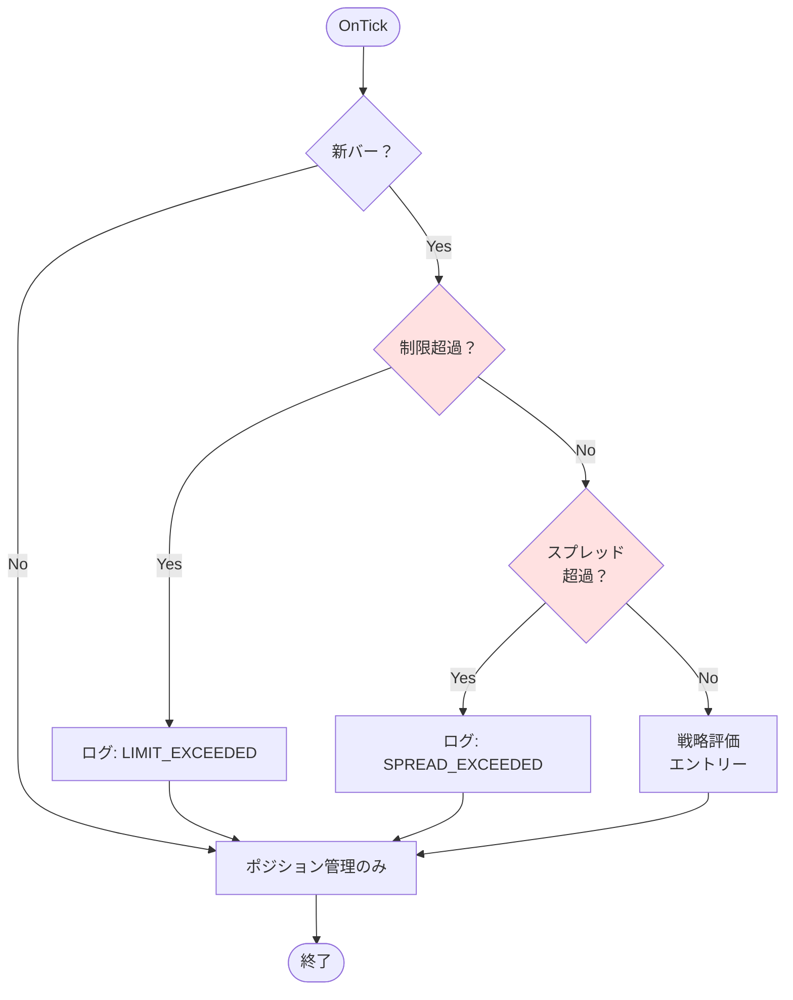

# 03_design/70_security_safety.md
# セキュリティ・安全設計 — Strategy Bricks（仮称）

## 0. ドキュメント情報
- ファイル名：`docs/03_design/70_security_safety.md`
- 版：v0.1
- 対象：実装担当、運用担当
- 目的：リスク管理と運用事故防止のための安全機構を定義

---

## 1. 概要と設計方針

### 1.1 安全設計の目的

Strategy Bricksは、自動取引システムとして運用されるため、以下のリスクに対する安全機構が必須です：

- **過剰エントリー防止**：ポジション数・ロット数の制限
- **高スプレッド時の停止**：スプレッド拡大時の取引停止
- **ナンピン暴走防止**：ナンピン段数制限、シリーズ損切り
- **設定ミス防止**：GUI/EA双方でのバリデーション
- **ブローカー制約遵守**：最小ロット、ストップレベル等の考慮
- **運用事故防止**：ログ、状態監視、緊急停止

### 1.2 設計の基本方針

**多層防御（Defense in Depth）:**
- GUI側でのバリデーション（第一防御）
- EA側でのバリデーション（第二防御）
- 実行時のガード（第三防御）

**安全側動作（Fail-Safe）:**
- エラー時は取引を停止（見送り）
- 制限超過時は新規エントリーを停止
- インジケータ取得失敗時は評価をFAIL

**観測性（Observability）:**
- すべての拒否理由をログに記録
- 状態監視により異常を検知可能
- 緊急停止の仕組み

---

## 2. リスクガード

### 2.1 最大ポジション制限

**目的:** 同時保有ポジション数を制限し、リスク集中を防止

**設定項目（globalGuards）:**
```json
{
  "globalGuards": {
    "maxPositionsTotal": 3,
    "maxPositionsPerSymbol": 1
  }
}
```

**実装（EA側）:**
```mql5
bool IsPositionLimitExceeded() {
    int totalPositions = PositionsTotal();
    int maxTotal = g_config.globalGuards.maxPositionsTotal;

    if (totalPositions >= maxTotal) {
        g_logger.LogInfo("LIMIT_EXCEEDED",
                        "Total positions limit exceeded: " +
                        IntegerToString(totalPositions) + "/" +
                        IntegerToString(maxTotal));
        return true;
    }

    // シンボル別制限
    int symbolPositions = CountPositionsBySymbol(Symbol());
    int maxPerSymbol = g_config.globalGuards.maxPositionsPerSymbol;

    if (symbolPositions >= maxPerSymbol) {
        g_logger.LogInfo("LIMIT_EXCEEDED",
                        "Symbol positions limit exceeded: " +
                        IntegerToString(symbolPositions) + "/" +
                        IntegerToString(maxPerSymbol));
        return true;
    }

    return false;
}

int CountPositionsBySymbol(string symbol) {
    int count = 0;
    for (int i = 0; i < PositionsTotal(); i++) {
        ulong ticket = PositionGetTicket(i);
        if (ticket == 0) continue;

        if (PositionGetString(POSITION_SYMBOL) == symbol &&
            PositionGetInteger(POSITION_MAGIC) == MAGIC_NUMBER) {
            count++;
        }
    }
    return count;
}
```

**制限超過時の挙動:**
- 新規エントリーを停止
- ポジション管理（トレール、決済等）は継続
- ログに理由を記録

### 2.2 最大ロット制限

**目的:** 1回の取引ロット数を制限し、単一取引での損失を制限

**設定項目（globalGuards）:**
```json
{
  "globalGuards": {
    "maxLotPerOrder": 1.0,
    "maxLotTotal": 3.0
  }
}
```

**実装（EA側）:**
```mql5
bool ValidateLot(double lot) {
    // 1注文あたりの最大ロット
    double maxPerOrder = g_config.globalGuards.maxLotPerOrder;
    if (lot > maxPerOrder) {
        g_logger.LogOrderReject("LOT_EXCEEDED",
                                "Lot exceeds maxLotPerOrder: " +
                                DoubleToString(lot) + " > " +
                                DoubleToString(maxPerOrder));
        return false;
    }

    // 合計ロット数チェック
    double currentTotalLot = CalculateTotalLot();
    double maxTotal = g_config.globalGuards.maxLotTotal;

    if (currentTotalLot + lot > maxTotal) {
        g_logger.LogOrderReject("LOT_EXCEEDED",
                                "Total lot would exceed maxLotTotal: " +
                                DoubleToString(currentTotalLot + lot) + " > " +
                                DoubleToString(maxTotal));
        return false;
    }

    // ブローカー制約チェック
    double minLot = SymbolInfoDouble(Symbol(), SYMBOL_VOLUME_MIN);
    double maxLot = SymbolInfoDouble(Symbol(), SYMBOL_VOLUME_MAX);

    if (lot < minLot || lot > maxLot) {
        g_logger.LogOrderReject("INVALID_LOT",
                                "Lot out of broker range: " +
                                DoubleToString(lot) + " (min=" +
                                DoubleToString(minLot) + ", max=" +
                                DoubleToString(maxLot) + ")");
        return false;
    }

    return true;
}

double CalculateTotalLot() {
    double total = 0;
    for (int i = 0; i < PositionsTotal(); i++) {
        ulong ticket = PositionGetTicket(i);
        if (ticket == 0) continue;

        if (PositionGetInteger(POSITION_MAGIC) == MAGIC_NUMBER) {
            total += PositionGetDouble(POSITION_VOLUME);
        }
    }
    return total;
}
```

### 2.3 スプレッド停止

**目的:** スプレッド拡大時（経済指標発表時等）の取引を停止

**設定項目（globalGuards）:**
```json
{
  "globalGuards": {
    "maxSpreadPips": 2.0
  }
}
```

**実装（filter.spreadMaxブロック + globalGuards二重チェック）:**
```mql5
// 1. ブロック評価でチェック（filter.spreadMax）
BlockResult FilterSpreadMax::Evaluate(const Context &ctx) {
    double currentSpread = ctx.market.spread;
    bool pass = (currentSpread <= m_maxSpreadPips);

    string reason = "Spread=" + DoubleToString(currentSpread, 1) +
                    " pips (max=" + DoubleToString(m_maxSpreadPips, 1) + ")";

    return BlockResult(pass ? PASS : FAIL, NEUTRAL, reason);
}

// 2. globalGuardsで二重チェック
bool CheckGlobalSpread() {
    double ask = SymbolInfoDouble(Symbol(), SYMBOL_ASK);
    double bid = SymbolInfoDouble(Symbol(), SYMBOL_BID);
    double point = SymbolInfoDouble(Symbol(), SYMBOL_POINT);
    double spread = (ask - bid) / point / 10.0;  // pips

    double maxSpread = g_config.globalGuards.maxSpreadPips;

    if (spread > maxSpread) {
        g_logger.LogInfo("SPREAD_EXCEEDED",
                        "Spread exceeds limit: " +
                        DoubleToString(spread, 1) + " > " +
                        DoubleToString(maxSpread, 1) + " pips");
        return false;
    }

    return true;
}
```

### 2.4 クールダウン（再エントリー間隔制限）

**目的:** 短時間での連続エントリーを防止

**設定項目（globalGuards、オプション）:**
```json
{
  "globalGuards": {
    "cooldownMinutes": 5
  }
}
```

**実装（EA側）:**
```mql5
class CooldownManager {
private:
    datetime m_lastEntryTime;
    int m_cooldownMinutes;

public:
    CooldownManager(int cooldownMinutes)
        : m_lastEntryTime(0), m_cooldownMinutes(cooldownMinutes) {}

    bool IsCooldownActive() {
        if (m_lastEntryTime == 0) return false;

        datetime now = TimeCurrent();
        int elapsedMinutes = (int)((now - m_lastEntryTime) / 60);

        if (elapsedMinutes < m_cooldownMinutes) {
            g_logger.LogInfo("COOLDOWN_ACTIVE",
                            "Cooldown active: " +
                            IntegerToString(elapsedMinutes) + "/" +
                            IntegerToString(m_cooldownMinutes) + " minutes");
            return true;
        }

        return false;
    }

    void RecordEntry() {
        m_lastEntryTime = TimeCurrent();
    }
};
```

---

## 3. ナンピン安全装置

### 3.1 ナンピンの設計方針

**重要な前提:**
- ナンピンは「分割エントリー」の発想
- **必ず損切り（損失限定）を行う**
- ポジション数が増えすぎた場合は平均建値で決済

**安全装置:**
- 最大段数制限
- シリーズ損切り（累積損失制限）
- 最大時BE決済（平均建値で全決済）
- 追加条件の厳格化（逆行幅、ATR倍率等）

### 3.2 最大段数制限

**目的:** ナンピン段数を制限し、無限ナンピンを防止

**設定項目（nanpinModel）:**
```json
{
  "nanpinModel": {
    "type": "nanpin.standard",
    "params": {
      "maxCount": 3,
      "additionalCondition": {
        "type": "reverseDistance",
        "pips": 20
      }
    }
  }
}
```

**実装（PositionManager）:**
```mql5
bool CanAddNanpin(Strategy &strat) {
    // ナンピンモードチェック
    if (strat.nanpinModel.type == "nanpin.off") {
        return false;
    }

    // 現在のポジション数カウント
    int currentCount = CountPositionsForStrategy(strat.id);
    int maxCount = strat.nanpinModel.params.maxCount;

    if (currentCount >= maxCount) {
        g_logger.LogInfo("NANPIN_LIMIT",
                        "Nanpin max count reached: " +
                        IntegerToString(currentCount) + "/" +
                        IntegerToString(maxCount));
        return false;
    }

    return true;
}

int CountPositionsForStrategy(string strategyId) {
    // magic numberまたは他の識別方法でカウント
    // 簡易実装: 全ポジションをカウント
    int count = 0;
    for (int i = 0; i < PositionsTotal(); i++) {
        ulong ticket = PositionGetTicket(i);
        if (ticket == 0) continue;

        if (PositionGetInteger(POSITION_MAGIC) == MAGIC_NUMBER) {
            count++;
        }
    }
    return count;
}
```

### 3.3 シリーズ損切り

**目的:** ナンピンシリーズ全体での累積損失を制限

**設定項目（nanpinModel）:**
```json
{
  "nanpinModel": {
    "type": "nanpin.standard",
    "params": {
      "maxCount": 3,
      "seriesStopLoss": {
        "type": "totalLoss",
        "amount": 100.0
      }
    }
  }
}
```

**実装（PositionManager）:**
```mql5
void CheckSeriesStopLoss(Strategy &strat) {
    // ナンピンシリーズの累積損益計算
    double totalProfit = CalculateTotalProfit(strat.id);

    // シリーズ損切り設定
    double maxLoss = strat.nanpinModel.params.seriesStopLoss.amount;

    if (totalProfit <= -maxLoss) {
        g_logger.LogInfo("NANPIN_SERIES_CUT",
                        "Series stop loss triggered: " +
                        DoubleToString(totalProfit, 2) + " <= -" +
                        DoubleToString(maxLoss, 2));

        // 全ポジション決済
        CloseAllPositionsForStrategy(strat.id, "Series Stop Loss");
    }
}

double CalculateTotalProfit(string strategyId) {
    double total = 0;
    for (int i = 0; i < PositionsTotal(); i++) {
        ulong ticket = PositionGetTicket(i);
        if (ticket == 0) continue;

        if (PositionGetInteger(POSITION_MAGIC) == MAGIC_NUMBER) {
            total += PositionGetDouble(POSITION_PROFIT);
        }
    }
    return total;
}

void CloseAllPositionsForStrategy(string strategyId, string reason) {
    for (int i = PositionsTotal() - 1; i >= 0; i--) {
        ulong ticket = PositionGetTicket(i);
        if (ticket == 0) continue;

        if (PositionGetInteger(POSITION_MAGIC) == MAGIC_NUMBER) {
            MqlTradeRequest request = {};
            MqlTradeResult result = {};

            request.action = TRADE_ACTION_DEAL;
            request.position = ticket;
            request.symbol = PositionGetString(POSITION_SYMBOL);
            request.volume = PositionGetDouble(POSITION_VOLUME);
            request.type = (PositionGetInteger(POSITION_TYPE) == POSITION_TYPE_BUY) ?
                          ORDER_TYPE_SELL : ORDER_TYPE_BUY;
            request.price = (request.type == ORDER_TYPE_SELL) ?
                           SymbolInfoDouble(request.symbol, SYMBOL_BID) :
                           SymbolInfoDouble(request.symbol, SYMBOL_ASK);
            request.deviation = 5;
            request.magic = MAGIC_NUMBER;
            request.comment = reason;

            OrderSend(request, result);

            g_logger.LogInfo("POSITION_CLOSED",
                            "Ticket: " + IntegerToString(ticket) +
                            ", Reason: " + reason);
        }
    }
}
```

### 3.4 最大時BE決済（平均建値決済）

**目的:** ポジション数が最大段数に達した場合、平均建値近辺で全決済

**設定項目（nanpinModel）:**
```json
{
  "nanpinModel": {
    "type": "nanpin.standard",
    "params": {
      "maxCount": 3,
      "breakEvenAtMax": true,
      "breakEvenPips": 0.5
    }
  }
}
```

**実装（PositionManager）:**
```mql5
void CheckBreakEvenAtMax(Strategy &strat) {
    // 最大段数到達チェック
    int currentCount = CountPositionsForStrategy(strat.id);
    int maxCount = strat.nanpinModel.params.maxCount;

    if (currentCount < maxCount) {
        return;  // まだ最大ではない
    }

    if (!strat.nanpinModel.params.breakEvenAtMax) {
        return;  // BE決済なし
    }

    // 平均建値計算
    double avgPrice = CalculateAveragePrice(strat.id);
    double currentPrice = SymbolInfoDouble(Symbol(), SYMBOL_BID);  // LONG想定

    // BE条件チェック（平均建値 + わずかな利益）
    double beThreshold = strat.nanpinModel.params.breakEvenPips * 10 *
                        SymbolInfoDouble(Symbol(), SYMBOL_POINT);

    if (currentPrice >= avgPrice + beThreshold) {
        g_logger.LogInfo("NANPIN_BE_AT_MAX",
                        "Break-even at max triggered: " +
                        "avgPrice=" + DoubleToString(avgPrice, 5) +
                        ", currentPrice=" + DoubleToString(currentPrice, 5));

        // 全ポジション決済
        CloseAllPositionsForStrategy(strat.id, "Break-Even at Max");
    }
}

double CalculateAveragePrice(string strategyId) {
    double totalVolume = 0;
    double weightedPrice = 0;

    for (int i = 0; i < PositionsTotal(); i++) {
        ulong ticket = PositionGetTicket(i);
        if (ticket == 0) continue;

        if (PositionGetInteger(POSITION_MAGIC) == MAGIC_NUMBER) {
            double volume = PositionGetDouble(POSITION_VOLUME);
            double openPrice = PositionGetDouble(POSITION_PRICE_OPEN);

            totalVolume += volume;
            weightedPrice += openPrice * volume;
        }
    }

    if (totalVolume > 0) {
        return weightedPrice / totalVolume;
    }

    return 0;
}
```

---

## 4. 設定バリデーション（二重チェック）

### 4.1 GUI側バリデーション（第一防御）

**目的:** Export前にエラーを検出し、不正な設定の出力を防止

**検証項目:**
- 必須パラメータ未設定
- 型不整合（number/string/boolean）
- 範囲外（minimum/maximum）
- 参照切れ（存在しないblockId参照）
- 循環参照（将来拡張）

**実装:** `docs/03_design/60_gui_builder_design.md` を参照

**検証失敗時:**
- Export抑止
- ValidationPanelにエラー表示
- ユーザーに修正を促す

### 4.2 EA側バリデーション（第二防御）

**目的:** OnInit時に設定を検証し、不正な設定での実行を防止

**検証項目:**
- formatVersion互換性
- 必須フィールド存在確認
- 絶対条件の確認（M1固定、useClosedBarOnly=true等）
- ブロック参照の解決可能性

**実装:**
```mql5
bool ValidateConfig(Config &config) {
    // formatVersionチェック
    if (!ValidateFormatVersion(config)) {
        return false;
    }

    // 必須フィールドチェック
    if (!ValidateRequiredFields(config)) {
        return false;
    }

    // 絶対条件チェック
    if (!ValidateAbsoluteConditions(config)) {
        return false;
    }

    // ブロック参照チェック
    if (!ValidateBlockReferences(config)) {
        return false;
    }

    return true;
}

bool ValidateAbsoluteConditions(Config &config) {
    // M1固定
    if (config.globalGuards.timeframe != "M1") {
        LogError("CONFIG_ERROR",
                "globalGuards.timeframe must be M1, got: " +
                config.globalGuards.timeframe);
        return false;
    }

    // useClosedBarOnly = true
    if (!config.globalGuards.useClosedBarOnly) {
        LogError("CONFIG_ERROR",
                "globalGuards.useClosedBarOnly must be true");
        return false;
    }

    // noReentrySameBar = true
    if (!config.globalGuards.noReentrySameBar) {
        LogError("CONFIG_ERROR",
                "globalGuards.noReentrySameBar must be true");
        return false;
    }

    return true;
}
```

**検証失敗時:**
- `OnInit()` で `INIT_FAILED` を返す
- 取引処理を実行しない
- ログに詳細な理由を記録

---

## 5. ブローカー制約対応

### 5.1 主要な制約

**最小ロット（SYMBOL_VOLUME_MIN）:**
- 例: 0.01 lot

**最大ロット（SYMBOL_VOLUME_MAX）:**
- 例: 100 lot

**ロットステップ（SYMBOL_VOLUME_STEP）:**
- 例: 0.01 lot

**ストップレベル（SYMBOL_TRADE_STOPS_LEVEL）:**
- 現在価格からSL/TPまでの最小距離（pips）

**フリーズレベル（SYMBOL_TRADE_FREEZE_LEVEL）:**
- 注文変更・決済不可の価格範囲

### 5.2 実装（OrderExecutor）

```mql5
bool ValidateOrderParams(double lot, double sl, double tp, int direction) {
    // ロット検証
    double minLot = SymbolInfoDouble(Symbol(), SYMBOL_VOLUME_MIN);
    double maxLot = SymbolInfoDouble(Symbol(), SYMBOL_VOLUME_MAX);
    double lotStep = SymbolInfoDouble(Symbol(), SYMBOL_VOLUME_STEP);

    if (lot < minLot || lot > maxLot) {
        g_logger.LogOrderReject("INVALID_LOT",
                                "Lot out of range: " + DoubleToString(lot) +
                                " (min=" + DoubleToString(minLot) +
                                ", max=" + DoubleToString(maxLot) + ")");
        return false;
    }

    // ロットステップ検証
    double remainder = fmod(lot - minLot, lotStep);
    if (remainder > 0.00001) {  // 浮動小数点誤差考慮
        g_logger.LogOrderReject("INVALID_LOT_STEP",
                                "Lot does not match step: " +
                                DoubleToString(lot) +
                                " (step=" + DoubleToString(lotStep) + ")");
        return false;
    }

    // ストップレベル検証
    int stopsLevel = (int)SymbolInfoInteger(Symbol(), SYMBOL_TRADE_STOPS_LEVEL);
    if (stopsLevel > 0) {
        double currentPrice = (direction == LONG) ?
                             SymbolInfoDouble(Symbol(), SYMBOL_ASK) :
                             SymbolInfoDouble(Symbol(), SYMBOL_BID);
        double point = SymbolInfoDouble(Symbol(), SYMBOL_POINT);
        double minDistance = stopsLevel * point;

        // SLチェック
        if (MathAbs(currentPrice - sl) < minDistance) {
            g_logger.LogOrderReject("INVALID_SL",
                                   "SL too close: " + DoubleToString(sl) +
                                   " (min distance=" +
                                   DoubleToString(minDistance / point, 0) +
                                   " points)");
            return false;
        }

        // TPチェック
        if (MathAbs(currentPrice - tp) < minDistance) {
            g_logger.LogOrderReject("INVALID_TP",
                                   "TP too close: " + DoubleToString(tp) +
                                   " (min distance=" +
                                   DoubleToString(minDistance / point, 0) +
                                   " points)");
            return false;
        }
    }

    return true;
}
```

---

## 6. 運用事故防止

### 6.1 ログによる追跡

**重要ログイベント:**
- `CONFIG_LOADED` - 設定読込成功/失敗
- `LIMIT_EXCEEDED` - 制限超過
- `SPREAD_EXCEEDED` - スプレッド超過
- `ORDER_REJECT` - 発注拒否理由
- `NANPIN_SERIES_CUT` - シリーズ損切り
- `NANPIN_BE_AT_MAX` - 最大時BE決済

**ログ設計:** `docs/04_operations/90_observability_and_testing.md` を参照

### 6.2 状態監視

**監視項目:**
- ポジション数（total, per symbol）
- 合計ロット数
- 累積損益
- 最終エントリー時刻
- ナンピン段数

**実装（StateStore）:**
```mql5
class StateStore {
private:
    // 状態変数
    datetime m_lastEntryBarTime;
    int m_totalPositions;
    double m_totalLot;
    double m_totalProfit;
    int m_nanpinCount;

public:
    void UpdateState() {
        // 定期的に状態更新
        m_totalPositions = PositionsTotal();
        m_totalLot = CalculateTotalLot();
        m_totalProfit = CalculateTotalProfit("");
        m_nanpinCount = CountPositionsForStrategy("");

        // ログ出力（定期）
        if (TimeSeconds(TimeCurrent()) % 60 == 0) {  // 1分ごと
            g_logger.LogInfo("STATE_UPDATE",
                            "Positions=" + IntegerToString(m_totalPositions) +
                            ", Lot=" + DoubleToString(m_totalLot, 2) +
                            ", Profit=" + DoubleToString(m_totalProfit, 2) +
                            ", NanpinCount=" + IntegerToString(m_nanpinCount));
        }
    }

    // 異常検知
    bool DetectAnomaly() {
        // ポジション数異常
        if (m_totalPositions > 10) {
            g_logger.LogError("ANOMALY_DETECTED",
                            "Too many positions: " +
                            IntegerToString(m_totalPositions));
            return true;
        }

        // ロット数異常
        if (m_totalLot > 10.0) {
            g_logger.LogError("ANOMALY_DETECTED",
                            "Too much lot: " +
                            DoubleToString(m_totalLot, 2));
            return true;
        }

        // 累積損失異常
        if (m_totalProfit < -1000.0) {
            g_logger.LogError("ANOMALY_DETECTED",
                            "Large loss: " +
                            DoubleToString(m_totalProfit, 2));
            return true;
        }

        return false;
    }
};
```

### 6.3 緊急停止

**トリガー:**
- 異常検知（ポジション数/ロット数/損失）
- ユーザーからの停止指示（Expertパラメータ等）

**実装:**
```mql5
// グローバル変数
bool g_emergencyStop = false;

void OnTick() {
    // 緊急停止チェック
    if (g_emergencyStop) {
        g_logger.LogError("EMERGENCY_STOP", "Trading halted");
        return;  // すべての処理をスキップ
    }

    // 異常検知
    if (g_stateStore.DetectAnomaly()) {
        g_emergencyStop = true;
        g_logger.LogError("EMERGENCY_STOP", "Anomaly detected, trading halted");
        return;
    }

    // 通常処理
    // ...
}

// Expertパラメータ
input bool EmergencyStopParam = false;  // ユーザーが手動で停止可能

void OnInit() {
    if (EmergencyStopParam) {
        g_emergencyStop = true;
        g_logger.LogError("EMERGENCY_STOP", "Manual emergency stop activated");
    }
    // ...
}
```

---

## 7. 制限超過時の挙動

### 7.1 フロー図



### 7.2 実装（OnTick統合）

```mql5
void OnTick() {
    // 緊急停止チェック
    if (g_emergencyStop) {
        return;
    }

    // 新バー検知
    if (g_newBarDetector.IsNewBar()) {
        datetime barTime = g_newBarDetector.GetCurrentBarTime();
        g_logger.LogBarEvalStart(barTime);

        // ポジション制限チェック
        if (IsPositionLimitExceeded()) {
            g_logger.LogInfo("LIMIT_EXCEEDED", "Entry skipped");
            g_positionManager.ManagePositions();
            return;
        }

        // スプレッドチェック
        if (!CheckGlobalSpread()) {
            g_logger.LogInfo("SPREAD_EXCEEDED", "Entry skipped");
            g_positionManager.ManagePositions();
            return;
        }

        // クールダウンチェック
        if (g_cooldownManager.IsCooldownActive()) {
            g_logger.LogInfo("COOLDOWN_ACTIVE", "Entry skipped");
            g_positionManager.ManagePositions();
            return;
        }

        // 戦略評価（エントリー判定）
        g_strategyEngine.EvaluateStrategies();
    }

    // ポジション管理（毎Tick or 新バーのみ）
    g_positionManager.ManagePositions();

    // 状態更新・異常検知
    g_stateStore.UpdateState();
}
```

---

## 8. セキュリティチェックリスト

### 8.1 実装時の確認事項

**設定バリデーション:**
- [ ] GUI側で必須パラメータチェック実装
- [ ] EA側でformatVersionチェック実装
- [ ] 絶対条件（M1固定等）チェック実装

**リスクガード:**
- [ ] 最大ポジション制限実装
- [ ] 最大ロット制限実装
- [ ] スプレッド停止実装
- [ ] クールダウン実装（オプション）

**ナンピン安全装置:**
- [ ] 最大段数制限実装
- [ ] シリーズ損切り実装
- [ ] 最大時BE決済実装

**ブローカー制約:**
- [ ] 最小/最大ロット検証実装
- [ ] ストップレベル検証実装
- [ ] ロットステップ検証実装

**運用事故防止:**
- [ ] すべての拒否理由をログ出力
- [ ] 状態監視実装
- [ ] 異常検知実装
- [ ] 緊急停止機能実装

### 8.2 テスト項目

**単体テスト:**
- ポジション制限超過時の挙動
- ロット制限超過時の挙動
- スプレッド超過時の挙動
- ナンピン最大段数到達時の挙動

**統合テスト:**
- 制限超過時にエントリーが停止されること
- ポジション管理は継続されること
- ログに理由が記録されること

**ストレステスト:**
- 最大ポジション数での動作
- 最大ロット数での動作
- ナンピン最大段数での動作

---

## 9. 未決事項

以下は実装時に決定が必要:

### 9.1 クールダウンの実装方法
- グローバル vs Strategy単位
- 時間ベース vs バー数ベース

### 9.2 緊急停止の実装方法
- Expertパラメータ vs グローバル変数 vs ファイル監視

### 9.3 異常検知の閾値
- ポジション数、ロット数、損失の具体的な閾値

### 9.4 ナンピン追加条件の詳細
- 逆行幅のみ vs 再トリガー必須
- ATR倍率の使用

---

## 10. 参照ドキュメント

本安全設計は以下のドキュメントを基に作成されています:

- `docs/00_overview.md` - 合意事項・前提条件
- `docs/01_proposal/01_project_brief.md` - リスクと対策
- `docs/02_requirements/10_requirements.md` - 要件定義書
- `docs/03_design/20_architecture.md` - アーキテクチャ設計
- `docs/03_design/50_ea_runtime_design.md` - EA Runtime詳細設計
- `docs/03_design/60_gui_builder_design.md` - GUI Builder詳細設計

---
