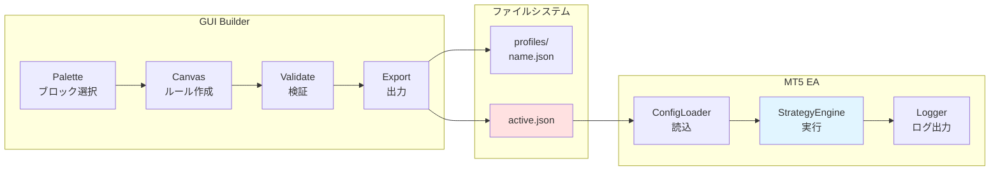
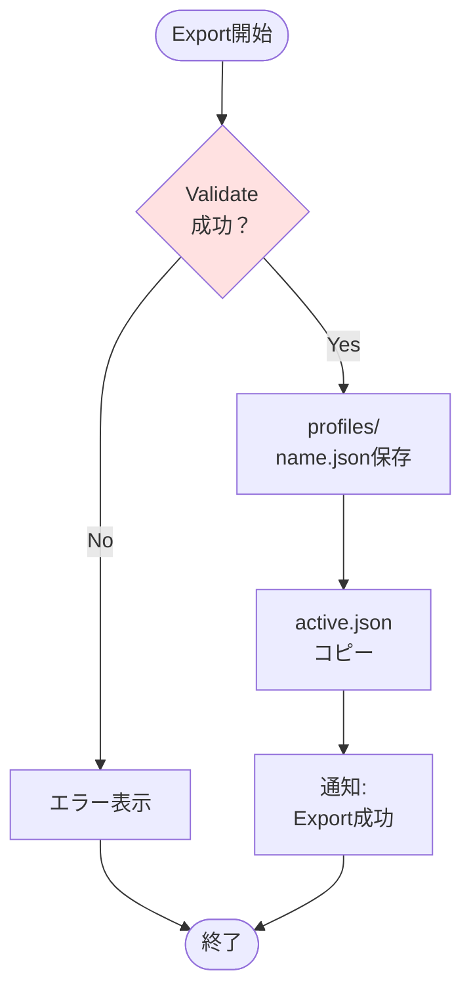
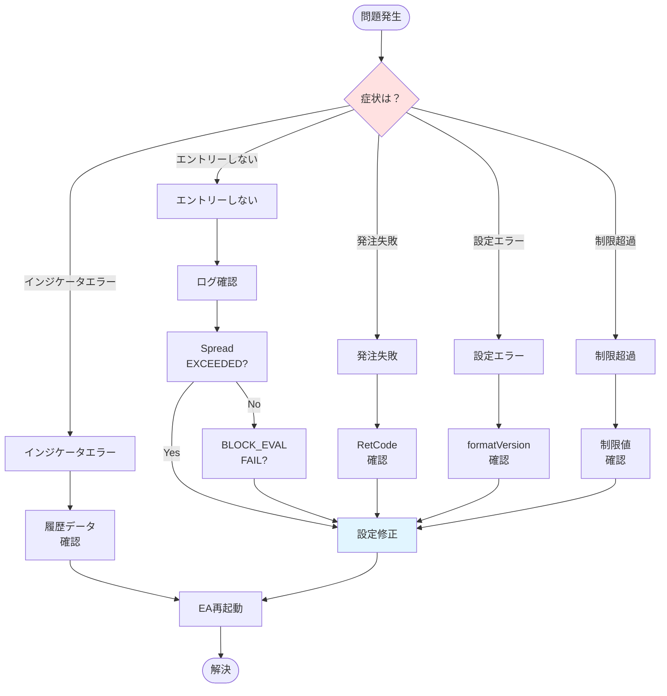

# 04_operations/99_runbook.md
# 運用マニュアル（Runbook） — Strategy Bricks（仮称）

## 0. ドキュメント情報
- ファイル名：`docs/04_operations/99_runbook.md`
- 版：v0.1
- 対象：運用担当、トレーダー
- 目的：実運用における日常的な操作手順とトラブルシュート

---

## 1. 概要

### 1.1 本マニュアルの目的

Strategy Bricksの実運用において必要となる以下の操作手順を提供します：

- **日常運用**：設定変更、EA起動・停止、ログ確認
- **トラブルシュート**：発注失敗、制限超過等の対処方法
- **メンテナンス**：バックアップ、ログローテーション

### 1.2 対象読者

- **トレーダー**：戦略の設定・変更・運用を行う方
- **運用担当**：システムの監視・保守を行う方

### 1.3 前提条件

**必要な知識:**
- MT5の基本操作
- Strategy Bricks GUI Builderの使用方法
- JSONファイルの基本的な理解

**必要な環境:**
- MT5がインストールされている
- Strategy Bricks EA（StrategyBricks.ex5）が配置されている
- GUI Builderがインストールされている

---

## 2. システム構成の理解

### 2.1 全体フロー



### 2.2 重要なファイルとパス

**設定ファイル:**
```
MT5インストールディレクトリ/
└── MQL5/
    └── Files/
        └── strategy/
            ├── active.json           # 実行中の設定（EA読込）
            └── profiles/
                ├── strategy_A.json   # 戦略A保存用
                ├── strategy_B.json   # 戦略B保存用
                └── ...
```

**ログファイル:**
```
MT5インストールディレクトリ/
└── MQL5/
    └── Files/
        └── strategy/
            └── logs/
                ├── strategy_20240110.jsonl  # 日次ログ
                ├── strategy_20240111.jsonl
                └── ...
```

**EAファイル:**
```
MT5インストールディレクトリ/
└── MQL5/
    └── Experts/
        └── StrategyBricks.ex5
```

---

## 3. active.json差し替え手順

### 3.1 GUI Builderでの設定変更

#### 手順1: GUI Builder起動

```bash
# Electron GUI起動
# （インストール方法により異なる）
```

#### 手順2: 戦略の作成・編集

1. **Palette**からブロックを選択
2. **Canvas**でルールを作成（OR/AND構造）
3. **Property**でパラメータ設定
4. **Validate**で検証実行

**検証項目:**
- 必須パラメータが設定されているか
- ブロック参照が正しいか
- 型が正しいか

#### 手順3: Export実行



**操作:**
1. Exportボタンをクリック
2. プロファイル名を入力（例：`strategy_A`）
3. 「Export to active.json」にチェック
4. 実行

**出力:**
- `MQL5/Files/strategy/profiles/strategy_A.json`（保存用）
- `MQL5/Files/strategy/active.json`（実行用）

### 3.2 EA再起動

**MT5での操作:**

1. **チャートからEAを削除**
   - チャート右上の「EA名」を右クリック
   - 「削除」を選択

2. **EAを再アタッチ**
   - ナビゲーター → Expert Advisors → StrategyBricks
   - チャートにドラッグ&ドロップ

3. **初期化成功を確認**
   - Expertsタブで `CONFIG_LOADED` が成功しているか確認
   - ログファイルで `"event":"CONFIG_LOADED","success":true` を確認

**ログ確認例:**
```json
{
  "ts": "2024-01-10 10:00:00",
  "event": "CONFIG_LOADED",
  "success": true,
  "formatVersion": "1.0",
  "strategiesCount": 2,
  "blocksCount": 12
}
```

### 3.3 注意事項

**重要:**
- EA稼働中に `active.json` を直接編集しないこと
- 必ずGUI BuilderからExportすること
- Export後はEA再起動が必要

**確認ポイント:**
- [ ] Validate成功
- [ ] active.json更新日時が最新
- [ ] EA初期化成功（CONFIG_LOADED）
- [ ] ログに設定エラーがない

---

## 4. パラメータ変更手順

### 4.1 既存戦略のパラメータ変更

**ユースケース:** スプレッド上限を2.0 → 1.5に変更

#### 手順1: プロファイル読込

1. GUI Builderを起動
2. メニュー → Open Profile
3. `profiles/strategy_A.json` を選択

#### 手順2: パラメータ変更

1. Canvasで該当ブロックを選択
2. Propertyパネルで `maxSpreadPips` を 1.5 に変更
3. Validateで検証

#### 手順3: Export → EA再起動

- 前述の「3.1 GUI Builderでの設定変更」に従う

### 4.2 戦略の優先度変更

**ユースケース:** Strategy Aの優先度を 10 → 20 に変更

**操作:**
1. Canvas上部の戦略リストでStrategy Aを選択
2. Propertyパネルで `priority` を 20 に変更
3. Export → EA再起動

**確認:**
- ログで `STRATEGY_EVAL` の評価順序が変わっているか確認

### 4.3 戦略の有効化・無効化

**操作:**
1. 戦略を選択
2. Propertyパネルで `enabled` をtrue/falseに変更
3. Export → EA再起動

**無効化した戦略の挙動:**
- 評価されない
- ログに `"reason":"disabled"` が出力される

---

## 5. EA起動・停止手順

### 5.1 EA起動（初回）

#### 手順1: EAファイル配置

```bash
# EAファイルをコピー
cp StrategyBricks.ex5 "<MT5>/MQL5/Experts/"
```

#### 手順2: active.json配置

```bash
# GUI BuilderでExportするか、手動で配置
cp strategy_A.json "<MT5>/MQL5/Files/strategy/active.json"
```

#### 手順3: MT5でアタッチ

1. MT5を起動
2. チャートを開く（任意のシンボル・時間足）
3. ナビゲーター → Expert Advisors → StrategyBricks
4. チャートにドラッグ&ドロップ

#### 手順4: パラメータ設定

**Expertパラメータ:**
- `MagicNumber`：識別用（例：12345）
- `EmergencyStopParam`：緊急停止（既定：false）

**共通設定:**
- 「アルゴリズム取引を許可する」にチェック
- 「DLLの使用を許可する」不要（通常）

#### 手順5: 初期化確認

**Expertsタブ確認:**
```
StrategyBricks EURUSD,M1: initialized
StrategyBricks EURUSD,M1: CONFIG_LOADED success
```

**ログファイル確認:**
```bash
tail -f "<MT5>/MQL5/Files/strategy/logs/strategy_20240110.jsonl"
```

期待されるログ:
```json
{"ts":"2024-01-10 10:00:00","event":"INIT_START"}
{"ts":"2024-01-10 10:00:01","event":"CONFIG_LOADED","success":true}
```

### 5.2 EA停止

#### 通常停止

1. チャート右上の「EA名」を右クリック
2. 「削除」を選択

#### 緊急停止

**方法1: パラメータ変更**
1. EA設定を開く
2. `EmergencyStopParam` を true に変更
3. OK

**方法2: チャートから削除**
- 上記の通常停止と同じ

**緊急停止後のログ:**
```json
{"ts":"2024-01-10 10:05:00","event":"EMERGENCY_STOP","reason":"Manual emergency stop activated"}
```

### 5.3 初期化失敗時の対処

**症状:**
```
StrategyBricks EURUSD,M1: initialization failed, reason 1
```

**対処:**

1. **ログ確認:**
```bash
grep "CONFIG_ERROR" strategy_20240110.jsonl
```

2. **原因別対処:**

| エラー内容 | 原因 | 対処方法 |
|----------|------|---------|
| `File not found` | active.jsonが存在しない | GUI BuilderでExport実行 |
| `Unsupported formatVersion` | バージョン非互換 | active.jsonを最新版で再Export |
| `timeframe must be M1` | timeframe設定ミス | 設定を修正してExport |
| `Block reference not found` | ブロック参照切れ | GUI BuilderでValidate実行 |

3. **修正後の再起動:**
- EA削除 → 設定修正 → EA再アタッチ

---

## 6. ログ確認手順

### 6.1 ログファイルの場所

**パス:**
```
<MT5インストールディレクトリ>/MQL5/Files/strategy/logs/strategy_YYYYMMDD.jsonl
```

**ファイル形式:**
- JSON Lines（各行が1つのJSONオブジェクト）
- 日次でファイル分割

### 6.2 ログの見方

#### 主要ログイベント

| イベント | 意味 | 重要度 |
|---------|------|-------|
| `CONFIG_LOADED` | 設定読込結果 | Critical |
| `BAR_EVAL_START` | 新バー評価開始 | Info |
| `STRATEGY_EVAL` | Strategy評価結果 | Info |
| `BLOCK_EVAL` | ブロック評価結果 | Debug |
| `ORDER_RESULT` | 発注結果 | Critical |
| `ORDER_REJECT` | 発注拒否 | Warning |
| `LIMIT_EXCEEDED` | 制限超過 | Warning |
| `SPREAD_EXCEEDED` | スプレッド超過 | Warning |
| `NANPIN_SERIES_CUT` | シリーズ損切り | Critical |

#### ログフィルタリング（コマンドライン）

**特定イベントのみ表示:**
```bash
# 発注結果のみ
grep '"event":"ORDER_RESULT"' strategy_20240110.jsonl

# 発注拒否のみ
grep '"event":"ORDER_REJECT"' strategy_20240110.jsonl

# エラーレベルのみ
grep '"level":"ERROR"' strategy_20240110.jsonl
```

**JSON整形表示:**
```bash
# jqを使用
cat strategy_20240110.jsonl | jq 'select(.event == "ORDER_RESULT")'
```

### 6.3 トラブルシュート用の検索

#### 「なぜ入らなかったか」を追跡

**手順:**

1. **該当時刻のBAR_EVAL_STARTを特定:**
```bash
grep '"event":"BAR_EVAL_START"' strategy_20240110.jsonl | grep "10:00:00"
```

出力例:
```json
{"ts":"2024-01-10 10:00:00","event":"BAR_EVAL_START","symbol":"EURUSD","barTimeM1":"2024-01-10 10:00:00"}
```

2. **同一barTimeのBLOCK_EVALを確認:**
```bash
grep '"barTimeM1":"2024-01-10 10:00:00"' strategy_20240110.jsonl | grep '"event":"BLOCK_EVAL"'
```

出力例:
```json
{"ts":"...","event":"BLOCK_EVAL","blockId":"filter.spreadMax#1","status":"FAIL","reason":"Spread=3.5 pips (max=2.0)"}
```

3. **原因特定:**
- 上記の例ではスプレッドが3.5 pipsで、上限2.0を超過したためFAIL

#### 「なぜ発注失敗したか」を追跡

**手順:**

1. **ORDER_RESULTでsuccessがfalseを検索:**
```bash
grep '"event":"ORDER_RESULT"' strategy_20240110.jsonl | grep '"success":false'
```

2. **理由確認:**
```json
{"ts":"...","event":"ORDER_RESULT","success":false,"reason":"RetCode: 10013, Comment: Invalid stops"}
```

3. **原因特定:**
- RetCode 10013 = Invalid stops（ストップレベル制約違反）

---

## 7. トラブルシュート

### 7.1 発注失敗

#### 症状

**ログ例:**
```json
{"event":"ORDER_RESULT","success":false,"reason":"RetCode: 10004, Comment: Requote"}
```

#### 原因と対処

| RetCode | 意味 | 対処方法 |
|---------|------|---------|
| 10004 | Requote（価格変動） | スリッページ設定を広げる |
| 10006 | Request rejected | ブローカー制約確認、時間外取引チェック |
| 10013 | Invalid stops | SL/TP距離を広げる、ストップレベル確認 |
| 10014 | Invalid volume | ロット数を最小ロット以上に設定 |
| 10015 | Invalid price | 価格取得エラー、再試行 |
| 10016 | Invalid order | 注文パラメータ確認 |
| 10019 | No money | 証拠金不足、ロット数減少 |

**ストップレベル確認方法:**
```mql5
// MT5の「気配値表示」でシンボル右クリック → 「仕様」
// または以下のコード
int stopsLevel = (int)SymbolInfoInteger(Symbol(), SYMBOL_TRADE_STOPS_LEVEL);
Print("Stops Level: ", stopsLevel, " points");
```

**対処手順:**
1. ログでRetCodeを確認
2. 上記表で原因特定
3. 設定修正（SL/TP距離、ロット数等）
4. GUI BuilderでExport → EA再起動

### 7.2 スプレッド停止

#### 症状

**ログ例:**
```json
{"event":"SPREAD_EXCEEDED","message":"Spread exceeds limit: 3.5 > 2.0 pips"}
{"event":"BLOCK_EVAL","blockId":"filter.spreadMax#1","status":"FAIL","reason":"Spread=3.5 pips (max=2.0)"}
```

#### 原因

- 経済指標発表時
- 流動性低下時（早朝、週末等）
- ブローカー側の問題

#### 対処

**設定変更（推奨）:**
1. GUI Builderで `filter.spreadMax` の `maxSpreadPips` を調整
2. 例：2.0 → 3.0 に緩和
3. Export → EA再起動

**一時的な対応:**
- スプレッドが正常に戻るまで待機
- EA停止（必要に応じて）

### 7.3 インジケータハンドル失敗

#### 症状

**ログ例:**
```json
{"event":"INDICATOR_ERROR","message":"iMA failed: MA_200_EMA"}
{"event":"BLOCK_EVAL","blockId":"trend.maRelation#1","status":"FAIL","reason":"Indicator unavailable"}
```

#### 原因

- MT5データ不足（履歴データ未ダウンロード）
- インジケータパラメータエラー
- MT5の一時的な問題

#### 対処

**手順1: 履歴データ確認**
1. チャートで該当シンボル・時間足を開く
2. 過去データがロードされるまで待機
3. 十分なバー数があるか確認（例：MA200なら最低200バー以上）

**手順2: EA再起動**
- 履歴データロード後、EA再アタッチ

**手順3: パラメータ確認**
- MA期間が大きすぎないか確認
- 例：MA500は500バー必要

### 7.4 設定エラー

#### 症状

**ログ例:**
```json
{"event":"CONFIG_ERROR","level":"ERROR","message":"Unsupported formatVersion: 2.0 (Supported: 1.0)"}
```

#### 原因別対処

**formatVersion非互換:**
- 対処：GUI Builderで最新版として再Export

**timeframe != M1:**
```json
{"event":"CONFIG_ERROR","message":"globalGuards.timeframe must be M1, got: M5"}
```
- 対処：GUI Builderで `globalGuards.timeframe` を "M1" に修正

**ブロック参照切れ:**
```json
{"event":"CONFIG_ERROR","message":"Block reference not found: trend.maRelation#99"}
```
- 対処：GUI BuilderでValidate実行、エラー修正

### 7.5 ポジション制限超過

#### 症状

**ログ例:**
```json
{"event":"LIMIT_EXCEEDED","message":"Total positions limit exceeded: 3/3"}
```

#### 対処

**期待される挙動:**
- 新規エントリーは停止
- ポジション管理（トレール、決済等）は継続

**確認:**
- ログで `ORDER_ATTEMPT` が出ていないこと
- `MANAGEMENT_ACTION` は継続していること

**設定変更（必要に応じて）:**
1. `globalGuards.maxPositionsTotal` を増やす
2. 例：3 → 5 に変更
3. Export → EA再起動

### 7.6 ナンピン暴走（疑い）

#### 症状

- ポジション数が想定以上に増加
- ナンピン段数が最大値を超えている

#### 確認

**ログ確認:**
```bash
grep '"event":"NANPIN_ACTION"' strategy_20240110.jsonl
```

**ポジション数カウント:**
```bash
# ORDER_RESULTでsuccess=trueの件数
grep '"event":"ORDER_RESULT"' strategy_20240110.jsonl | grep '"success":true' | wc -l
```

#### 対処

**緊急対処:**
1. EA停止（チャートから削除）
2. ポジションを手動決済

**設定見直し:**
1. `nanpinModel.maxCount` を減らす（例：5 → 3）
2. `nanpinModel.seriesStopLoss` を設定（累積損失制限）
3. `nanpinModel.breakEvenAtMax` を true に設定

**再起動:**
- 設定修正後、Export → EA再アタッチ

### 7.7 トラブルシュートフローチャート



---

## 8. バックアップ・復旧手順

### 8.1 設定ファイルのバックアップ

#### 定期バックアップ（推奨：日次または週次）

**手動バックアップ:**
```bash
# バックアップディレクトリ作成
mkdir -p ~/StrategyBricks_Backup/$(date +%Y%m%d)

# 設定ファイルをコピー
cp "<MT5>/MQL5/Files/strategy/active.json" \
   ~/StrategyBricks_Backup/$(date +%Y%m%d)/

cp -r "<MT5>/MQL5/Files/strategy/profiles" \
      ~/StrategyBricks_Backup/$(date +%Y%m%d)/
```

**自動バックアップスクリプト（Linux/Mac）:**
```bash
#!/bin/bash
# backup_strategy.sh

BACKUP_DIR=~/StrategyBricks_Backup/$(date +%Y%m%d)
MT5_DIR="<MT5インストールディレクトリ>"

mkdir -p "$BACKUP_DIR"

cp "$MT5_DIR/MQL5/Files/strategy/active.json" "$BACKUP_DIR/"
cp -r "$MT5_DIR/MQL5/Files/strategy/profiles" "$BACKUP_DIR/"

echo "Backup completed: $BACKUP_DIR"
```

**cron設定（毎日午前3時）:**
```bash
crontab -e

# 以下を追加
0 3 * * * /path/to/backup_strategy.sh
```

### 8.2 ログのバックアップ

#### ログローテーション（月次）

**手順:**
```bash
# 過去30日より古いログをアーカイブ
cd "<MT5>/MQL5/Files/strategy/logs"

# アーカイブディレクトリ作成
mkdir -p archive/$(date +%Y%m)

# 30日より古いファイルを移動
find . -name "strategy_*.jsonl" -mtime +30 -exec mv {} archive/$(date +%Y%m)/ \;

# アーカイブを圧縮
tar -czf archive/logs_$(date +%Y%m).tar.gz archive/$(date +%Y%m)/
rm -rf archive/$(date +%Y%m)/
```

### 8.3 復旧手順

#### シナリオ1: 設定ミスによる復旧

**症状:**
- 誤った設定でExportしてしまった
- EAが正常に動作しない

**手順:**

1. **EA停止**
```
チャートからEAを削除
```

2. **バックアップから復元**
```bash
cp ~/StrategyBricks_Backup/20240109/active.json \
   "<MT5>/MQL5/Files/strategy/active.json"
```

3. **EA再起動**
```
EAを再アタッチ
```

4. **動作確認**
```bash
tail -f "<MT5>/MQL5/Files/strategy/logs/strategy_$(date +%Y%m%d).jsonl"
```

#### シナリオ2: ログ解析による原因調査

**症状:**
- 過去の特定日時の挙動を調査したい

**手順:**

1. **該当日のログ確認**
```bash
# アーカイブから展開
tar -xzf archive/logs_202401.tar.gz

# ログ検索
grep '"barTimeM1":"2024-01-05 14:30:00"' \
     archive/202401/strategy_20240105.jsonl
```

2. **必要に応じて再バックテスト**
- 該当期間のバックテスト実行
- ログ比較による原因特定

---

## 9. 定期メンテナンス

### 9.1 日次メンテナンス

#### チェック項目

**ログ確認:**
```bash
# 当日のエラーログ確認
grep '"level":"ERROR"' \
     "<MT5>/MQL5/Files/strategy/logs/strategy_$(date +%Y%m%d).jsonl"

# 発注拒否確認
grep '"event":"ORDER_REJECT"' \
     "<MT5>/MQL5/Files/strategy/logs/strategy_$(date +%Y%m%d).jsonl"
```

**ポジション確認:**
- MT5のターミナルでポジション数・損益確認
- 想定範囲内か確認

**チェックリスト:**
- [ ] エラーログなし
- [ ] 発注拒否が異常に多くない
- [ ] ポジション数が制限内
- [ ] 累積損益が許容範囲内

### 9.2 週次メンテナンス

#### パフォーマンス確認

**ログ統計:**
```python
#!/usr/bin/env python3
import json
import sys
from collections import Counter

# 週次ログ統計
def weekly_stats(log_files):
    events = Counter()
    order_results = {'success': 0, 'fail': 0}

    for log_file in log_files:
        with open(log_file, 'r') as f:
            for line in f:
                log = json.loads(line)
                events[log['event']] += 1

                if log['event'] == 'ORDER_RESULT':
                    if log.get('success'):
                        order_results['success'] += 1
                    else:
                        order_results['fail'] += 1

    print("=== Weekly Stats ===")
    print(f"Total Events: {sum(events.values())}")
    print(f"ORDER_RESULT: {order_results['success']} success, {order_results['fail']} fail")
    print(f"ORDER_REJECT: {events.get('ORDER_REJECT', 0)}")
    print(f"LIMIT_EXCEEDED: {events.get('LIMIT_EXCEEDED', 0)}")
    print(f"SPREAD_EXCEEDED: {events.get('SPREAD_EXCEEDED', 0)}")

# 使用例
# python weekly_stats.py strategy_20240108.jsonl strategy_20240109.jsonl ...
```

**チェックリスト:**
- [ ] 週次統計レポート確認
- [ ] 発注成功率確認（目安：80%以上）
- [ ] 制限超過頻度確認
- [ ] バックアップ実施

### 9.3 月次メンテナンス

#### ログローテーション

**手順:**
```bash
# 9.2 ログのバックアップ参照
# 過去30日より古いログをアーカイブ・圧縮
```

#### 設定レビュー

**チェック項目:**
- [ ] スプレッド上限が適切か
- [ ] ポジション制限が適切か
- [ ] ナンピン設定が適切か
- [ ] ロット数が適切か

**見直しの観点:**
- 発注拒否が多い → スプレッド上限を緩和
- エントリー機会が少ない → フィルタ条件を緩和
- ドローダウンが大きい → リスク設定を厳格化

#### バックテスト実施

**推奨:**
- 月次で過去1ヶ月のバックテスト実行
- フォワードテスト結果と比較
- 乖離がある場合は原因調査

### 9.4 メンテナンススケジュール

| 頻度 | タスク | 所要時間 |
|-----|-------|---------|
| 日次 | ログエラー確認、ポジション確認 | 5分 |
| 週次 | ログ統計、パフォーマンス確認、バックアップ | 15分 |
| 月次 | ログローテーション、設定レビュー、バックテスト | 1時間 |

---

## 10. よくある質問（FAQ）

### Q1: active.jsonを変更したのにEAに反映されない

**A:** EA再起動が必要です。チャートからEAを削除し、再アタッチしてください。

### Q2: ログファイルが見つからない

**A:** 以下を確認:
1. パスが正しいか（`MQL5/Files/strategy/logs/`）
2. EAが実行されているか
3. 日付が正しいか（ファイル名は `strategy_YYYYMMDD.jsonl`）

### Q3: スプレッドが広すぎてエントリーしない

**A:** `filter.spreadMax` の `maxSpreadPips` を調整してください。ブローカーの通常スプレッドを確認し、適切な値を設定。

### Q4: ナンピンが機能しない

**A:** 以下を確認:
1. `nanpinModel.type` が "nanpin.off" でないか
2. 最大段数（`maxCount`）に達していないか
3. 追加条件（逆行幅等）が満たされているか

### Q5: バックテストと実運用で結果が異なる

**A:** 以下の要因を確認:
1. スプレッド設定（バックテストは固定値、実運用は変動）
2. 約定スリッページ
3. ログで実際の約定価格・時刻を確認

### Q6: 緊急停止方法は？

**A:** 以下の2つの方法:
1. EA設定で `EmergencyStopParam` を true に変更
2. チャートからEAを削除

---

## 11. 連絡先・サポート

### 11.1 ドキュメント参照

**詳細設計:**
- `docs/03_design/50_ea_runtime_design.md` - EA内部動作
- `docs/03_design/70_security_safety.md` - 安全機構

**テスト:**
- `docs/04_operations/80_testing.md` - テスト方法
- `docs/04_operations/90_observability_and_testing.md` - ログ仕様

**設定:**
- `docs/03_design/30_config_spec.md` - strategy_config.json仕様
- `docs/03_design/40_block_catalog_spec.md` - ブロック仕様

### 11.2 トラブル報告時の情報

**必要な情報:**
1. 症状の詳細
2. ログファイル（該当日）
3. active.json（現在の設定）
4. MT5のバージョン
5. 再現手順（可能であれば）

---

## 12. 参照ドキュメント

本運用マニュアルは以下のドキュメントを基に作成されています:

- `docs/00_overview.md` - 合意事項・前提条件
- `docs/03_design/50_ea_runtime_design.md` - EA Runtime詳細設計
- `docs/03_design/70_security_safety.md` - セキュリティ・安全設計
- `docs/04_operations/80_testing.md` - テスト計画
- `docs/04_operations/90_observability_and_testing.md` - 観測性とテスト

---
